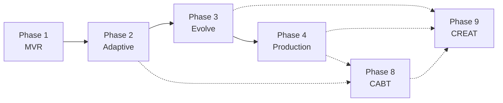

# ROADMAP: llive

**Defined:** 2026-05-13
**Granularity:** coarse (4 phases — MVR / Adaptive / Evolve / Production)

> このファイルは GSD ワークフロー用の roadmap。詳細な milestone + Gantt 図は `docs/roadmap.md` を参照。

## Phase 1: Minimal Viable Research Platform (MVR)

**Goal**: 1 つの ContainerSpec を読み込み、semantic + episodic memory と接続、A/B candidate 評価が走る最小研究基盤を完成させる。

**Requirements (16)**: CORE-01, CORE-02, BC-01, BC-02, BC-03, MEM-01, MEM-02, MEM-03, MEM-04, RTR-01, RTR-02, EVO-01, EVO-02, OBS-01, OBS-02, TRIZ-01

**Success Criteria**:
1. `llive run --template specs/templates/qwen2_5_0_5b.yaml --prompt "..."` で推論が動く
2. ContainerSpec の sub-block 5 種類以上を順序実行できる
3. semantic + episodic memory への read/write が provenance 付きで動作
4. router が 2 経路選択し explanation log を出力する
5. CandidateDiff を読み込んで baseline vs candidate の A/B ベンチが回る
6. route trace + memory link を JSON で取得し人間が読める形に整形できる

**UI hint**: no (CLI のみ)

**Plans (予想)**:
- P1.1 Schema validator + plugin registry skeleton
- P1.2 BaseModelAdapter + 小型モデル (Qwen2.5-0.5B / TinyLlama 1.1B) 検証
- P1.3 Memory backend 最小 (Faiss + DuckDB) + write gate
- P1.4 Block Container Engine + 5 sub-block 実装
- P1.5 Rule-based Router + CandidateDiff A/B harness

---

## Phase 2: Adaptive Modular System

**Goal**: 4 層メモリ + Bayesian surprise + consolidation cycle + llove TUI 最小可視化を完成。連続タスク学習で BWT ≥ -1% を達成。

**Requirements (9)**: MEM-05, MEM-06, MEM-07, MEM-08, MEM-09, BC-04, BC-05, OBS-03, OBS-04

**Success Criteria**:
1. structural memory (graph) + parameter memory (adapter store) が動作
2. surprise score が Bayesian uncertainty として扱われ、write 閾値が動的化
3. consolidation サイクルが夜間 batch で走り、replay → semantic 凝集する
4. memory phase transition (short → mid → long → archived → erased) が cron で動く
5. llove TUI で route trace + memory link viz が見られる
6. 連続 5 タスク学習で BWT ≥ -1%、route entropy が正常範囲

**UI hint**: yes (llove TUI 連携)

**Plans (予想)**:
- P2.1 Structural + Parameter memory backend
- P2.2 Hippocampal Consolidation Scheduler (FR-12)
- P2.3 Memory Phase Manager (FR-16)
- P2.4 Surprise-Bayesian Write Gate (FR-21)
- P2.5 Adapter / lora_switch sub-block
- P2.6 llove HITL minimal (route trace + memory viz)

---

## Phase 3: Controlled Self-Evolution

**Goal**: AI 自動 mutation + 形式検証 gate + shadow eval + TRIZ 内蔵 で安全な自己進化サイクル。candidate acceptance rate ≥ 20%, rollback rate ≤ 10%, BWT 悪化 0 回。

**Requirements (12)**: EVO-03, EVO-04, EVO-05, EVO-06, EVO-07, EVO-08, TRIZ-02, TRIZ-03, TRIZ-04, TRIZ-05, TRIZ-06, TRIZ-07

**Success Criteria**:
1. Static Verifier (Z3 / Lean) で candidate の構造不変量検証が走り、refuted は LLM 評価せず reject
2. Multi-precision shadow evaluation で計算劣線形化を確認 (元の 1/5 以下のコストで上位 80% を発見)
3. Failed-Candidate Reservoir に rejected を蓄積、mutation policy が学習データとして利用
4. Reverse-Evolution Monitor が forgetting 悪化方向の変更を自動 rollback
5. Contradiction Detector が運用メトリクスから矛盾を自動抽出
6. TRIZ Principle Mapper が矛盾 → 40 原理推奨を返す
7. RAD-Backed Idea Generator が candidate diff を生成
8. ARIZ Pipeline が 9 ステップを 1 コマンドで実行
9. Self-Reflection モードで `llive triz brainstorm` 1 回 → 5 候補 → 1 promote が成立
10. candidate acceptance rate ≥ 20%, rollback rate ≤ 10%, BWT 悪化 0 回

**UI hint**: yes (TRIZ ブレストの可視化を llove TUI で)

**Plans (予想)**:
- P3.1 mutation policy registry + llm_generated baseline
- P3.2 Static Verifier (Z3 連携) + 構造不変量定義
- P3.3 Multi-precision Shadow Eval (FR-14)
- P3.4 Failed-Candidate Reservoir + mutation 学習 (FR-15)
- P3.5 Reverse-Evolution Monitor (FR-22)
- P3.6 Population-based search (EP-04)
- P3.7 Contradiction Detector (FR-23)
- P3.8 TRIZ Principle Mapper + 9-Window + ARIZ (FR-24/26/27)
- P3.9 RAD-Backed Idea Generator (FR-25)
- P3.10 Self-Reflection モード + cron

---

## Phase 4: Multimodal / Production PoC

**Goal**: Quarantine + 署名 P2P + llmesh sensor 直結 + llove Candidate Arena で本番運用 PoC、30 日連続稼働。

**Requirements (9)**: SEC-01, SEC-02, SEC-03, SEC-04, INT-01, INT-02, INT-03, INT-04, EVO-09, EVO-10

**Success Criteria**:
1. Quarantined Memory Zone の cross-zone read が署名検証 100% pass
2. Signed Adapter (Ed25519 + SBOM) が llmesh P2P で配布可能
3. 監査ログが append-only + SHA-256 chain で改竄検知可能
4. mTLS / OIDC で外部接続 auth、設定ファイルに secret 平文無し
5. llmesh sensor stream (MQTT + OPC-UA) が episodic memory に直接書込される
6. MTEngine / XbarRChart / CUSUM で memory access の SPC モニタが動作
7. llove F16 アリーナで candidate vs baseline の対局評価が可視化
8. llmesh-suite に `llmesh-llive` が依存追加され、`pip install llmesh-suite` で 4 兄弟が揃う
9. 産業 IoT 模擬環境で 30 日連続稼働、forgetting 監視で人手介入ゼロ
10. HITL UI で 50 件/日の candidate を 1 reviewer が捌ける

**UI hint**: yes (llove TUI 本格化)

**Plans (予想)**:
- P4.1 Quarantined Memory Zone (FR-17)
- P4.2 Signed Adapter Marketplace + 鍵管理 + SBOM (FR-18)
- P4.3 監査ログ + SHA-256 chain
- P4.4 mTLS / OIDC + secret manager
- P4.5 llmesh Sensor Bridge (FR-19) + SPC モニタ連携
- P4.6 llove Candidate Arena (FR-20)
- P4.7 llmesh-suite 統合 + リリース
- P4.8 30 日連続稼働 PoC + HITL UX 改善

---

## Phase 8: Cognitive-aware Transformer Block (CABT) — 2026-05-17 追加

**Goal**: LLMBackend の OSS LLM 依存を緩和し、FullSense 6 stage loop と
親和性の高い「思考層対応 Transformer ブロック」を内製化。スパイラル開発
S1〜S6 で進める。

**Requirements (7)**: CABT-01〜CABT-07 (詳細 REQUIREMENTS.md v0.8 セクション)

**Success Criteria**:
1. **S1**: BriefGrounder (L1) — Brief API ledger に TRIZ + RAD citation が完全に記録される (✅ 2026-05-17)
2. **S2**: CABT-01 prototype — HF transformers forward hook で attention に metadata column が注入される、Brief × {grounded, ungrounded} の精度差を測定
3. **S3**: CABT-03 + CABT-04 — EpistemicType embedding + Salience gate を hook で追加、token-level surprise log で A/B
4. **S4**: CABT-02 — Stage-aware routing 試作、per-stage benchmark で安定性確認
5. **S5**: CABT-05 + CABT-06 — TRIZ-conditioned head + Approval-gated decoding、safety bench (RPAR) 通過
6. **S6**: CABT-07 統合 — 4 層メモリ residual fusion、full progressive matrix (xs〜xl × 3 models × {plain, CABT}) で品質測定

**スパイラル進行原則** (Boehm 1988 適用):
- 各 S は (a) リスク分析 → (b) 試作 → (c) Brief API 経由ベンチ評価 → (d) 次イテレーション計画 の 4 段サイクル
- リスク順: S5/S6 (アーキ変更) > S4 (routing) > S2/S3 (hook) > S1 (外側)
- Brief API ベンチは全 S 共通の評価ハーネス — overhead < 1% は維持必須

**UI hint**: 評価結果は llove TUI の per-stage timeline に統合

**Plans (予想)**:
- P8.1 (S1) — BriefGrounder ✅ (2026-05-17 実装済)
- P8.2 (S2) — CABT-01 HFAdapter forward hook + metadata column
- P8.3 (S3) — CABT-03 EpistemicType embedding + CABT-04 Salience gate
- P8.4 (S4) — CABT-02 Soft-MoE 風 stage router
- P8.5 (S5) — CABT-05 TRIZ head mask + CABT-06 Approval-gated decoding
- P8.6 (S6) — CABT-07 Memory-augmented residual + full matrix bench

---

## Phase 9: Creative Thinking Layer (CREAT) — 2026-05-17 追加

**Goal**: 人間の創造プロセス (KJ法 / MindMap / TRIZ / Six Hats / Synectics)
を llive 思考層に追加し、BriefRunner 前段の「拡散層」として実装。Brief →
KJ → MindMap → TRIZ → Six Hats → 構造化変換 のフルパスで「Brief から要件
spec を自動生成」できる状態を目指す。

**Requirements (5)**: CREAT-01〜CREAT-05 (詳細 REQUIREMENTS.md v0.9 セクション)

**Success Criteria**:
1. **C1**: CREAT-01 KJ法ノード — Brief 1 件で拡散アイデア ≥20 件 + 親和 group ≥3
2. **C2**: CREAT-02 MindMap ノード — depth=3 の tree 構造を ledger に保存
3. **C3**: CREAT-04 Six Hats — 6 観点それぞれ独立した sub-Brief を発行
4. **C4**: CREAT-05 類比エンジン — cross-domain RAD から意味的に遠い類比を取得
5. **C5**: CREAT-03 構造化変換 — KJ + MindMap + TRIZ + Six Hats の 4 出力を統合した REQUIREMENTS.md フラグメントを生成
6. **C6**: end-to-end Brief → 自動生成された REQUIREMENTS.md の妥当性確認

**人間の思考フローとの対応** (REQUIREMENTS.md v0.9 の図と同一)

**UI hint**: llove TUI の **Creative workbench** モードに統合 — KJ 付箋、MindMap 樹形図、Six Hats 6 タブを並列表示

**Plans (予想)**:
- P9.1 (C1) — CREAT-01 KJ法ノード (LLM mixture sampling + clustering)
- P9.2 (C2) — CREAT-02 MindMap ノード (DFS depth=3)
- P9.3 (C3) — CREAT-04 Six Hats multi-track
- P9.4 (C4) — CREAT-05 類比エンジン (cross-domain RAD bridge)
- P9.5 (C5) — CREAT-03 構造化変換
- P9.6 (C6) — フルパス統合 + 自動 REQUIREMENTS 生成

---

## Phase Dependencies

Phase は基本 sequential。但し:
- Phase 3 の TRIZ-XX 系は Phase 2 完了を待たずに先行 PoC 可能
- Phase 4 の SEC-XX は Phase 3 と並行で着手可能（独立性高）
- **Phase 8 (CABT)** は Phase 2 (4 層メモリ) と Phase 4 (Approval Bus / SIL ledger) に依存。Phase 5-7 (Rust) とは独立並走可
- **Phase 9 (CREAT)** は Phase 3 (TRIZ 既存実装) と Phase 4 (ledger) に依存。Phase 8 と相互補完可

## Out of Roadmap (Future Milestone)

これらは v1.0 (Phase 4 完了) 後の検討:
- Mamba / RWKV / non-Transformer コアモデルのサポート
- LLM 自前 fine-tune (PEFT 超え) ループ
- マルチエージェント llive (複数 llive ノードが連携進化)
- Public benchmark contribution (CLOC, CORE50 等への投稿)
- 商用支援 (managed cloud / self-hosted エンタープライズ)
- **Phase 5 — Spatial Memory / Metrology-Grade Gaussian Tokens** (`docs/requirements_v0.5_spatial_memory.md`)
  - 3DGS の SH係数を VQ 量子化して LLM トークンとして扱う研究テーマ
  - 5 層目メモリ (`memory_type=spatial`) + Gaussian-level 計測精度保存 + クロス時間 diff + CAD anchoring
  - 論文化想定 (CVPR / ICCV / ICRA / IROS / CASE / IEEE T-ASE / IEEE T-IM)、実装はゆっくり

---
*Last updated: 2026-05-13 after initialization*
