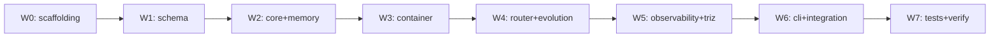

# Phase 1: MVR - Implementation Plan

**Phase:** 01-mvr (Minimal Viable Research Platform)
**Created:** 2026-05-13 (auto-generated from 01-CONTEXT.md, gsd-sdk 不在環境のため手動展開)
**Status:** Active

> Phase Goal (ROADMAP.md): 1 つの ContainerSpec を読み込み、semantic + episodic memory と接続、A/B candidate 評価が走る最小研究基盤を完成させる。

## Plan Overview

16 requirements を 7 wave に分解。各 wave 内のタスクは依存無しで並列実行可能、wave 間は逐次。



---

## Wave 0: Scaffolding（依存：なし）

### T0.1 pyproject.toml

- **Output:** `pyproject.toml`
- **Dependencies:**
  - runtime: `transformers>=4.40`, `accelerate>=0.30`, `torch>=2.2`, `jsonschema>=4.21`, `pydantic>=2.6`, `faiss-cpu>=1.8`, `duckdb>=0.10`, `sentence-transformers>=2.7`, `structlog>=24.1`, `typer>=0.12`, `pyyaml>=6.0`, `numpy>=1.26`
  - dev: `pytest>=8.0`, `pytest-cov>=4.1`, `hypothesis>=6.100`, `ruff>=0.4`, `mypy>=1.10`
- **Constraints:** Python `>=3.11,<3.12` (memory `project_python_311_unification.md`)
- **Entry-points:** `llive = llive.cli:app`, `[project.entry-points."llive.subblocks"]` の placeholder
- **PyPI name:** `llmesh-llive`, import name: `llive`

### T0.2 ディレクトリ構造

```
src/llive/
  __init__.py            (__version__ = "0.1.0.dev0")
  cli/__init__.py
  cli/main.py            (typer app)
  orchestration/__init__.py
  orchestration/pipeline.py
  core/__init__.py
  core/adapter.py        (BaseModelAdapter, HFAdapter)
  container/__init__.py
  container/executor.py
  container/registry.py
  container/subblocks/__init__.py
  container/subblocks/builtin.py  (5 sub-blocks)
  memory/__init__.py
  memory/semantic.py
  memory/episodic.py
  memory/encoder.py
  memory/provenance.py
  memory/surprise.py
  evolution/__init__.py
  evolution/change_op.py
  evolution/bench.py
  observability/__init__.py
  observability/logging.py
  observability/metrics.py
  observability/trace.py
  schema/__init__.py
  schema/validator.py
  schema/models.py       (pydantic v2 models)
  triz/__init__.py
  triz/loader.py
  router/__init__.py
  router/engine.py
  router/explanation.py
tests/
  unit/
  component/
  property/
  data/mvr_bench/        (toy dataset, 10〜50 prompts)
specs/
  schemas/               (JSON Schema 3 files: container-spec.v1.json, subblock-spec.v1.json, candidate-diff.v1.json)
  templates/qwen2_5_0_5b.yaml  (新規追加)
  routes/default.yaml          (新規追加)
  containers/                  (新規 dir: fast_path_v1.yaml, adaptive_reasoning_v1.yaml)
  candidates/                  (新規 dir: A/B 用 candidate diff サンプル)
```

### T0.3 .gitignore / .github/workflows/ci.yml

- pytest-cov / __pycache__ / dist / .ruff_cache / D ドライブ data path
- CI: ubuntu-latest + windows-latest + macos-latest、Python 3.11、pytest + ruff + mypy

---

## Wave 1: Schema 検証基盤（依存：W0）

### T1.1 specs/schemas/ に JSON Schema 3 ファイル展開

- `container-spec.v1.json` — `docs/yaml_schemas.md` §2 から JSON 化
- `subblock-spec.v1.json` — §3 から
- `candidate-diff.v1.json` — §4 から

### T1.2 llive/schema/validator.py

- `validate_container_spec(yaml_text: str) -> ContainerSpec`
- `validate_subblock_spec(...)` / `validate_candidate_diff(...)`
- jsonschema Draft 2020-12 で validate → エラーは `SchemaValidationError` で包む
- Config schema (per-subblock) も lookup できる

### T1.3 llive/schema/models.py

- pydantic v2 model: `ContainerSpec`, `SubBlockRef`, `SubBlockSpec`, `CandidateDiff`, `ChangeOp` (Discriminated union via `action` field)
- `from_yaml(path) -> Model` ヘルパ

### T1.4 unit tests for schema (BC-03)

- 各 schema の positive/negative case (10+ ケース)
- `additionalProperties: false` 違反、`schema_version` 不一致、必須フィールド欠落

**Requirements covered:** BC-03 ✓

---

## Wave 2: Core + Memory（依存：W1）

### T2.1 llive/core/adapter.py (CORE-01, CORE-02)

- `class BaseModelAdapter(Protocol)`: `generate(prompt, max_new_tokens, **kwargs) -> GenerationResult`
- `class HFAdapter(BaseModelAdapter)`: HF transformers ラッパー
- `class AdapterConfig` (dataclass): `model_name`, `tokenizer_name`, `context_length`, `dtype`, `device_map`
- `class GenerationResult` (dataclass): `text`, `tokens`, `hidden_states` (optional), `logits` (optional)
- HF model template (`specs/templates/qwen2_5_0_5b.yaml`) を新規生成

### T2.2 llive/memory/encoder.py

- `class MemoryEncoder`: sentence-transformers wrapper, default `all-MiniLM-L6-v2`
- `encode(texts: list[str]) -> ndarray (n, 384)`
- L2 normalize for cosine

### T2.3 llive/memory/provenance.py (MEM-03)

- `class Provenance` (pydantic model): `source_type`, `source_id`, `signed_by`, `signature`, `derived_from: list[str]`, `confidence: float`, `created_at: datetime`
- JSON serializer / deserializer
- Phase 1: `signed_by` / `signature` は default 空文字許容

### T2.4 llive/memory/semantic.py (MEM-01)

- `class SemanticMemory`:
  - backend: Faiss IndexFlatIP (cosine via L2-norm), index dir = env `LLIVE_DATA_DIR` (default `D:/data/llive/memory/semantic/`)
  - row store: JSONL append-only (`rows.jsonl`)
  - `write(content: str, embedding: ndarray, provenance: Provenance) -> entry_id`
  - `query(text: str, top_k: int) -> list[SemanticHit]`
  - persistence: `save()` / `load()` で Faiss index serialize

### T2.5 llive/memory/episodic.py (MEM-02)

- `class EpisodicMemory`:
  - backend: DuckDB at `D:/data/llive/memory/episodic.duckdb`
  - schema: `events(event_id UUID PRIMARY KEY, ts TIMESTAMP, content TEXT, metadata JSON, provenance JSON, embedding BLOB)`
  - `write(event) -> event_id`
  - `query(time_range, limit)` / `query_by_content(text, top_k)` (embedding 内積)

### T2.6 llive/memory/surprise.py (MEM-04)

- `class SurpriseGate`:
  - `compute_surprise(new_embedding, memory) -> float` — `1 - max cosine`
  - `should_write(surprise: float, theta: float = 0.3) -> bool`

### T2.7 unit tests for core + memory

- HFAdapter: tiny model load + generate smoke test (Qwen2.5-0.5B、CPU、5 tokens)
- SemanticMemory: write 3, query top_1, assert match
- EpisodicMemory: write/query time range
- Provenance: round-trip JSON
- SurpriseGate: threshold cases

**Requirements covered:** CORE-01 ✓ CORE-02 ✓ MEM-01 ✓ MEM-02 ✓ MEM-03 ✓ MEM-04 ✓

---

## Wave 3: Block Container Engine（依存：W2）

### T3.1 llive/container/registry.py (BC-02)

- `class SubBlockRegistry`:
  - `register(name, factory: Callable[[dict], SubBlock])`
  - `create(type_name, config) -> SubBlock`
  - entry-points discovery (`llive.subblocks` group)

### T3.2 llive/container/subblocks/builtin.py (BC-02)

5 sub-block を実装：

1. `PreNormBlock` — RMSNorm via `torch.nn.functional.rms_norm`
2. `CausalAttentionBlock` — thin wrapper around HF model's attention (re-implement avoid)
3. `MemoryReadBlock` — top_k semantic + episodic query
4. `FfnSwigluBlock` — wrapper around HF FFN (or simple SwiGLU MLP for fallback)
5. `MemoryWriteBlock` — surprise-gated write

各 sub-block は `SubBlock` Protocol: `__call__(state: BlockState) -> BlockState` を満たす。
`BlockState` (dataclass): `hidden: torch.Tensor`, `meta: dict`, `surprise: float | None`.

### T3.3 llive/container/executor.py (BC-01)

- `class BlockContainerExecutor`:
  - load ContainerSpec
  - resolve sub-block via registry
  - execute in order with conditional branch (`surprise_gt` のみ Phase 1)
  - emit trace events per sub-block

### T3.4 specs/containers/ に 2 つの ContainerSpec

- `fast_path_v1.yaml`: pre_norm → causal_attention → ffn_swiglu
- `adaptive_reasoning_v1.yaml`: pre_norm → causal_attention → memory_read → ffn_swiglu → memory_write (surprise_gt: 0.3)

### T3.5 unit + component tests

- Registry: register/create cycle
- Executor: spec 読込 → execute → trace 出力
- Component: 全 sub-block の I/O contract (shape 保存)

**Requirements covered:** BC-01 ✓ BC-02 ✓

---

## Wave 4: Router + Evolution（依存：W3）

### T4.1 llive/router/engine.py (RTR-01)

- `class RouterEngine`:
  - load `specs/routes/default.yaml`
  - `select(prompt: str, features: dict) -> RouterDecision`
  - 2 経路サポート (fast_path_v1, adaptive_reasoning_v1)

### T4.2 llive/router/explanation.py (RTR-02)

- `class RouterExplanation` (pydantic):
  - request_id, timestamp, selected_container, matched_rule, candidates[], prompt_features
- explanation を JSON で `D:/data/llive/logs/router.jsonl` に append

### T4.3 specs/routes/default.yaml

```yaml
schema_version: 1
routes:
  - container: fast_path_v1
    when: {prompt_length_lt: 256}
  - container: adaptive_reasoning_v1
```

### T4.4 llive/evolution/change_op.py (EVO-02)

4 ChangeOp class:

- `InsertSubblock` — apply / invert
- `RemoveSubblock` — apply / invert (元 spec 保存)
- `ReplaceSubblock` — apply / invert
- `ReorderSubblocks` — apply / invert

共通 base: `class ChangeOp(ABC)` with `apply(container_spec) -> container_spec'` and `invert() -> ChangeOp`.

### T4.5 llive/evolution/bench.py (EVO-01)

- `class BenchHarness`:
  - load baseline container + candidate diff
  - apply diff → candidate container
  - run inference for each prompt in dataset, both baseline and candidate
  - collect metrics: perplexity, memory hit rate, latency, route entropy
  - emit `D:/data/llive/bench/<timestamp>/results.json`

### T4.6 tests/data/mvr_bench/

- 10〜50 prompts (短/中/長 mix)
- 1 candidate diff sample (`candidates/example_001.yaml`)

### T4.7 unit + property tests

- Router: 2 ルール選択ケース + fallback
- ChangeOp: apply→invert→apply 同一性 (hypothesis)
- BenchHarness: smoke

**Requirements covered:** RTR-01 ✓ RTR-02 ✓ EVO-01 ✓ EVO-02 ✓

---

## Wave 5: Observability + TRIZ（依存：W3, W4 一部）

### T5.1 llive/observability/logging.py

- structlog config (JSON formatter, context binding for `run_id`, `request_id`, `route_id`, `candidate_id`)
- ENV `LLIVE_LOG_LEVEL` (default INFO)

### T5.2 llive/observability/trace.py (OBS-01)

- `class RouteTrace` (pydantic):
  - request_id, container, subblocks: list[SubblockTrace], memory_accesses: list[MemoryAccessTrace], metrics
- `dump(path)` で JSONL append

### T5.3 llive/observability/metrics.py (OBS-02)

- DuckDB at `D:/data/llive/metrics.duckdb`
- schema: `metrics(timestamp, run_id, key, value)`
- compute: `forgetting_proxy`, `pollution_rate`, `latency_p50_p95`, `route_entropy`, `dead_subblock_rate`

### T5.4 llive/triz/loader.py (TRIZ-01)

- lazy load API:
  - `load_principles() -> dict[int, Principle]`
  - `load_matrix() -> dict[tuple[int, int], list[int]]`
  - `load_attributes() -> dict[int, Attribute]`
- input: `specs/resources/triz_*.yaml`

### T5.5 unit tests

- RouteTrace round-trip JSON
- Metrics compute
- TRIZ load 40 principles + matrix size 39×39 + 50 attributes

**Requirements covered:** OBS-01 ✓ OBS-02 ✓ TRIZ-01 ✓

---

## Wave 6: CLI + Integration（依存：W2〜W5）

### T6.1 llive/cli/main.py (typer app)

Subcommand 体系：

- `llive run --template <path> --prompt "<text>"`
- `llive bench --baseline <container> --candidate <diff.yaml> --dataset <path>`
- `llive memory query <text>` / `llive memory stats` / `llive memory clear --layer semantic|episodic`
- `llive schema validate <yaml-path>` / `llive schema show <name>`
- `llive route explain --prompt "<text>"` / `llive route dry-run --prompt "<text>"`
- `llive triz principle <id>` / `llive triz matrix <improving> <worsening>`

### T6.2 llive/orchestration/pipeline.py

Inference pipeline glue: prompt → router → container executor → trace → response.

### T6.3 Integration test: end-to-end

- `llive run --template specs/templates/qwen2_5_0_5b.yaml --prompt "Hello"` → 動く
- `llive bench --baseline adaptive_reasoning_v1 --candidate candidates/example_001.yaml --dataset tests/data/mvr_bench/` → results.json 生成

---

## Wave 7: Tests + Verify（依存：W6）

### T7.1 全テスト通過

- `pytest tests/ -v --cov=src/llive` で全 PASS
- coverage ≥ 60% (Phase 1 目標)

### T7.2 Success Criteria 6 項目検証

1. ✅ `llive run --template specs/templates/qwen2_5_0_5b.yaml --prompt "..."` で推論が動く
2. ✅ ContainerSpec の sub-block 5 種類以上を順序実行できる
3. ✅ semantic + episodic memory への read/write が provenance 付きで動作
4. ✅ router が 2 経路選択し explanation log を出力する
5. ✅ CandidateDiff を読み込んで baseline vs candidate の A/B ベンチが回る
6. ✅ route trace + memory link を JSON で取得し人間が読める形に整形できる

### T7.3 最終 commit + SESSION_SUMMARY.md 更新

- 各 wave で wave-level commit を打つ
- Phase 1 完了で SESSION_SUMMARY.md / STATE.md / REQUIREMENTS.md (status を Phase 1 → Validated) 更新

### T7.4 PyPI 公開検討

- v0.1.0 リリースは Phase 1 verify 完了後にユーザ確認 (push / PyPI publish は危険操作)

---

## Risk & Anti-Patterns

| Risk | Mitigation |
|---|---|
| HF model dl が CI で遅い | tests/conftest.py で `HF_HOME` キャッシュ、必要なら mock |
| Windows path 問題 (D:\\) | `pathlib.Path` 一貫使用、env override |
| Faiss-CPU の Windows wheel | pip install fallback、CI で先に install チェック |
| DuckDB ファイルロック | テストごとに tmp_path fixture |
| sub-block の torch shape | shape contract test を全 sub-block で書く |
| 大型モデル (Qwen 7B) を CI で引かない | デフォルト 0.5B、`@pytest.mark.gpu` で skip |

## Phase 1 Acceptance

- 全 16 requirements の chebox を REQUIREMENTS.md で `Validated` に更新
- `pytest -v` 全 PASS
- 6 Success Criteria 全達成
- ユーザ確認後に `pip install llmesh-llive==0.1.0` 候補ビルド (Phase 1 ship)

---
*Plan: 01-PLAN.md*
*Created: 2026-05-13*
