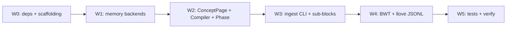

# Phase 2: Adaptive Modular System - Implementation Plan

**Phase:** 02-adaptive
**Created:** 2026-05-13
**Status:** Active

> Phase Goal (ROADMAP): 4 層メモリ + Bayesian surprise + consolidation cycle + llove TUI 最小可視化を完成し、連続タスク学習で BWT ≥ -1% を達成する。LLW-01〜03/06 で LLM Wiki layer も着工。

## Plan Overview

13 requirements (v2: 9, LLW: 4) を 6 wave に分解。Phase 1 と同様 wave 内は並列可、wave 間は逐次。



---

## Wave 0: Dependencies + Scaffolding（依存：Phase 1 完了）

### T0.1 pyproject.toml 拡張

**追加依存** (core):
- `kuzu>=0.4` (graph DB)
- `apscheduler>=3.10` (scheduler)

**追加 optional extras**:
- `[torch]` 既存 + `peft>=0.10`, `hdbscan>=0.8`
- `[ingest]` 新規: `pypdf>=4.0`, `arxiv>=2.1`, `readability-lxml>=0.8`
- `[llm]` 新規: `anthropic>=0.30`

**version bump**: `0.1.1` → `0.2.0.dev0` (Phase 2 開発中)。Phase 2 verify 完了で `0.2.0`。

### T0.2 ディレクトリ構造拡張

```
src/llive/
  memory/
    structural.py        (新: MEM-05 Kùzu wrapper)
    parameter.py         (新: MEM-06 AdapterStore)
    bayesian_surprise.py (新: MEM-07)
    consolidation.py     (新: MEM-08, LLW-02)
    phase.py             (新: MEM-09)
    concept.py           (新: LLW-01)
  container/subblocks/
    adapter_block.py     (新: BC-04 adapter)
    lora_switch_block.py (新: BC-04 lora_switch)
  wiki/
    __init__.py
    compiler.py          (新: LLW-02 entry point)
    ingest.py            (新: LLW-06)
    schemas/             (LLW-03 loader)
  cli/
    wiki.py              (新: llive wiki ingest / compile)
    consolidate.py       (新: llive consolidate run / status)
specs/wiki_schemas/       (新: page_type JSON Schemas)
src/llive/_specs/wiki_schemas/ (wheel 同梱用 mirror)
```

### T0.3 venv で依存インストール確認

`pip install -e .[torch,ingest,llm,dev]` が走り、`pip show llmesh-llive` で 0.2.0.dev0 が確認できる。

---

## Wave 1: Memory Backends（依存：W0、3 task 並列）

### T1.1 structural.py (MEM-05)

- `class StructuralMemory`:
  - backend: Kùzu (`kuzu.Database(D:/data/llive/memory/structural.kuzu)`)
  - bipartite schema: `MemoryNode (id, memory_type, zone, payload_json, embedding_blob, created_at, provenance_json)` + `MemoryEdge (src_id, dst_id, rel_type, weight, provenance_json, created_at)`
  - `rel_type` enum: derived_from / contradicts / generalizes / temporal_after / co_occurs_with / linked_concept
  - API: `add_node` / `add_edge` / `query_neighbors` / `query_by_type` / `delete_node` (cascade edges)
- unit tests: round-trip add/query, edge integrity, cascade delete

### T1.2 parameter.py (MEM-06)

- `class AdapterStore`:
  - filesystem: `D:/data/llive/memory/parameter/<adapter_id>.safetensors`
  - index: DuckDB `adapter_index` table
  - API: `register / load / activate / deactivate / list / verify_sha256`
- `class AdapterProfile` (pydantic): `(id, name, base_model, format, adapter_size_mb, target_modules, alpha, dropout, tags, provenance, sha256)`
- Phase 2 で実 LoRA load は HF PEFT に委譲 (optional dependency)。`safetensors` だけ Phase 2 必須、`peft` は `[torch]` extra。
- unit tests: register → list → load (mock format) → verify_sha256 round-trip

### T1.3 bayesian_surprise.py (MEM-07)

- `class BayesianSurpriseGate`:
  - Welford online mean+var
  - `update(value)` / `surprise(value)` (z-score)
  - `should_write(surprise, theta_factor=1.0)` (動的 θ = μ + k·σ)
- 既存 `SurpriseGate` (Phase 1) は **後方互換のため残す**
- unit tests: empty memory → write always、similar values → low surprise、outlier → high surprise

---

## Wave 2: ConceptPage + Compiler + Phase（依存：W1）

### T2.1 concept.py (LLW-01)

- `class ConceptPage` (pydantic): `(concept_id, title, summary, page_type, linked_entry_ids[], linked_concept_ids[], schema_version, provenance, last_updated_at, surprise_stats)`
- 永続化: `StructuralMemory` に `memory_type=concept` の MemoryNode として登録
- Markdown export: `D:/data/llive/wiki/<concept_id>.md`
- API: `ConceptPageRepo.upsert / get / list / link_concept / link_entry / export_markdown`

### T2.2 wiki/schemas/ (LLW-03)

- `specs/wiki_schemas/domain_concept.v1.json`
- `specs/wiki_schemas/experiment_record.v1.json`
- `specs/wiki_schemas/failure_post_mortem.v1.json`
- `specs/wiki_schemas/principle_application.v1.json`
- `src/llive/_specs/wiki_schemas/` にミラー (wheel 同梱)
- `wiki.schemas.validate_page(page_type, structured_fields)`

### T2.3 consolidation.py (MEM-08, LLW-02)

- `class Consolidator`:
  - APScheduler `BackgroundScheduler`
  - default cron: 毎日 02:00、`interval`: `llive consolidate run --since 1h`、event trigger 用 `Consolidator.run_once()`
- single cycle = "Wiki Compile pass":
  1. Replay Select: 過去 N 時間の events を surprise-weighted reservoir sample (default 200)
  2. Cluster: sentence embedding + HDBSCAN
  3. Compile: 各 cluster で既存 ConceptPage を query → LLM が「新規/更新/統合/分割」判定 → ConceptPage upsert
  4. Link: 関連 ConceptPage 間に structural edge
  5. Provenance: derived_from で記録
- LLM backend: Anthropic Haiku (`anthropic` SDK)、`LLIVE_CONSOLIDATOR_MOCK=1` で deterministic mock
- integration test: events 投入 → run_once → ConceptPage 作成確認 (mock LLM)

### T2.4 phase.py (MEM-09)

- `class MemoryPhaseManager`:
  - 5 段階: `hot / warm / cold / archived / erased`
  - 各 entry: `phase, last_access_at, access_count, phase_changed_at`
  - daily evaluation: hot→warm (7d 未参照) / warm→cold (30d) / cold→archived (90d + low surprise) / archived→erased (180d)
  - access 時に hot 復帰
  - erased: payload + embedding 削除、metadata 保持
- consolidation cycle 後に chained execution
- integration test: time-machine fixture で age 操作 → 各 transition 確認

---

## Wave 3: Ingest + Sub-blocks + nested_container（依存：W2、3 task 並列）

### T3.1 wiki/ingest.py (LLW-06)

- `class WikiIngestor`:
  - `ingest_text(content) -> n_chunks`
  - `ingest_markdown(path) -> n_chunks` (heading で auto-chunk)
  - `ingest_pdf(path) -> n_chunks` (pypdf 経由)
  - `ingest_arxiv(arxiv_id) -> n_chunks` (`arxiv` lib)
  - `ingest_url(url) -> n_chunks` (`readability-lxml`)
- chunk size: 500 tokens target、provenance に `source_type=imported, source_id=<uri>`
- CLI: `llive wiki ingest --source <path|url> --type <type> [--compile-now]`

### T3.2 adapter_block.py + lora_switch_block.py (BC-04)

- `AdapterBlock`: AdapterStore から load → forward 時に merge
- `LoraSwitchBlock`: 複数 adapter から router task_tag で 1 つ動的選択
- HF PEFT 依存 (optional)、PEFT 無し時は warn + base model fallback
- SubBlockRegistry に `adapter`, `lora_switch` を登録
- unit tests: register → execute (mock adapter)、cold-start fallback、selector 切替

### T3.3 nested_container (BC-05)

- BlockContainerExecutor 拡張: `nested_containers:` を再帰展開
- max depth: 3 (config 可変)
- 循環参照検出: visited set で同 container_id 2 度目で `ChangeOpError`
- unit tests: 2 段 nest 実行、循環参照 reject、depth 超過 reject

---

## Wave 4: BWT + llove JSONL（依存：W3）

### T4.1 BWT 計測 (OBS-04)

- `class BWTMeter`:
  - 連続タスク学習中の `a_k_k` (タスク k 学習直後) と `a_k_K` (最終タスク K 後) を記録
  - `BWT = mean(a_k_K - a_k_k for k=1..K-1)`
- bench.py 拡張: `llive bench --continual --tasks <task1>,<task2>,...` で BWT 出力
- MetricsStore に `bwt` 列を追記

### T4.2 llove JSONL フォーマット確定 (OBS-03)

- `D:/data/llive/logs/llove/route_trace.jsonl` (Phase 1 既存 trace を mirror)
- `D:/data/llive/logs/llove/memory_link.jsonl` (新規、ConceptPage ↔ linked_entries / linked_concepts)
- `D:/data/llive/logs/llove/bwt.jsonl` (新規、BWT timeseries)
- 仕様ドキュメント: `docs/llove_jsonl_v1.md` を新規作成 (llove 側実装者向け)
- 本 wave では llove 側コードは触らない (llove リポジトリで別実装)

---

## Wave 5: Tests + Verify Phase 2（依存：W4）

### T5.1 全テスト通過

- `pytest tests/ -v --cov=src/llive` で全 PASS
- coverage 目標 ≥ 65% (Phase 1 の 82% より低い受容、Integration test 比重増のため)
- Anthropic API 無くて CI でも動く mock 強制 (`LLIVE_CONSOLIDATOR_MOCK=1`)

### T5.2 Success Criteria 7 項目検証

1. ✅ structural memory (graph) + parameter memory (adapter store) が動作
2. ✅ Bayesian surprise uncertainty として扱われる + 動的 θ
3. ✅ consolidation cycle が走り、replay → semantic 凝集
4. ✅ memory phase transition が cron で動く
5. ✅ llove TUI で route trace + memory link viz が見られる → JSONL spec 確定で代替評価 (Phase 2 では llive 側責務まで)
6. ✅ 連続 5 タスク学習 BWT ≥ -1% (smoke level)
7. ✅ ConceptPage が第一級表現、Wiki Compiler 動作、ingest CLI 動作 (LLW-01/02/03/06)

### T5.3 v0.2.0 リリース準備

- version bump `0.2.0.dev0` → `0.2.0`
- build + twine check
- VERIFICATION.md (`.planning/phases/02-adaptive/02-VERIFICATION.md`)
- STATE.md / SESSION_SUMMARY.md / REQUIREMENTS.md Traceability 更新

### T5.4 PyPI 公開 (ユーザ確認後)

- TestPyPI → 本番 PyPI → tag v0.2.0
- v0.1.1 と同じ公開フロー

---

## Risk & Anti-Patterns

| Risk | Mitigation |
|---|---|
| Kùzu の Windows wheel が無い / 不安定 | 最初に `pip install kuzu` 動作確認、ダメなら NetworkX+SQLite fallback (要件 D-01 で許容) |
| HF PEFT の version 互換 | `peft>=0.10` で固定、`[torch]` extra 必須化を CLI で warn |
| HDBSCAN の Windows wheel | sklearn の OPTICS fallback を用意 |
| Anthropic API キーが CI で取れない | `LLIVE_CONSOLIDATOR_MOCK=1` で deterministic mock、CI で強制 |
| APScheduler の Windows ファイルロック | persistence backend は SQLite job store、tmp_path fixture |
| Wiki Compiler の LLM cost 暴走 | default `Consolidator.max_calls_per_cycle = 50`、超過時 warn |
| nested_container 無限再帰 | max depth=3 + visited set 厳守 |
| BWT 計測の toy dataset 不足 | tests/data/mvr_bench/ を 5 タスク分に拡張、Phase 3 で本格 task pool |
| consolidation cycle が走る間 ConceptPage が変わるレース | コンソリ中は exclusive lock (DuckDB ROW LOCK)、Phase 4 で改善 |

## Phase 2 Acceptance

- 全 13 requirements を REQUIREMENTS.md で Validated 更新
- `pytest -v` 全 PASS、coverage ≥ 65%
- 7 Success Criteria 全達成 (#5 は JSONL spec 確定までで合格)
- v0.2.0 ビルド + TestPyPI 動作確認まで（本番公開はユーザ確認後）

---
*Plan: 02-PLAN.md*
*Created: 2026-05-13*
