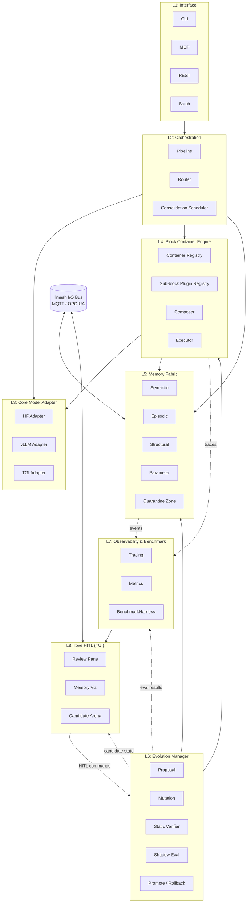
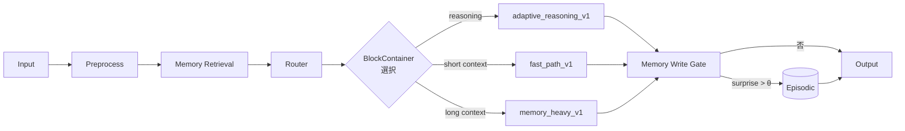
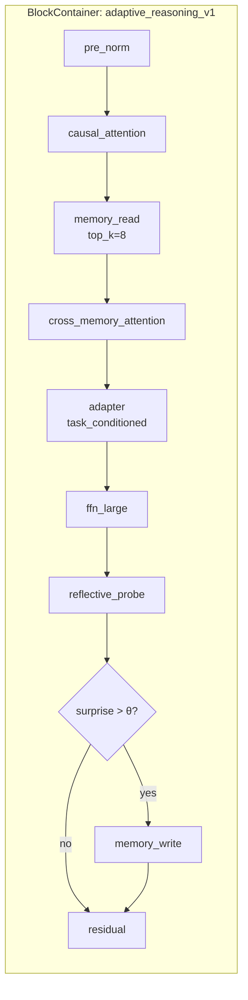
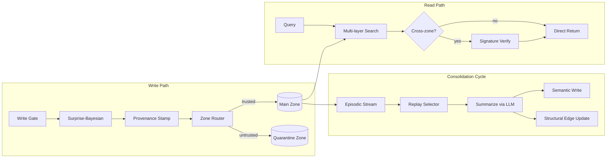
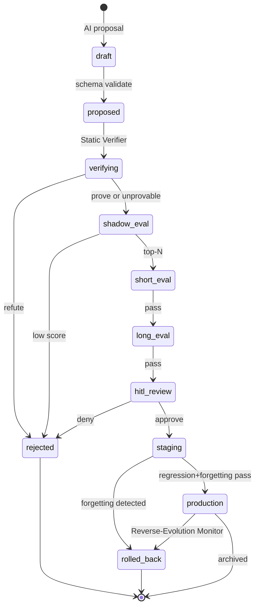
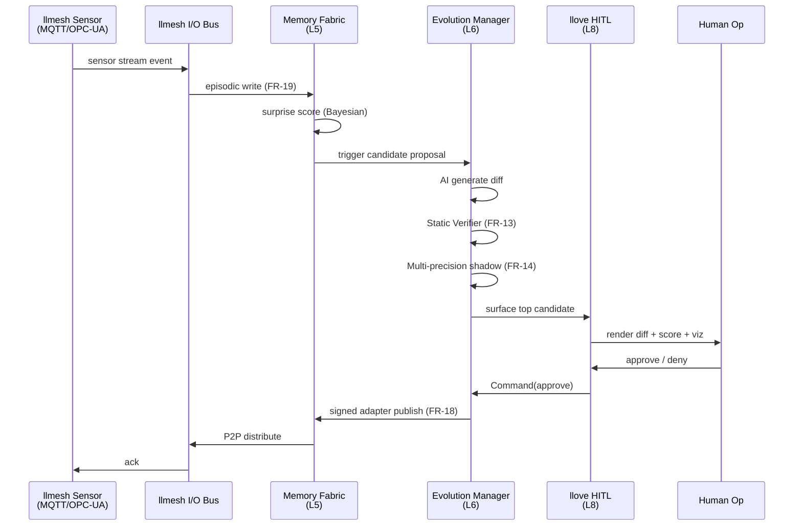
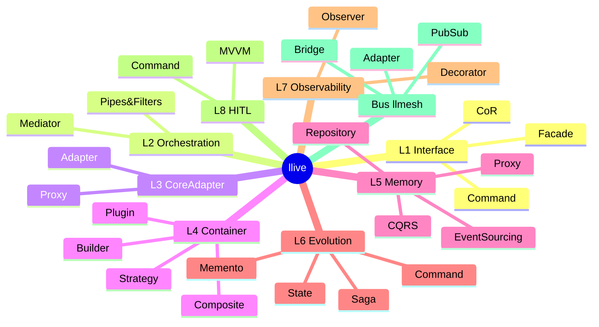

# llive アーキテクチャ図

> v0.2 で 6 層 → 8 層に再構成。Mermaid 図で各層・各パターン・各データフローを可視化。

## 1. 全体構成（8 層 + llmesh I/O bus）

## 2. 推論パイプライン（Pipes & Filters）

## 3. BlockContainer 内部（Composite + Chain of Responsibility）

## 4. Memory Fabric（CQRS + Event Sourcing）

## 5. Evolution Lifecycle（State + Saga）

## 6. llmesh / llove 統合フロー

## 7. パターン適用マップ（簡易）

