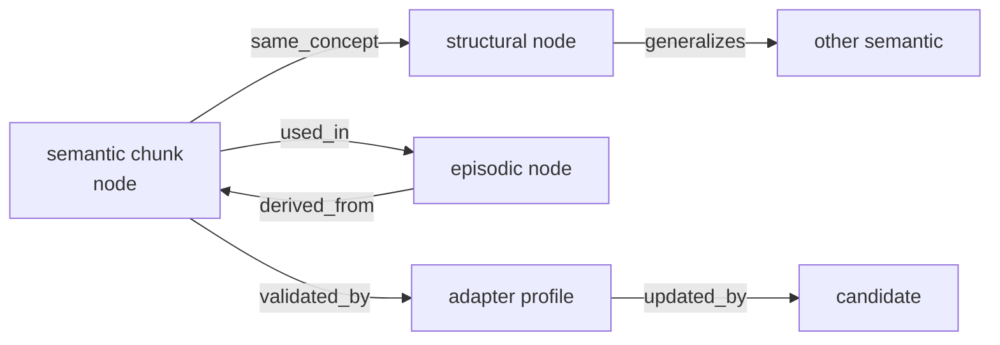

# llive データモデル詳細

> v0.1 §「データモデル」の精密化。各エンティティの JSON Schema 風定義、関係性、不変条件、provenance 規約を明示する。

## 1. 共通フィールド規約

すべての永続エンティティに以下を必須とする。

| フィールド | 型 | 説明 |
|---|---|---|
| `id` | string (ULID or UUIDv7) | 単調増加で時系列ソート可能な ID |
| `created_at` | datetime (RFC3339, UTC) | 生成時刻 |
| `updated_at` | datetime (RFC3339, UTC) | 最終更新時刻 |
| `version` | int | optimistic locking 用 |
| `provenance` | `Provenance` (後述) | 出所、根拠、署名 |

### Provenance 共通スキーマ

```yaml
provenance:
  source_type: enum [llm_generated, human_authored, sensor, derived, replay, imported]
  source_id: string            # 元となった node_id / candidate_id / agent_id
  signed_by: string | null     # Ed25519 public key fingerprint
  signature: bytes | null      # Ed25519 signature over canonical payload
  derived_from: [string]       # 直接の親 id 群
  confidence: float            # 0.0-1.0, 信頼度
```

## 2. エンティティ詳細

### 2.1 `TaskSpec`

```yaml
type: TaskSpec
id: string                     # ULID
task_id: string                # 人間可読タスク名 (e.g., "math.gsm8k", "summarize.news")
domain: enum [reasoning, retrieval, generation, classification, multi-modal, agent]
difficulty: enum [easy, medium, hard, novel]
constraints:
  max_latency_ms: int | null
  max_vram_mb: int | null
  privacy_class: enum [public, internal, confidential, untrusted]
  determinism_required: bool
  context_length_min: int
metadata:
  dataset_ref: string | null
  evaluation_metrics: [string]
```

### 2.2 `ContainerSpec`

```yaml
type: ContainerSpec
id: string
container_id: string           # 人間可読名 (e.g., "adaptive_reasoning_v1")
routing_tags: [string]         # router が選択時に参照
cost_profile:
  latency: enum [low, medium, high]
  vram: enum [low, medium, high]
  est_flops_per_token: int | null
subblocks: [SubBlockRef]       # 順序付き
nested_containers:             # FR-02 拡張: 条件付き入れ子
  - target: string             # nesting point name
    condition: ConditionSpec
    container_ref: string      # 別 ContainerSpec の id
schema_version: int
```

### 2.3 `SubBlockSpec`

```yaml
type: SubBlockSpec
id: string
name: string                   # registry key (e.g., "memory_read")
version: string                # SemVer
io_contract:
  input:
    hidden_dim: int
    seq_dim: bool
    extras: [string]           # additional tensor names
  output:
    hidden_dim: int
    seq_dim: bool
    extras: [string]
trainable: bool
supports_streaming: bool
latency_cost_per_token_ms: float
vram_cost_mb: float
config_schema: object          # JSON Schema for instance config
plugin_module: string          # Python import path
```

### 2.4 `MemoryNode`

```yaml
type: MemoryNode
id: string                     # ULID
memory_type: enum [semantic, episodic, structural, parameter]
zone: enum [trusted, quarantine]
payload:
  format: enum [text, embedding, blob, adapter_diff, graph_snippet]
  content_ref: string          # blob storage ref or inline
  embedding: [float] | null
  embedding_model: string | null
ttl_until: datetime | null
phase: enum [short_term, mid_term, long_term, archived]   # FR-16
surprise_score: float          # Bayesian: mean
surprise_uncertainty: float    # Bayesian: stddev      # FR-21
access_count: int
last_accessed: datetime
```

### 2.5 `MemoryEdge`

```yaml
type: MemoryEdge
id: string
src: string                    # MemoryNode.id
dst: string
relation_type: enum [
  same_concept, derived_from, used_in,
  updated_by, validated_by, contradicts,
  generalizes, instantiates, refutes
]
weight: float                  # 0.0-1.0
bidirectional: bool
```

### 2.6 `AdapterProfile` (Parameter Memory)

```yaml
type: AdapterProfile
id: string
adapter_id: string             # 人間可読名
target_modules: [string]       # 適用先 sub-block 名
rank: int                      # LoRA rank
method: enum [lora, ia3, dora, prompt_tuning, prefix_tuning]
training:
  dataset_ref: string
  steps: int
  lr: float
score_bundle:                  # 評価指標バンドル
  task_quality: float
  forgetting_score: float      # lower is better
  vram_overhead_mb: float
  inference_latency_ms: float
signature:                     # FR-18
  signed_by: string
  signature: bytes
  sbom_ref: string             # Software Bill of Materials
```

### 2.7 `CandidateSpec` (構造進化候補)

```yaml
type: CandidateSpec
id: string
candidate_id: string           # 人間可読名 (e.g., "cand_20260513_001")
base_candidate: string         # 親 candidate_id
diff_spec:                     # CandidateDiff (後述) のシリアライズ
  changes: [ChangeOp]
  rationale: [string]
status: enum [draft, proposed, verifying, shadow_eval, short_eval,
              long_eval, hitl_review, staging, production,
              rejected, rolled_back, archived]
score_bundle:
  static_verifier_result: enum [proved, unprovable, refuted] | null  # FR-13
  shadow_eval_score: float | null                                    # FR-14
  short_eval_score: float | null
  long_eval_score: float | null
  forgetting_score: float | null
  pollution_score: float | null
  human_review:
    reviewer: string | null
    decision: enum [approve, deny, defer] | null
    comments: string | null
mutation_metadata:
  policy: enum [llm_generated, template, population, neuroevolution] # EP-04
  parent_diversity: float                                            # 親集団からの距離
```

### 2.8 `ExperimentRun`

```yaml
type: ExperimentRun
id: string
experiment_id: string
candidate_id: string
dataset_id: string
seed: int
model_hash: string             # base model identity
config_hash: string            # full config hash
started_at: datetime
finished_at: datetime | null
status: enum [running, succeeded, failed, cancelled]
artifacts:
  logs_ref: string
  metrics_ref: string
  trace_ref: string
  route_log_ref: string        # router decision log
  memory_access_log_ref: string
```

## 3. 関係性モデル

1 つの概念単位を複数 memory node に展開し、相互リンクで意味を保持する。



### 整合性制約

- `MemoryEdge.relation_type == "contradicts"` のリンクが両方向に立った場合、`MemoryNode.phase` を `archived` に降格し、HITL レビュー要求
- `quarantine` zone の node を src/dst に持つ edge は、edge にも `quarantined` フラグ自動付与
- 親 (`derived_from`) が `archived` の場合、子の `confidence` を線形減衰

## 4. ID 規約

| 用途 | 形式 | 例 |
|---|---|---|
| 内部 ID | ULID (Crockford base32) | `01HX5R8K4F3N7Q2V8W3Y6Z9XAB` |
| 人間可読 ID | `<kind>_<YYYYMMDD>_<seq>` | `cand_20260513_001` |
| Container 名 | `<purpose>_v<n>` | `adaptive_reasoning_v1` |
| Adapter 名 | `<task>_<method>_v<n>` | `math_lora_v3` |
| Signature fp | SHA-256 short (12 hex) | `a1b2c3d4e5f6` |

## 5. 永続化バックエンド対応表

| エンティティ | デフォルト backend | 代替候補 |
|---|---|---|
| MemoryNode (semantic) | Qdrant / Weaviate | Faiss + sqlite, pgvector |
| MemoryNode (episodic) | DuckDB / Parquet | TimescaleDB, ClickHouse |
| MemoryNode (structural) | Kùzu / Neo4j | NetworkX + sqlite |
| MemoryNode (parameter) | filesystem + sqlite manifest | S3 / MinIO |
| MemoryEdge | 同上 (memory_type 依存) | — |
| CandidateSpec | sqlite | PostgreSQL |
| ExperimentRun | sqlite + filesystem artifacts | MLflow tracking |

## 6. シリアライゼーション

- 永続化: JSON (canonical, sorted keys) + msgpack 圧縮オプション
- YAML: 人間編集用、I/O 境界で JSON へ正規化
- 署名対象: canonical JSON のバイト列 (RFC 8785 JSON Canonicalization Scheme)
