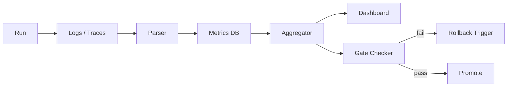

# llive 評価指標精密化

> v0.1 § FR-08 の数式定義 + 計測手順。連続学習 / pollution / route entropy / dead block 等を再現可能に。

## 1. 指標カテゴリ

| カテゴリ | 指標数 | 主目的 |
|---|---|---|
| 品質 | 5 | 推論結果の正しさ |
| 継続学習 | 6 | 忘却 / 転移の定量 |
| 資源 | 6 | 計算・メモリ・I/O |
| 構造 | 5 | モジュール多様性・健全性 |
| メモリ衛生 | 4 | 汚染・冗長度・整合性 |

## 2. 品質指標

### 2.1 task_success_rate
$$ \text{TSR} = \frac{\#\{\text{passed}\}}{\#\{\text{total}\}} $$
- 単位: ratio (0.0-1.0)
- フィールド: per-task / overall

### 2.2 exact_match / F1 / BLEU / ROUGE / pass@k
タスク種別ごとに定義。詳細は `bench/quality/<task>/spec.yaml` 参照。

### 2.3 hallucination_rate
- 検出: LLM-as-judge + retrieval grounding score
- $$ \text{HR} = \frac{\#\{\text{unsupported claims}\}}{\#\{\text{claims}\}} $$

### 2.4 self_consistency_score
- 同入力 N 回サンプル時の答え一致率
- $$ \text{SC} = 1 - \text{normalized\_entropy}(\text{answers}) $$

### 2.5 error_recovery_score
- 意図的に与えた誤情報を後段で訂正できる率
- 評価セット: `bench/quality/error_recovery/`

## 3. 継続学習指標

タスク列 $T_1, T_2, ..., T_K$ を順に学習し、各 $T_i$ 終了後にすべてのタスクで評価する。$a_{i,j}$ を「タスク $j$ を $T_i$ 学習後に評価した精度」とする。

### 3.1 average_accuracy
$$ \text{AA}_K = \frac{1}{K} \sum_{j=1}^{K} a_{K,j} $$

### 3.2 forgetting_score (BWT: Backward Transfer)
$$ \text{BWT} = \frac{1}{K-1} \sum_{j=1}^{K-1} (a_{K,j} - a_{j,j}) $$
- 負: 忘却、正: 後方転移ありで改善
- llive では絶対値が一定閾値超で `Reverse-Evolution Monitor` 起動

### 3.3 forward_transfer
$$ \text{FWT} = \frac{1}{K-1} \sum_{j=2}^{K} (a_{j-1,j} - b_j) $$
- $b_j$: $T_j$ 単独学習時のベースライン

### 3.4 memory_reuse_ratio
- 推論時に retrieve された semantic / episodic node のうち、過去タスクで作成されたものの割合
- $$ \text{MRR} = \frac{\#\{\text{cross-task retrievals}\}}{\#\{\text{total retrievals}\}} $$

### 3.5 plasticity_stability_ratio
- 新規タスク学習速度 ÷ 既存タスク精度低下幅
- 高い = 可塑性と安定性の両立

### 3.6 sleep_consolidation_gain
- consolidation cycle 前後で `memory_reuse_ratio` がどれだけ向上したか (FR-12 効果測定)

## 4. 資源指標

### 4.1 latency
- p50 / p90 / p95 / p99
- 計測点: `pipeline.invoke()` の wall-clock
- streaming 時は TTFT (Time To First Token) と TPOT (Time Per Output Token) を分離

### 4.2 throughput
- tokens / second (decode), requests / minute (orchestration)

### 4.3 vram_peak_mb / vram_avg_mb
- `torch.cuda.max_memory_allocated()` ベース
- container ごと / sub-block ごとに breakdown

### 4.4 memory_backend_call_count
- per-type (semantic / episodic / structural / parameter)
- per-operation (read / write)

### 4.5 route_depth
- 1 推論あたりに通過した sub-block 数

### 4.6 activated_subblock_count
- 推論 1 回で発火した sub-block の uniq 数

## 5. 構造指標

### 5.1 dead_block_rate
$$ \text{DBR} = \frac{\#\{\text{sub-blocks never activated in N runs}\}}{\#\{\text{total sub-blocks}\}} $$
- 高い → 余剰モジュール、prune 候補
- 監視: `bench/structural/dead_blocks/`

### 5.2 router_entropy
$$ H(\text{routes}) = -\sum_{r \in R} p(r) \log p(r) $$
- 低い → 経路が固定化、多用途性が失われる
- 高い → 経路が散漫、安定性が落ちる

### 5.3 container_diversity
- 利用された ContainerSpec の uniq 数 / 総数

### 5.4 candidate_acceptance_rate
$$ \text{CAR} = \frac{\#\{\text{promoted to production}\}}{\#\{\text{proposed}\}} $$

### 5.5 rollback_rate
$$ \text{RBR} = \frac{\#\{\text{rolled\_back}\}}{\#\{\text{promoted}\}} $$

## 6. メモリ衛生指標

### 6.1 memory_pollution_ratio
- 「retrieve しても答えに寄与しなかった」node の割合
- 寄与度: LLM-as-judge + downstream score delta
- $$ \text{MPR} = \frac{\#\{\text{non-contributing retrievals}\}}{\#\{\text{total retrievals}\}} $$

### 6.2 duplication_ratio
- 同一 / 類似 (cosine > 0.95) embedding を持つ node 比率

### 6.3 provenance_completeness
- 全 node に対する `provenance.source_id` 非 null 率
- 目標: 1.0 (100%)

### 6.4 cross_zone_violation_count
- `quarantine` zone からの未署名 read 試行数 (FR-17)
- 目標: 0

## 7. 計測パイプライン

- Logs: OpenTelemetry semantic conventions 準拠 (詳細: `observability_schema.md`)
- Metrics DB: DuckDB (local) / TimescaleDB (prod)
- Aggregator: 定期 batch、`bench/aggregate/`
- Dashboard: llove TUI + Grafana 互換 JSON export
- Gate Checker: FR-08 と Evolution Layer の橋渡し

## 8. ベンチマークセット

| バンドル | 含まれるタスク | 用途 |
|---|---|---|
| `mini` | smoke test (5 タスク) | PR チェック |
| `standard` | 各カテゴリから 20 タスク | nightly |
| `full` | 全タスク (>200) | release 前 |
| `forgetting` | tasks A→B→C→...→A の列 | FR-08 継続学習 |
| `pollution` | 意図的ノイズ含む dataset | FR-06 / FR-17 検証 |
| `ablation` | 各 sub-block を外して比較 | FR-08 ablation |

## 9. 受け入れ閾値（暫定）

| 指標 | 受け入れ閾値 | 備考 |
|---|---|---|
| task_success_rate | ≥ baseline - 0.5% | regression 抑制 |
| forgetting_score (BWT) | ≥ -2.0% | 強い忘却を禁止 |
| latency p95 | ≤ baseline × 1.10 | 10% 増まで許容 |
| vram_peak | ≤ baseline × 1.15 | 15% 増まで許容 |
| dead_block_rate | ≤ 20% | 高過ぎは prune 推奨 |
| memory_pollution_ratio | ≤ 30% | 改善余地ありなら consolidation 再設計 |
| cross_zone_violation_count | == 0 | 絶対条件 |
| rollback_rate | ≤ 10% | 高過ぎは promote 基準見直し |
