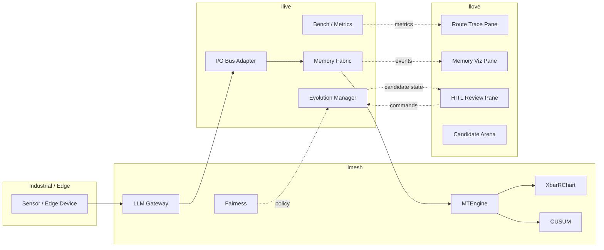
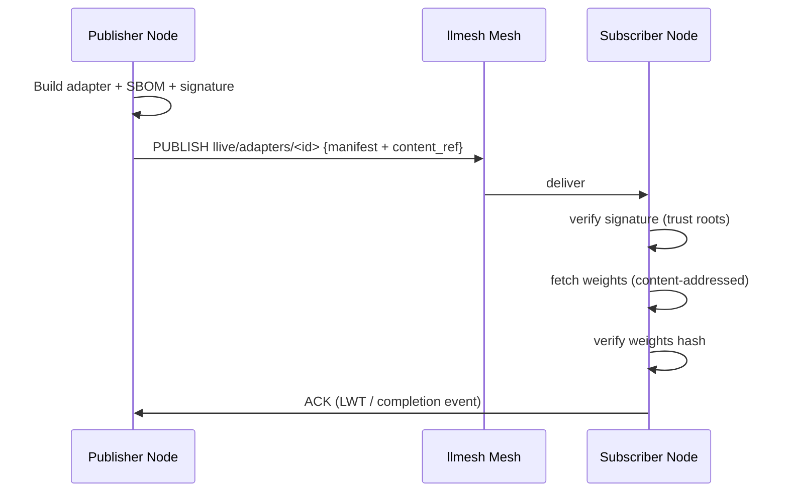
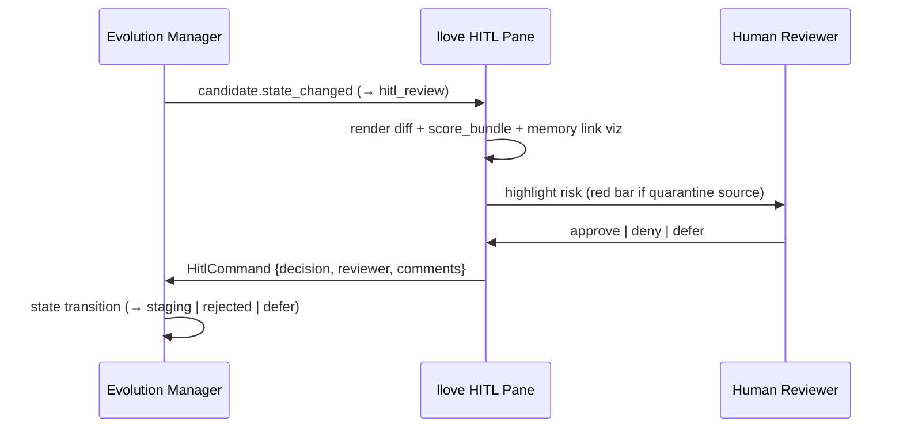

# llmesh / llove ファミリー統合仕様

> v0.1 にはなかった **ファミリー統合** を独立章として精密化。各統合点の I/F、データフロー、責務分界を定義。

## 0. 全体マップ



## 1. llmesh 統合

### 1.1 統合点

| llmesh コンポーネント | llive 接続点 | 用途 |
|---|---|---|
| LLM Gateway | L1 Interface | 上位呼び出しの routing、プロトコル変換 |
| MQTT broker | L5 Memory Fabric (via Bus Adapter) | sensor stream を episodic write |
| OPC-UA server | L5 同上 | 産業プロトコル経由の event 取り込み |
| MTEngine | L7 Observability | memory access latency / write rate を SPC モニタ |
| XbarRChart | L7 同上 | 上下限管理、異常検知 |
| CUSUMChart | L7 同上 | 累積和管理、ドリフト検知 |
| Fairness 機構 | L6 Evolution Manager | candidate 間の memory 公平アクセス policy |

### 1.2 I/F 仕様

#### MQTT → Episodic Memory

```yaml
# MQTT topic
topic: llive/sensors/<site>/<device>/<channel>

# payload (CloudEvents over MQTT)
specversion: "1.0"
type: llive.sensor.reading
source: mqtt://<broker>/llive/sensors/<site>/<device>/<channel>
id: <ULID>
time: <RFC3339>
data:
  value: <number>
  unit: <str>
  quality: enum [good, uncertain, bad]
  metadata: { ... }
```

llive 側 Bus Adapter (FR-19) が以下を実施:

1. MQTT message を CloudEvents パース
2. zone 判定 (`trusted` if signed payload, else `quarantine`)
3. Embedding 生成 (数値は scalar-to-text 変換 + 既存 embedding model)
4. `MemoryNode` 化して episodic に append
5. `XbarRChart` / `CUSUM` のための raw も保存

#### OPC-UA → Episodic Memory

OPC-UA NodeId を `MemoryNode.provenance.source_id` に明示。Browse path 階層を `structural memory` の edge として追加生成（FR-19 拡張）。

#### MTEngine / SPC モニタ統合

llive の `evaluation_metrics.md` で定義された以下を MTEngine 経由で監視:

- `llive.memory.write.latency_ms` (Histogram)
- `llive.memory.pollution_ratio` (Gauge)
- `llive.router.entropy` (Gauge)
- `llive.subblock.dead_rate` (Gauge)

MTEngine は閾値超過時に `XbarRChart` のアラートと連動、自動で `Reverse-Evolution Monitor` (FR-22) に rollback 検討要求を投げる。

#### Fairness 機構 ↔ Evolution Manager

Fairness 機構は llmesh で「複数モデル / 複数 candidate 間で公平に GPU/メモリリソース配分する」機能。llive では:

- 並列に評価中の candidate に対し、評価予算（時間 / VRAM / API call）を公平配分
- `EvolutionManager.shadow_eval` がリソースリクエストを発行 → Fairness が許可量を返す
- 不公平が発生（特定 candidate ばかり評価）した場合 Fairness alert

### 1.3 P2P 配布 (FR-18 + llmesh)

`Signed Adapter` の P2P 配布:



## 2. llove 統合

### 2.1 統合点

| llove F-機能 | llive 接続点 | 用途 |
|---|---|---|
| F11 HITL レビュー画面 | L6 Evolution Manager | candidate 昇格時のレビュー |
| F15 (Markdown / SVG / Mermaid) | L7 Observability | architecture / memory link 可視化 |
| F16 Multi-game Arena | L6 + L7 | candidate vs candidate 対局 |
| F17 MainWindow 管理基盤 | L8 全体 | 複数ペイン管理 |
| F19 Scripting IDE | 開発時 | sub-block / mutation policy のスクリプティング |
| F23 PowerShell 互換シェル | 開発時 | llive CLI のシェル統合 |
| F24 Claude Code 統合 | 開発時 | AI 補助 |

### 2.2 ペイン構成（提案）

```
┌────────────────────────────────────────────────────────────┐
│ llive @ llove (MainWindow: SDI mode)                       │
├──────────────────────┬─────────────────────────────────────┤
│ Route Trace          │ Memory Link Viz                     │
│ (timeline)           │ (Mermaid graph, interactive)        │
│                      │                                     │
├──────────────────────┼─────────────────────────────────────┤
│ Candidate Board      │ HITL Review                         │
│ (state diagram)      │ (diff + score + viz + approve)      │
└──────────────────────┴─────────────────────────────────────┘
   [F16] Candidate Arena pane (toggleable)
```

### 2.3 HITL Command フロー



### 2.4 Candidate Arena (FR-20 詳細)

llove F16 の **マルチゲームアリーナ抽象**を流用:

- 「ゲーム」= 1 タスク bench
- 「プレイヤー」= candidate
- 「勝敗」= bench score 比較
- 「Elo / TrueSkill」= candidate ranking

```yaml
arena_config:
  task_bench: bench/standard
  tournament: round_robin | swiss | elimination
  candidates:
    - cand_20260513_001
    - cand_20260513_002
    - cand_20260513_003
    - baseline_qwen_lora_mem_v2
  ranking_method: elo | trueskill
  rounds: 10
  display: llove.arena.live
```

TUI で対局進行を live 表示、人間が `pause` / `step` / `commentary` 可能。

## 3. llmesh-suite メタパッケージへの追加

将来 (Phase 4 完了時):

```toml
# llmesh-suite/pyproject.toml
[project]
dependencies = [
  "llmesh>=1.6.0",
  "llmesh-llove>=0.6.0",
  "llmesh-llive>=0.4.0",   # 追加予定
]
```

これにより `pip install llmesh-suite` で 3 つ揃ってインストール可能。

## 4. 責務分界

- **llmesh**: ゲートウェイ + 産業プロトコル + フェアネス + SPC モニタ
- **llive**: LLM 自己進化基盤 + 多層記憶 + candidate 評価
- **llove**: 可視化 + HITL + アリーナ + 開発者体験
- **llmesh-suite**: メタパッケージ、依存解決のみ

各リポジトリは独立にリリース可能、互換性は SemVer + integration tests で担保。

## 5. テスト統合

- llive 単体テストでは llmesh / llove をモック
- llmesh / llove との実 integration test は **`tests/integration/family/`** 配下に分離
- nightly で 3 者統合 smoke を回す
- llmesh-suite の release 候補時に full integration

## 6. オープン課題

- [ ] llmesh の MTEngine API 仕様確認 (memory `project_llmesh.md` 参照)
- [ ] llove の F11 HITL pane の TUI コンポーネント設計
- [ ] OPC-UA NodeId → structural memory edge の変換ルール
- [ ] 大量 sensor stream の rate limit と backpressure
- [ ] 鍵管理の UI (llove で扱うか別ツールか)
