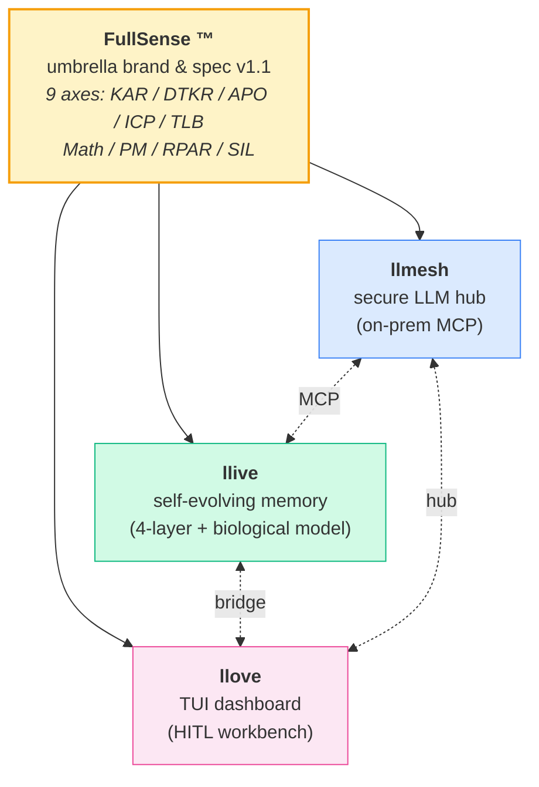
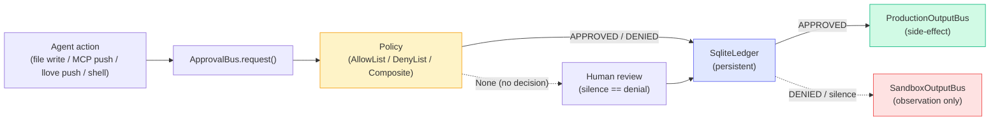
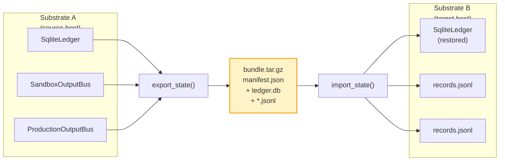

# FullSense ™ — llive

> **Part of the [FullSense ™](../TRADEMARK.md) family** — `llmesh` ・ **llive** ・ `llove` の 3 製品で構成される FullSense ブランドの中で、本サイトは **llive (self-evolving modular memory LLM framework)** の公式 documentation です。

---

## FullSense Family



| Product   | Role                                       | GitHub                                                |
|-----------|--------------------------------------------|-------------------------------------------------------|
| **llmesh** | secure LLM hub / on-prem MCP server        | <https://github.com/furuse-kazufumi/llmesh>          |
| **llive**  | self-evolving modular memory LLM framework | <https://github.com/furuse-kazufumi/llive>           |
| **llove**  | TUI dashboard / HITL workbench             | <https://github.com/furuse-kazufumi/llove>           |
| llmesh-suite | one-shot installer                       | <https://github.com/furuse-kazufumi/llmesh-suite>    |

PyPI から: `pip install llmesh-llive` (v0.6.0 時点。v1.0.0 で `fullsense-llive` へ rename 予定 — [v1.0_migration_plan.md](v1.0_migration_plan.md) 参照)

## Quick Start

```bash
# install
pip install llmesh-llive

# minimal demo
python -m llive.demo
```

詳細は [README.md](https://github.com/furuse-kazufumi/llive#readme) を参照。

## Architecture — Approval Bus 経路 (C-1 + C-2)

副作用を伴う action は **ApprovalBus** を gate に置き、Policy で auto-approve/deny → 残りは人手 review。すべての判定は SQLite ledger に永続化されて再起動越しに replay 可能。



## Architecture — Cross-substrate Migration (C-3, §MI1)

Agent state を別 substrate に携行して再開できることを実証する spike。tar.gz bundle 形式 (`manifest.json` + ledger DB + JSONL records) で portable。



CLI: `python -m llive.migration export --ledger=approval.db --out=state.tar.gz`

## What's New (v0.6.0, 2026-05-16)

- **9 axes skeleton** 完成 — KAR / DTKR / APO / ICP / TLB / Math / PM / RPAR / SIL
- **Approval Bus production 化** (Policy + SQLite Ledger, C-1)
- **`@govern` + ProductionOutputBus** (Policy gate × 副作用 emit, C-2)
- **Cross-substrate migration spike** (§MI1, C-3)
- **Brief API end-to-end** (LLIVE-001/002) — CLI / MCP / Ledger / Approval gate / Tool whitelist
- **Apache-2.0 + Commercial dual-license** に切替
- **FullSense umbrella ブランド** 導入

詳細: [CHANGELOG](https://github.com/furuse-kazufumi/llive/blob/main/CHANGELOG.md)

## llive vs 素の OSS LLM (Qwen / Llama / Mistral / ...)

llive にとって OSS LLM weights は **競合ではなく内側で呼ぶ素材**。Brief API
(LLIVE-002, 2026-05-16 実装) でどの OSS LLM も `LLMBackend` として透過的に差し
替え可能 — 差別化はモデル単体ではなく、その上に乗る **フレームワーク層** にある。

| 層 | 素の OSS LLM (Qwen / Llama / Mistral / ...) | llive (それを内包する) | 実装状況 |
|---|---|---|---|
| **推論コア** | Decoder-only LLM 重み | OSS LLM を `LLMBackend` として呼び出す | 実装済 (Ollama / OpenAI / Anthropic / Mock) |
| **記憶** | 単一 context window | 4 層 (semantic / episodic / structural / parameter) + 海馬-皮質 consolidation (FR-12) | semantic/episodic 実装済 |
| **意思決定** | 1 ターン生成 | FullSense 6 stage loop (salience → curiosity → thought → ego/altruism → plan → output) | 実装済 |
| **入力契約** | プロンプト 1 本 | **Brief API** ― 構造化 work unit + constraints + success_criteria + tool whitelist | 実装済 (2026-05-16) |
| **安全** | プロンプトレベル | Approval Bus + Policy + Quarantined Memory (SEC-01) + Ed25519 Signed Adapter (SEC-02) | 実装済 |
| **監査** | なし | append-only SIL ledger (Brief / Approval) + SHA-256 hash chain (SEC-03) | 実装済 |
| **自己進化** | 事前学習 + ファインチューニングのみ | オンライン提案 → Z3 形式検証 (EVO-04) → 審査 → 昇格 (EVO-06/07) | Phase 3 完了 |
| **アイデア源** | なし | TRIZ 40 原理 + 39×39 矛盾マトリクス内蔵 (FR-23〜27) | 実装済 |
| **HITL** | なし | llove TUI Candidate Arena (FR-20) | 設計済、未統合 |
| **産業 IoT** | なし | llmesh MQTT / OPC-UA sensor bridge (FR-19) | 設計済、未統合 |

実測 (2026-05-16 progressive validation matrix, xs/s/m × {llama3.2:3b,
qwen2.5:7b, qwen2.5:14b}, on-prem only): **Brief API + loop overhead < 1 %**
(LLM-only wall time / Total wall time > 99.8 %)。詳細は
[`docs/benchmarks/2026-05-16-progressive-merged/summary.md`](https://github.com/furuse-kazufumi/llive/blob/main/docs/benchmarks/2026-05-16-progressive-merged/summary.md)。

同点と認める領域: **生成品質そのもの** (内蔵 OSS LLM に依存) / **on-prem 実行**
(OSS LLM 直叩きでも成立) / **多言語** (素のモデルでも対応)。

## 設計の核

1. **固定コア + 可変周辺** — Decoder-only LLM コアは凍結、周辺で能力を吸収
2. **4 層メモリの責務分離** — semantic / episodic / structural / parameter
3. **宣言的構造記述** — sub-block 列を YAML で表現
4. **審査付き自己進化** — オンラインは memory write、構造変更はオフライン審査
5. **生物学的記憶モデル** — 海馬-皮質 consolidation cycle、surprise score
6. **形式検証付き promotion** — Lean / Z3 / TLA+
7. **llmesh / llove ファミリー統合**
8. **TRIZ アイデア出しを内蔵** — 40 原理 + 39×39 マトリクス + ARIZ + 9 画法
9. **FullSense Spec v1.1** リファレンス実装 — 9 軸 (KAR/DTKR/APO/ICP/TLB/Math/PM/RPAR/SIL) Conformance Manifest holds=24

## Documentation

| Topic                          | File                                                  |
|--------------------------------|-------------------------------------------------------|
| FullSense Spec v1.1            | [fullsense_spec_eternal.md](fullsense_spec_eternal.md) |
| Roadmap                        | [roadmap.md](roadmap.md)                              |
| Architecture                   | [architecture.md](architecture.md)                    |
| Data model                     | [data_model.md](data_model.md)                        |
| MCP integration                | [mcp_integration.md](mcp_integration.md)              |
| Security model                 | [security_model.md](security_model.md)                |
| Testing strategy               | [testing_strategy.md](testing_strategy.md)            |
| Evaluation metrics             | [evaluation_metrics.md](evaluation_metrics.md)        |
| Glossary                       | [glossary.md](glossary.md)                            |
| v1.0 migration plan            | [v1.0_migration_plan.md](v1.0_migration_plan.md)      |

### Requirements (バージョン別)

- [v0.1](requirements_v0.1.md)
- [v0.2 addendum (RAD)](requirements_v0.2_addendum.md)
- [v0.3 (TRIZ self-evolution)](requirements_v0.3_triz_self_evolution.md)
- [v0.4 (LLM Wiki)](requirements_v0.4_llm_wiki.md)
- [v0.5 (spatial memory)](requirements_v0.5_spatial_memory.md)
- [v0.6 (concurrency)](requirements_v0.6_concurrency.md)
- [v0.7 (Rust acceleration)](requirements_v0.7_rust_acceleration.md)

## Articles

- LinkedIn 概観: [ja](linkedin/post_2026-05-14_overview.ja.md) / [en](linkedin/post_2026-05-14_overview.en.md) / [zh](linkedin/post_2026-05-14_overview.zh.md)
- 2026-05-16 update: [ja](linkedin/post_2026-05-16_update.ja.md) / [en](linkedin/post_2026-05-16_update.en.md) / [zh](linkedin/post_2026-05-16_update.zh.md)
- Qiita 概観: [qiita-overview.md](qiita/qiita-overview.md)

## Legal

- [LICENSE](https://github.com/furuse-kazufumi/llive/blob/main/LICENSE) — Apache-2.0
- [LICENSE-COMMERCIAL](https://github.com/furuse-kazufumi/llive/blob/main/LICENSE-COMMERCIAL)
- [NOTICE](https://github.com/furuse-kazufumi/llive/blob/main/NOTICE)
- [TRADEMARK.md](https://github.com/furuse-kazufumi/llive/blob/main/TRADEMARK.md)
- [SECURITY.md](https://github.com/furuse-kazufumi/llive/blob/main/SECURITY.md)
- [CONTRIBUTING.md](https://github.com/furuse-kazufumi/llive/blob/main/CONTRIBUTING.md)
- [Trademark drafts](legal/trademark/) — Wave 1 (FullSense) + Wave 2 (llmesh/llive/llove)

## Links

- **GitHub**: <https://github.com/furuse-kazufumi/llive>
- **PyPI**: <https://pypi.org/project/llmesh-llive/>
- **Contact**: `kazufumi@furuse.work`

---

*FullSense ™ / llive ™ / llmesh ™ / llove ™ are trademarks of Kazufumi Furuse.*
*Code distributed under Apache-2.0; commercial license available.*
