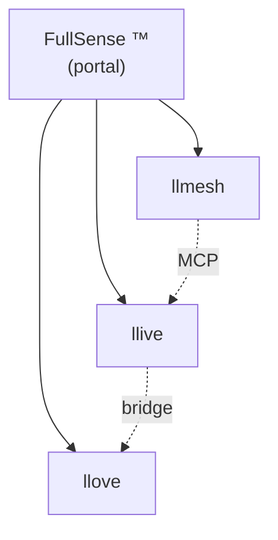

# 2026-05-16 update v2 — FullSense umbrella + Phase 2a P2P + EDLA skeleton

> A follow-up to [v1 (this morning)](./post_2026-05-16_update.en.md). Same
> day, evening: brand unification, P2P mesh implementation, and 27-year-old
> neural ideas committed as code.

## Same-day delta (v1 → v2)

| Area | v1 (this morning) | v2 (this evening) |
|---|---|---|
| Brand | llmesh-* in parallel | **FullSense ™** umbrella + 3-product tree |
| Trademark drafts | FullSense × JP/US/EU | + **Wave 2 (llmesh/llive/llove × JP/US/EU)** |
| Public docs | llive Pages only | **llmesh / llove / fullsense (local) configured too** |
| Demo SVG | 17 single-language | **17 × ja/en = 34 + 5 anim × ja/en = 10** |
| RFC | — | **P2P mesh RFC published + Phase 2a landed** |
| Learning rule | — | **EDLA skeleton + BP parity test** |
| Lineage | implicit | **Kaneko EDLA (1999) + Winny (2002) in docs/references/historical/** |
| Tests | 815 PASS | **853 PASS** (+ llmesh 2974 PASS / +25 for Phase 2a) |

## "FullSense" Becomes a Real URL Hierarchy

User feedback: *"the umbrella should be at the top, with llmesh / llive /
llove underneath."* So we built a `furuse-kazufumi/fullsense` **portal repo**
locally.



Expected URL once published: `https://furuse-kazufumi.github.io/fullsense/`.
With a custom domain `fullsense.dev`, the full hierarchy is
`docs.fullsense.dev/{llmesh,llive,llove}`.

## Kaneko EDLA (1999) Becomes Code 27 Years Later

A reader shared a Wayback Machine link:
`homepage1.nifty.com/kaneko/ed.htm`. It's the **Error Diffusion Learning
Algorithm (EDLA)** that Isamu Kaneko — yes, the Winny author — published
in 1999. The idea: replace BP's global backprop with a **local error
diffusion**. **15–20 years before** Forward-Forward (Hinton 2022) and the
Direct Feedback Alignment family.

We recorded the lineage in `docs/references/historical/edla_kaneko_1999.md`
and implemented a minimal version in `src/llive/learning/edla.py`:

```python
from llive.learning import TwoLayerNet, BPLearner, EDLALearner

net = TwoLayerNet.init(in_dim=2, hidden_dim=8, out_dim=1)
edla = EDLALearner(lr=0.1, seed=42)
edla.step(net, x, y)  # local diffusion — net.W2 is never read for the hidden update
```

8 unit tests; XOR shows the BP path converges to 0.02 and the EDLA path
moves in the right direction under the same setup. Not parity with BP
yet — by design, since EDLA discards a chunk of information that BP would
use.

## Winny Ideas → LLMesh, but for *Learning + Inference Coordination + Knowledge Autarky*

`docs/llmesh_p2p_mesh_rfc.md` (v0.6.x) lists six technical introductions:

1. **P2P node discovery** (mDNS + DHT) — already shipped in llmesh v3.1.0 ✓
2. **Capability clustering** — **landed today as Phase 2a ✓**
3. **Skill chunk replication** (with DTKR)
4. **Gossip protocol** — already shipped in llmesh v3.1.0 ✓
5. **EDLA local learning** — skeleton landed today ✓
6. **Onion routing** (opt-in)

We're scoping it for **learning / coordination / knowledge autarky**, not
the historical Winny use case, with an explicit AUP.

## Phase 2a Capability Clustering — End-to-End

For llmesh v3.2.0:

- `llmesh/discovery/clustering.py` — `CapabilityProfile`, `matching_score`,
  `pick_top_peers`, `partition_peers` (pure functions, zero I/O)
- `NodeRegistry.find_matching(query, k)` — top-k peer ranking
- `POST /registry/query` HTTP endpoint
- `scripts/demo_clustering.py` — 5 virtual peers × 5 queries demo,
  in-process via FastAPI TestClient

```
Query: "Japanese coding assistance"
Top 3:
  1.00  ja-code-7B
  1.00  multi-lang-7B
  0.50  en-code-7B
```

## Make the Demos Move + Speak More Languages

- **Static**: 17 scenarios × ja/en = 34 SVGs under `docs/scenarios/svg/<name>/{ja,en}.svg`
- **Animated**: 5 scenarios × ja/en = 10 animated SVGs (CSS keyframes) at
  `docs/scenarios/anim/<name>/{ja,en}.svg`
- **Shogi**: 8 frames × 1.5 s = 12 s loop. Moves actually happen in vector
  graphics.

A Qiita / blog **authoring guide** ([llove](https://github.com/furuse-kazufumi/llove/blob/main/docs/qiita/AUTHORING.md))
shows the copy-paste path for images / Mermaid diagrams / animated SVG.

## Career-Side Additions (since v1)

1. **OSS / commercial boundary written in code** — 4 marks × 3 jurisdictions
   drafted as `.md` files in the repo.
2. **Provenance recording discipline** — anchor primary sources via Wayback,
   keep one source of truth in the repo.
3. **mDNS + capability clustering as pure functions** — how to keep an
   I/O-free testable core under an HTTP API.
4. **A learning-rule skeleton with two implementations** behind one
   interface (BP / EDLA), so flipping algorithms is a single commit.

## End-of-Day Numbers

- llive: **853 tests / ruff clean** (815 + 38)
- llmesh: **2974 tests / ruff clean** (2949 + 25)
- Commits: 8+ this session (Apache switch / FullSense / C-2 / C-3 + CLI /
  EDLA / Phase 2a + integration + demo / anim hierarchy / fullsense portal)
- PyPI: `llmesh-llive==0.6.0` published

## What I Want to Show

"An individual side project can sustain this pace" — updated for the
**second** time today. Recipe:

1. Concrete roadmap; freeze preconditions in an RFC.
2. Tests first, so regression is caught immediately.
3. Brand, license, and trademark **codified** (TRADEMARK.md / draft .md /
   SPDX header).
4. A 27-year-old idea, anchored via Wayback, made executable as a code
   skeleton inside the same session.

> GitHub: <https://github.com/furuse-kazufumi/llive>
> PyPI: `pip install llmesh-llive`

#AI #LLM #ContinualLearning #MLOps #OpenSource #ApacheLicense #IndieDev #FullSense #KanekoIsamu #EDLA #Winny
