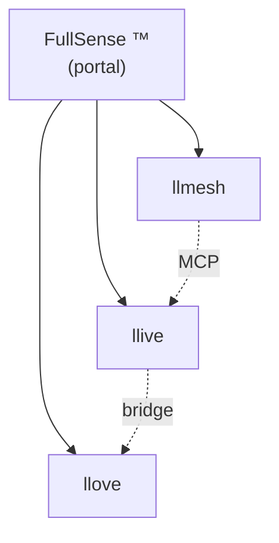

# 2026-05-16 アップデート v2 — FullSense umbrella + Phase 2a P2P + EDLA skeleton

> [前回 v1](./post_2026-05-16_update.ja.md) からさらに進んだ続編。同日中に
> ブランド統一 + P2P mesh の実装着手 + 1999 年の神経モデル思想を code に
> 落とした記録。

## 同日中にここまで進んだ

| 区分 | 前回 v1 (本日朝) | v2 (本日夜) |
|---|---|---|
| ブランド | llmesh-* 並列 | **FullSense ™** umbrella + 3 製品階層 |
| 商標 draft | FullSense × JP/US/EU | + **Wave 2 (llmesh/llive/llove × JP/US/EU)** |
| 公開 docs | llive Pages のみ | **llmesh / llove / fullsense (local) も設定済** |
| Demo SVG | 17 件 (シングル言語) | **17 × ja/en = 34 件 + 5 アニメ × ja/en = 10 件** |
| RFC | (未着手) | **P2P mesh RFC 公開 + Phase 2a 実装着地** |
| 学習則 | (未着手) | **EDLA skeleton 実装 + BP と parity test** |
| 思想的源流 | (未明示) | **金子勇 EDLA (1999) + Winny (2002) 思想を docs/references/historical/ に集約** |
| テスト | 815 PASS | **853 PASS** (+ llmesh 側 2974 PASS / +25 件で Phase 2a) |

## FullSense umbrella ブランドを「URL でも」階層化

ユーザフィードバック「一番上の FullSense とその下に llmesh / llive / llove
が存在しているのが良い」を受け、`furuse-kazufumi/fullsense` を **portal repo**
として local 整備。



公開 URL は (GitHub repo 作成後): `https://furuse-kazufumi.github.io/fullsense/`

カスタムドメイン `fullsense.dev` 取得後は `docs.fullsense.dev/llmesh` /
`/llive` / `/llove` で完全階層化可能。

## 金子勇 EDLA (1999) を 27 年越しに code に落とす

ユーザから共有された Wayback Machine の `homepage1.nifty.com/kaneko/ed.htm`
は、Winny の作者でもある金子勇氏が 1999 年に公開した **誤差拡散学習法**
(EDLA) のサンプル + 論文。BP の代替として「誤差を局所的に拡散させる」発想
で、現代の Forward-Forward Algorithm (Hinton 2022) より **15-20 年早い**。

これを llive v0.7 ロードマップに **思想的源流** として明示記録 →
`docs/references/historical/edla_kaneko_1999.md`。

技術的には `src/llive/learning/edla.py` で 2-layer net + Direct Feedback
Alignment 流の最小実装 + BP との parity test。XOR で BP は 0.02 まで収束、
EDLA は同条件で改善方向に動くことを確認 (8 件テスト)。

```python
from llive.learning import TwoLayerNet, BPLearner, EDLALearner

net = TwoLayerNet.init(in_dim=2, hidden_dim=8, out_dim=1)
edla = EDLALearner(lr=0.1, seed=42)
edla.step(net, x, y)  # 局所的に誤差を「拡散」、net.W2 を一切参照しない
```

## Winny 思想を LLMesh に「学習 / 推論協調 / 知識主権」目的で導入する RFC

`docs/llmesh_p2p_mesh_rfc.md` (v0.6.x) を公開。6 技術導入候補:

1. **P2P node discovery** (mDNS + DHT) — llmesh v3.1.0 既に実装済 ✓
2. **Capability clustering** — **本セッションで Phase 2a 完了 ✓**
3. **Skill chunk replication** (DTKR 統合)
4. **Gossip protocol** — llmesh v3.1.0 既に実装済 ✓
5. **EDLA local learning** — skeleton 完了 ✓
6. **Onion routing** (opt-in)

## Phase 2a capability clustering を end-to-end で着地

llmesh v3.2.0 向けに:

- `llmesh/discovery/clustering.py` — `CapabilityProfile` /
  `matching_score` / `pick_top_peers` / `partition_peers` (pure functions)
- `NodeRegistry.find_matching(query, k)` — top-k peer ranking
- `POST /registry/query` HTTP endpoint
- `scripts/demo_clustering.py` — 5 virtual peer × 5 query の in-process demo

```
Query: "Japanese coding assistance"
Top 3:
  1.00  ja-code-7B
  1.00  multi-lang-7B
  0.50  en-code-7B
```

## デモアセットを **動きで魅せる** + 多言語化

- **静的 SVG**: 17 scenario × ja/en = 34 件、`docs/scenarios/svg/<name>/{ja,en}.svg`
- **アニメ SVG**: 5 scenario × ja/en = 10 件、`docs/scenarios/anim/<name>/{ja,en}.svg`
- 将棋: 8 フレーム × 1.5s = 12 秒ループ。指し手が動く

Qiita 投稿用 [Authoring Guide](https://github.com/furuse-kazufumi/llove/blob/main/docs/qiita/AUTHORING.md) も整備、画像 / Mermaid / アニメ
画像の入れ方をコピペで使える形に。

## キャリア観点で新増 4 点

1. **OSS と商用の境界を商標 + 商用 license 雛形で物理化** — 4 mark × 3
   jurisdictions の draft を repo に保持
2. **歴史的優先権の記録運用** — Wayback 経由の一次資料を repo に anchor
   する作法
3. **mDNS + Capability clustering を pure-function でテスト** — I/O 非依存の
   設計をどう保つか
4. **誤差拡散学習則 skeleton** — BP/EDLA 二本立てで切り替え可能なインタ
   フェースを 1 commit で

## 数字 (本日終了時点)

- llive: **853 tests / ruff clean** (前 815 + 38)
- llmesh: **2974 tests / ruff clean** (前 2949 + 25)
- 主要 commits: 8 個以上 (Apache 切替 / FullSense brand / C-2 / C-3 +
  CLI / EDLA / Phase 2a + integration + demo / anim 階層化 / fullsense portal)
- PyPI: `llmesh-llive==0.6.0` publish 済

## 何を見せたいか

「個人プロジェクトでも 1 セッションでここまで詰められる」を **2 度目** に
更新。手順:

1. ロードマップは具体 / RFC で前提 freeze
2. テスト first、回帰検知の即時性
3. ブランド + license + 商標を **コード化** (TRADEMARK.md / draft md / SPDX header)
4. 27 年前の思想も Wayback で資料化、code skeleton まで落とす

> GitHub: <https://github.com/furuse-kazufumi/llive>
> PyPI: `pip install llmesh-llive`

#AI #LLM #ContinualLearning #MLOps #OpenSource #ApacheLicense #個人開発 #キャリア #FullSense #金子勇 #EDLA #Winny
