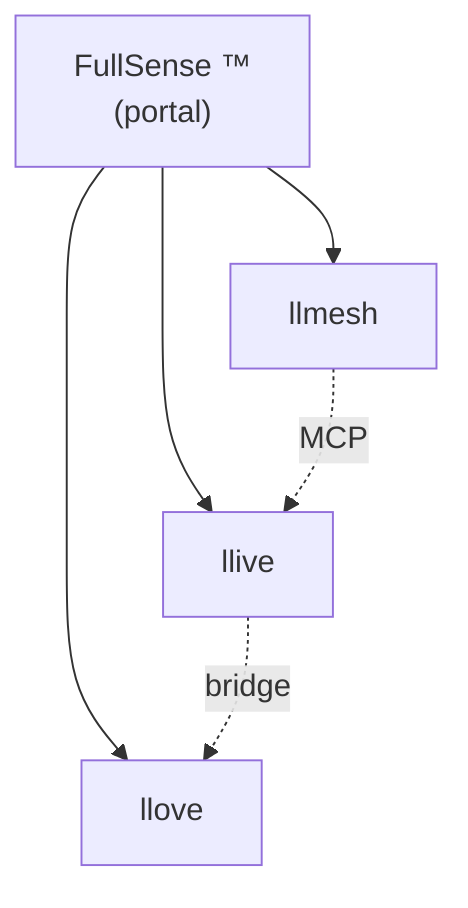

# 2026-05-16 업데이트 v2 — FullSense umbrella + Phase 2a P2P + EDLA skeleton

> [지난번 v1](./post_2026-05-16_update.ja.md) 에서 더 진전한 속편. 같은 날 안에
> 브랜드 통일 + P2P mesh 의 구현 착수 + 1999 년의 신경 모델 사상을 code 로
> 구현한 기록.

## 같은 날 안에 여기까지 진행되었다

| 구분 | 지난번 v1 (오늘 아침) | v2 (오늘 밤) |
|---|---|---|
| 브랜드 | llmesh-* 병렬 | **FullSense ™** umbrella + 3 제품 계층 |
| 상표 draft | FullSense × JP/US/EU | + **Wave 2 (llmesh/llive/llove × JP/US/EU)** |
| 공개 docs | llive Pages 만 | **llmesh / llove / fullsense (local) 도 설정 완료** |
| Demo SVG | 17 건 (단일 언어) | **17 × ja/en = 34 건 + 5 애니메 × ja/en = 10 건** |
| RFC | (미착수) | **P2P mesh RFC 공개 + Phase 2a 구현 착지** |
| 학습 규칙 | (미착수) | **EDLA skeleton 구현 + BP 와 parity test** |
| 사상적 원류 | (미명시) | **카네코 이사무 EDLA (1999) + Winny (2002) 사상을 docs/references/historical/ 에 집약** |
| 테스트 | 815 PASS | **853 PASS** (+ llmesh 측 2974 PASS / +25 건으로 Phase 2a) |

## FullSense umbrella 브랜드를 「URL 에서도」 계층화

사용자 피드백 「가장 위의 FullSense 와 그 아래에 llmesh / llive / llove
가 존재하는 것이 좋다」를 받아, `furuse-kazufumi/fullsense` 를 **portal repo**
로서 local 정비.



공개 URL 은 (GitHub repo 작성 후): `https://furuse-kazufumi.github.io/fullsense/`

커스텀 도메인 `fullsense.dev` 취득 후에는 `docs.fullsense.dev/llmesh` /
`/llive` / `/llove` 로 완전 계층화 가능.

## 카네코 이사무 EDLA (1999) 를 27 년 만에 code 로 구현

사용자로부터 공유된 Wayback Machine 의 `homepage1.nifty.com/kaneko/ed.htm`
는, Winny 의 작자이기도 한 카네코 이사무 씨가 1999 년에 공개한 **오차 확산 학습법**
(EDLA) 의 샘플 + 논문. BP 의 대체로서 「오차를 국소적으로 확산시킨다」 발상
으로, 현대의 Forward-Forward Algorithm (Hinton 2022) 보다 **15-20 년 빠르다**.

이를 llive v0.7 로드맵에 **사상적 원류** 로서 명시 기록 →
`docs/references/historical/edla_kaneko_1999.md`.

기술적으로는 `src/llive/learning/edla.py` 에서 2-layer net + Direct Feedback
Alignment 류의 최소 구현 + BP 와의 parity test. XOR 에서 BP 는 0.02 까지 수렴,
EDLA 는 같은 조건으로 개선 방향으로 움직이는 것을 확인 (8 건 테스트).

```python
from llive.learning import TwoLayerNet, BPLearner, EDLALearner

net = TwoLayerNet.init(in_dim=2, hidden_dim=8, out_dim=1)
edla = EDLALearner(lr=0.1, seed=42)
edla.step(net, x, y)  # 국소적으로 오차를 「확산」, net.W2 를 일절 참조하지 않는다
```

## Winny 사상을 LLMesh 에 「학습 / 추론 협조 / 지식 주권」 목적으로 도입하는 RFC

`docs/llmesh_p2p_mesh_rfc.md` (v0.6.x) 를 공개. 6 기술 도입 후보:

1. **P2P node discovery** (mDNS + DHT) — llmesh v3.1.0 이미 구현 완료 ✓
2. **Capability clustering** — **본 세션에서 Phase 2a 완료 ✓**
3. **Skill chunk replication** (DTKR 통합)
4. **Gossip protocol** — llmesh v3.1.0 이미 구현 완료 ✓
5. **EDLA local learning** — skeleton 완료 ✓
6. **Onion routing** (opt-in)

## Phase 2a capability clustering 을 end-to-end 로 착지

llmesh v3.2.0 용으로:

- `llmesh/discovery/clustering.py` — `CapabilityProfile` /
  `matching_score` / `pick_top_peers` / `partition_peers` (pure functions)
- `NodeRegistry.find_matching(query, k)` — top-k peer ranking
- `POST /registry/query` HTTP endpoint
- `scripts/demo_clustering.py` — 5 virtual peer × 5 query 의 in-process demo

```
Query: "Japanese coding assistance"
Top 3:
  1.00  ja-code-7B
  1.00  multi-lang-7B
  0.50  en-code-7B
```

## 데모 자산을 **움직임으로 매료시키기** + 다국어화

- **정적 SVG**: 17 scenario × ja/en = 34 건, `docs/scenarios/svg/<name>/{ja,en}.svg`
- **애니메 SVG**: 5 scenario × ja/en = 10 건, `docs/scenarios/anim/<name>/{ja,en}.svg`
- 장기: 8 프레임 × 1.5s = 12 초 루프. 수가 움직인다

Qiita 투고용 [Authoring Guide](https://github.com/furuse-kazufumi/llove/blob/main/docs/qiita/AUTHORING.md) 도 정비, 이미지 / Mermaid / 애니메
이미지의 삽입 방법을 복사 붙여 넣기로 사용 가능한 형태로.

## 커리어 관점에서 신규 추가 4 점

1. **OSS 와 상용의 경계를 상표 + 상용 license 양식으로 물리화** — 4 mark × 3
   jurisdictions 의 draft 를 repo 에 보관
2. **역사적 우선권의 기록 운용** — Wayback 경유의 1 차 자료를 repo 에 anchor
   하는 작법
3. **mDNS + Capability clustering 을 pure-function 으로 테스트** — I/O 비의존의
   설계를 어떻게 유지할 것인가
4. **오차 확산 학습 규칙 skeleton** — BP/EDLA 양립으로 전환 가능한 인터
   페이스를 1 commit 으로

## 숫자 (오늘 종료 시점)

- llive: **853 tests / ruff clean** (이전 815 + 38)
- llmesh: **2974 tests / ruff clean** (이전 2949 + 25)
- 주요 commits: 8 개 이상 (Apache 전환 / FullSense brand / C-2 / C-3 +
  CLI / EDLA / Phase 2a + integration + demo / anim 계층화 / fullsense portal)
- PyPI: `llmesh-llive==0.6.0` publish 완료

## 무엇을 보여주고 싶은가

「개인 프로젝트라도 1 세션으로 여기까지 다듬을 수 있다」를 **두 번째** 로
업데이트. 절차:

1. 로드맵은 구체적 / RFC 로 전제 freeze
2. 테스트 first, 회귀 검지의 즉시성
3. 브랜드 + license + 상표를 **코드화** (TRADEMARK.md / draft md / SPDX header)
4. 27 년 전의 사상도 Wayback 으로 자료화, code skeleton 까지 구현

> GitHub: <https://github.com/furuse-kazufumi/llive>
> PyPI: `pip install llmesh-llive`

#AI #LLM #ContinualLearning #MLOps #OpenSource #ApacheLicense #개인개발 #커리어 #FullSense #카네코이사무 #EDLA #Winny
