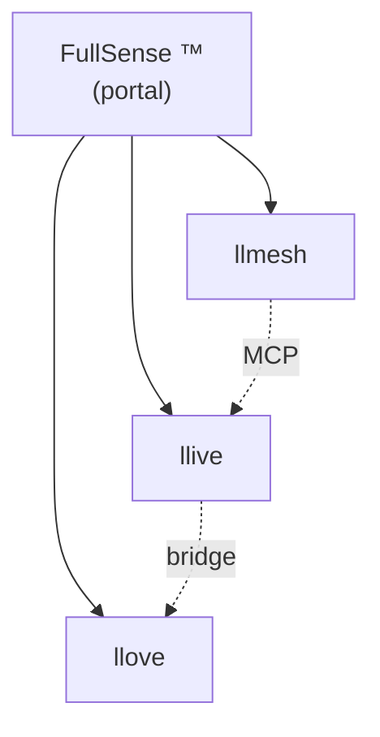

# 2026-05-16 更新 v2 — FullSense 总品牌 + Phase 2a P2P + EDLA skeleton

> 续 [v1（今天上午）](./post_2026-05-16_update.zh.md)，同一天的傍晚版本：
> 品牌统一 + P2P mesh 着地 + 把 1999 年的神经网络思想转成代码。

## 同日内的 delta（v1 → v2）

| 项目 | v1（今早） | v2（今晚） |
|---|---|---|
| 品牌 | llmesh-* 并列 | **FullSense ™** 总品牌 + 3 产品树状 |
| 商标 draft | FullSense × JP/US/EU | + **Wave 2（llmesh/llive/llove × JP/US/EU）** |
| 公开 docs | 仅 llive Pages | **llmesh / llove / fullsense（local）已配置** |
| Demo SVG | 17 件（单语） | **17 × ja/en = 34 件 + 5 动画 × ja/en = 10 件** |
| RFC | 未着手 | **P2P mesh RFC 公开 + Phase 2a 着地** |
| 学习规则 | 未着手 | **EDLA skeleton + BP parity test** |
| 思想源流 | 隐式 | **金子勇 EDLA（1999）+ Winny（2002）思想纳入 docs/references/historical/** |
| 测试 | 815 PASS | **853 PASS**（+ llmesh 侧 2974 PASS / Phase 2a +25） |

## 让 FullSense 不只是名字，而是真正的 URL 阶层

用户反馈：「最上面应是 FullSense，下面再排 llmesh / llive / llove」。
为此把 `furuse-kazufumi/fullsense` 当作 **portal repo** 在本地完成搭建。



GitHub repo 创建后 URL 是：`https://furuse-kazufumi.github.io/fullsense/`。
取得自定义域名 `fullsense.dev` 后可做 `docs.fullsense.dev/{llmesh,llive,llove}`
的完美阶层化。

## 把金子勇 EDLA（1999）经过 27 年后再变成代码

用户分享了 Wayback Machine 上 `homepage1.nifty.com/kaneko/ed.htm`。这是
Winny 作者金子勇 1999 年公开的 **誤差扩散学习法（EDLA）** 示例 + 论文。
思想是把 BP 的全局逆传播换成 **局部误差扩散**，比现代的 Forward-Forward
（Hinton 2022）等 **早 15-20 年**。

将历史脉络写入 `docs/references/historical/edla_kaneko_1999.md`，
代码以 `src/llive/learning/edla.py` 给出 2-layer net + Direct Feedback
Alignment 风格的最小实现 + BP 对比 test：

```python
from llive.learning import TwoLayerNet, BPLearner, EDLALearner

net = TwoLayerNet.init(in_dim=2, hidden_dim=8, out_dim=1)
edla = EDLALearner(lr=0.1, seed=42)
edla.step(net, x, y)  # 局部扩散误差，完全不引用 net.W2
```

XOR 上：BP 收敛到 0.02，EDLA 在同条件下向改善方向移动（8 个测试通过）。

## Winny 思想用于「学习 / 推理协同 / 知识主权」（不复刻 Winny 用途）

`docs/llmesh_p2p_mesh_rfc.md` 列出 6 项技术导入候选：

1. **P2P node discovery**（mDNS + DHT）— llmesh v3.1.0 已实现 ✓
2. **Capability clustering** — **本节着地（Phase 2a） ✓**
3. **Skill chunk replication**（与 DTKR 集成）
4. **Gossip protocol** — llmesh v3.1.0 已实现 ✓
5. **EDLA local learning** — skeleton 完成 ✓
6. **Onion routing**（opt-in）

定位明确：学习 / 推理协同 / 知识主权，不是历史上 Winny 的文件共享场景。
AUP 单独整理。

## Phase 2a Capability Clustering — end-to-end 着地

llmesh v3.2.0 向：

- `llmesh/discovery/clustering.py` — `CapabilityProfile` /
  `matching_score` / `pick_top_peers` / `partition_peers`（纯函数、零 I/O）
- `NodeRegistry.find_matching(query, k)` — top-k peer 排名
- `POST /registry/query` HTTP 端点
- `scripts/demo_clustering.py` — 5 个虚拟 peer × 5 个查询的 in-process 演示

```
Query: "Japanese coding assistance"
Top 3:
  1.00  ja-code-7B
  1.00  multi-lang-7B
  0.50  en-code-7B
```

## 用「动态」+「多语言」把 demo 推到位

- **静态 SVG**：17 scenario × ja/en = 34 件
- **动画 SVG**：5 scenario × ja/en = 10 件
- 将棋：8 帧 × 1.5 秒 = 12 秒循环。指法在 SVG 矢量中真的动起来

Qiita / 博客投稿用 [Authoring Guide](https://github.com/furuse-kazufumi/llove/blob/main/docs/qiita/AUTHORING.md)
也整理好了，把图片 / Mermaid / 动画 SVG 的嵌入方式做成可复制粘贴的形式。

## 职业角度新增 4 条（在 v1 之上）

1. **OSS / 商用界线写进代码** — 4 mark × 3 司法管辖区的 draft 全部保存在 repo
2. **历史优先权的记录运用** — 通过 Wayback 锚定一次资料，repo 内 single source of truth
3. **mDNS + capability clustering 做成纯函数** — I/O 零依赖下如何保持可测性
4. **学习规则 skeleton 双引擎** — BP / EDLA 一个 interface 两个实现，1 commit 切换

## 当天结束时的数字

- llive：**853 tests / ruff clean**（815 + 38）
- llmesh：**2974 tests / ruff clean**（2949 + 25）
- 主要 commits：8+（Apache 切换 / FullSense / C-2 / C-3 + CLI / EDLA /
  Phase 2a + integration + demo / 动画阶层化 / fullsense portal）
- PyPI：`llmesh-llive==0.6.0` 已发布

## 想要呈现什么

「个人项目也能维持这种节奏」— 当天**第二次**更新。配方：

1. 路线图具体；前提通过 RFC freeze
2. 测试先行，回归即时可发现
3. 把品牌 / 许可证 / 商标都 **代码化**（TRADEMARK.md / draft .md / SPDX header）
4. 27 年前的思想，通过 Wayback 锚定一次资料，在同一节内变成可执行 code skeleton

> GitHub：<https://github.com/furuse-kazufumi/llive>
> PyPI：`pip install llmesh-llive`

#AI #LLM #ContinualLearning #MLOps #OpenSource #ApacheLicense #IndieDev #FullSense #金子勇 #EDLA #Winny
