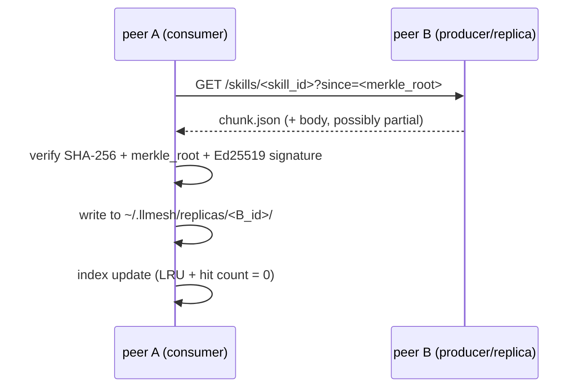

# RFC Phase 3 — Skill Chunk Replication 詳細仕様

> Status: **Draft** (2026-05-16). 親 RFC は
> [`docs/llmesh_p2p_mesh_rfc.md`](llmesh_p2p_mesh_rfc.md) Phase 3。
> 本書は実装着手前の **設計 freeze 用 sub document**。

## 目的 (1 行)

llive 側の **DTKR (Disk-Tier Knowledge Routing)** が持つ「skill = 1 file」
チャンクを、llmesh peer 間で **改ざん耐性付きで複製・伝播・キャッシュ管理**
することで、知識主権 (KAR) と可用性を両立する。

## 既存資産との関係

- **llive/DTKR** (memory:project_llive_9axis_skeleton) — skill chunk の
  起源 / consumer。本 RFC は **distribution layer** を提供。
- **llmesh/discovery (Phase 1+2a 実装済)** — Capability clustering で
  「どの peer にどの skill を複製すべきか」を決定する材料を提供。
- **llive/approval (C-1)** — peer 間転送 action は ApprovalBus 経由
  (`@govern`) で gate する。

## Chunk 仕様

### 物理形式

```json
{
  "schema_version": 1,
  "skill_id": "ja-code-7B/lang_idioms/pythonic_iter",
  "version": "2026-05-16T13:00:00Z",
  "size_bytes": 12345,
  "content_sha256": "<64 hex>",
  "merkle_root": "<64 hex>",
  "merkle_chunk_size": 4096,
  "license": "Apache-2.0",
  "license_url": "https://example.com/LICENSE",
  "language": "ja",
  "domains": ["code", "python"],
  "model_size_hint": "7B",
  "data_level": 0,
  "created_by": "did:key:z6Mk...",
  "signature": "<128 hex Ed25519>",
  "body": "<gzipped JSON or plain UTF-8 text, base64 encoded if binary>"
}
```

### Merkle tree

- body を `merkle_chunk_size=4096` バイト単位で分割
- 各 leaf の SHA-256 を pairwise hash (SHA-256) で root まで
- `merkle_root` は body 全体の改ざん検出と部分転送時の検証両方に使う
- BitTorrent 風の partial download に必要 (大きな skill の途中再開)

### Signature

- Ed25519 (既存 `llmesh/discovery/encrypted_announce.py` と同方式)
- 署名対象: `content_sha256 || merkle_root || skill_id || version` の SHA-256
- `created_by` の DID public key で検証

## Storage Layout

### Producer side (skill 作者の peer)

```
data/rad/_learned/<scenario>/
  <skill_id>.chunk.json     ← skill chunk (本書 schema)
  <skill_id>.body           ← raw body (body field を外出ししても可)
```

### Replica side (受信した peer)

```
~/.llmesh/replicas/<peer_short_id>/<skill_id>.chunk.json
~/.llmesh/replicas/_index.sqlite       ← LRU + hit count
```

### Tier policy (DTKR と統合)

| Tier | Storage | Capacity (default) | Eviction |
|------|---------|--------------------|----------|
| Hot  | RAM (in-process) | 100 MB | LRU |
| Warm | SSD / Disk | 1 GB | LRU + popularity |
| Cold | Disk (cold storage) | unlimited | TTL only (90 days) |
| Frozen | external storage | optional | manual |

popularity = recent hit count × time decay (DTKR Phase 5 の仕様準拠)。

## Replication Protocol

### Pull (基本)



### Push (任意、producer-driven)

- 新規 skill 公開時、Capability clustering で「興味がありそうな peer」を
  選び (Phase 2a `pick_top_peers`)、`POST /skills/notify` で告知。
- 告知だけ送り、本体は pull で要求させる (帯域節約)。

### Gossip (lazy synchronization)

- 既存 `llmesh/discovery/gossip.py` を流用、`/registry/peers` と並行で
  `/skills/index` を 30 秒間隔で交換。
- 新しい version の skill を peer 間で告知。

## HTTP API (案)

| Method | Path                                | 説明 |
|--------|-------------------------------------|------|
| GET    | `/skills/<skill_id>`                | chunk.json 取得 (`?since=<merkle>` で増分) |
| GET    | `/skills/<skill_id>/body`           | body 直配信 (range request 対応) |
| GET    | `/skills/index`                     | 自分が持つ skill 一覧 (gossip 用) |
| POST   | `/skills/notify`                    | 新 skill / 更新の告知 (push 用) |
| POST   | `/skills/<skill_id>/report-corrupt` | 改ざん検出報告 (peer reputation 影響) |

### Approval gate

- `/skills/notify` を受けた peer は **デフォルトでは何もしない** (lazy)
- 実際に DL する action は `@govern(policy=)` で gate
- AllowList で `domain ⊂ trusted_domains` の場合のみ自動 DL

## Security

### 改ざん耐性

- 受信時に必ず `content_sha256` / `merkle_root` / `signature` を検証
- 1 つでも fail なら破棄 + `report-corrupt` で peer reputation を下げる
- reputation = 直近 30 日の (corrupt報告数 / 総転送数)、閾値超で cluster
  から除外

### License filter

- chunk.license フィールドを必ず確認、`AllowList` policy で license を絞る
  (`["Apache-2.0", "MIT", "CC0-1.0", "CC-BY-4.0"]` がデフォルト推奨)
- license_url を audit log に記録 (出典トレース)
- `?` または `proprietary` ラベルは **reject** (FullSense AUP 整合)

### Privacy

- skill_id / merkle_root は転送経路で平文 (検索可能性が重要)
- body は **transit 中は TLS 必須**、保存時は OS の filesystem permission
- 高い data_level (=機密) の skill は `mDNS` での advertise なし、明示の
  peer-to-peer 招待のみ

### Malicious peer 検出

- Peer reputation < 0.7 で警告、< 0.5 で除外
- 同一 DID から短時間に大量転送リクエスト → rate limit
- 連続 corrupt 報告 → 即除外 + AUP 違反として記録

## Interface Skeleton (Python)

```python
# src/llmesh/skills/chunk.py (実装は後段)

@dataclass(frozen=True)
class SkillChunk:
    schema_version: int
    skill_id: str
    version: str
    size_bytes: int
    content_sha256: str
    merkle_root: str
    merkle_chunk_size: int
    license: str
    license_url: str
    language: str
    domains: tuple[str, ...]
    model_size_hint: str
    data_level: int
    created_by: str
    signature: str
    body: bytes

    def verify(self, public_key_hex: str) -> bool:
        """SHA-256 + merkle + signature を検証."""

    @classmethod
    def from_json(cls, data: dict) -> "SkillChunk": ...
    def to_json(self) -> dict: ...


class SkillReplica:
    """LRU + popularity 管理付き local replica store."""

    def __init__(self, root: Path, hot_mb: int = 100, warm_gb: int = 1): ...

    def put(self, chunk: SkillChunk) -> None: ...
    def get(self, skill_id: str) -> SkillChunk | None: ...
    def evict(self) -> int: ...  # returns evicted count
    def index(self) -> list[dict]:  # for /skills/index endpoint
        ...
```

## 評価指標 (KPI)

| Metric                             | 目標 |
|------------------------------------|------|
| Replication latency (LAN, 50KB)    | < 500 ms |
| Hit rate (popular skill, 10 peer)  | > 90 % |
| Storage overhead (per peer)        | < 2 GB |
| Corrupt detection accuracy         | > 99.9 % |
| Replication round time (10 peer)   | < 60 s |

## 実装 Phase

| Sub-phase | 内容 | Status |
|-----------|------|--------|
| 3.0 | RFC sub doc (本書) | **done** (v0.6.x) |
| 3.1 | `SkillChunk` dataclass + signature / merkle helpers | **done** (llmesh v3.3.0) |
| 3.2 | `SkillReplica` LRU + popularity store | **done** (llmesh v3.3.0) |
| 3.3 | HTTP API endpoints (`/skills/*`) | **done** (llmesh v3.4.0) |
| 3.4 | Pull / Push / Gossip protocol (`SkillSyncClient` + `GossipScheduler`) | **done** (llmesh v3.4.0, 2026-05-16) |
| 3.5 | Approval gate (`PullPolicyCheck` callable, llive `@govern` 連携可) | **done** (llmesh v3.4.0, 2026-05-16) |
| 3.6a | License filter (`LicenseFilter` + `allow_licenses()` + `DEFAULT_ALLOWED_LICENSES`) | **done** (llmesh v3.4.0, 2026-05-16) |
| 3.6b | Reputation system (`PeerReputation`, 30-day rolling SQLite window) | **done** (llmesh v3.4.0, 2026-05-16) |
| 3.6c | Router integration glue (`report-corrupt` → `PeerReputation`, `RateLimiter`, sync `record_transfer` hook) | **done** (llmesh v3.4.0, 2026-05-16) |
| 3.7 | 10-peer demo + KPI 測定 | **planned** (llmesh v3.5.0) |

## 倫理 / 法的注意

- skill license は **CC0 / CC-BY / Apache-2.0 / MIT のみ** デフォルト許可
- 著作権付き素材 (textbook chunks, copyrighted code) は **明示 license
  なしで伝播しない** (FullSense AUP 整合)
- federated learning の learning result (Δ weight) は **学習データに依存
  する可能性** があるので、DP-SGD で噪音注入してから共有 (Phase 5 と統合)
- GDPR/HIPAA: 各 peer のローカルデータは共有しない、chunk は **加工済み
  抽象** (skill) のみ

## 関連

- `docs/llmesh_p2p_mesh_rfc.md` Phase 3 (親 RFC)
- `llmesh/discovery/clustering.py` (Phase 2a、capability matching)
- `llmesh/discovery/encrypted_announce.py` (Ed25519 signature 既存実装)
- `llive/docs/fullsense_spec_eternal.md` §DTKR / §KAR / §APO
- `docs/references/historical/edla_kaneko_1999.md` (Winny の cache-based
  transfer 思想を「学習に転用」する文脈で参照)
