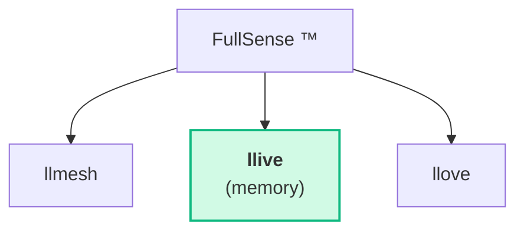
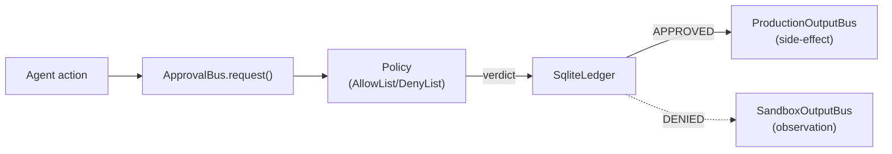
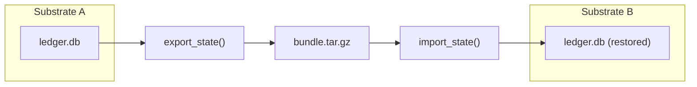
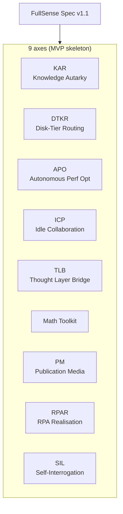

# Qiita Authoring Guide — llive

llive の Qiita 記事に **画像 / Mermaid 図 / アニメ画像** を入れるための実用ガイド。
詳細な手順は llove の同名ガイド ([../../../../llove/docs/qiita/AUTHORING.md](https://github.com/furuse-kazufumi/llove/blob/main/docs/qiita/AUTHORING.md)) に集約済。
本書は **llive 特有の図** に絞ってまとめる。

## llive 特有の図 (Mermaid)

### FullSense family + llive のポジショニング



### Approval Bus (C-1 + C-2)



### Cross-substrate migration (C-3 / §MI1)



### 9 軸 skeleton 全体図



## 画像 URL の生成

### 静的 SVG (llive にはまだ TUI 自体は無いので、Mermaid + 図表示が主)

llive はバックエンドフレームワークなので TUI スクリーンショットは無い。
**アーキ図 (Mermaid)** が中心。

llove 側で生成した demo SVG を「llive を観測する llove demo」として
記事に貼り付ける場合は llove リポジトリの GitHub Raw URL を参照:

```
https://raw.githubusercontent.com/furuse-kazufumi/llove/main/docs/scenarios/svg/<scenario>.svg
```

## Qiita への貼付け例 (llive の章で動きを見せる)

```markdown
## Approval Bus の挙動 (将棋デモ越しに観測)


> `llove demo --scenario=shogi` で起動した TUI に対して、llive の
> ApprovalBus が指し手 (action) ごとに policy 判定をかけ、SqliteLedger
> に永続化する様子が観測できる。
```

## 詳細な手順

- 画像生成 / Mermaid / 容量チューニング / GIF 代替 / 更新ワークフロー →
  [llove/docs/qiita/AUTHORING.md](https://github.com/furuse-kazufumi/llove/blob/main/docs/qiita/AUTHORING.md)
- リポ内 Qiita 投稿マスタ → [qiita-overview.md](qiita-overview.md)
