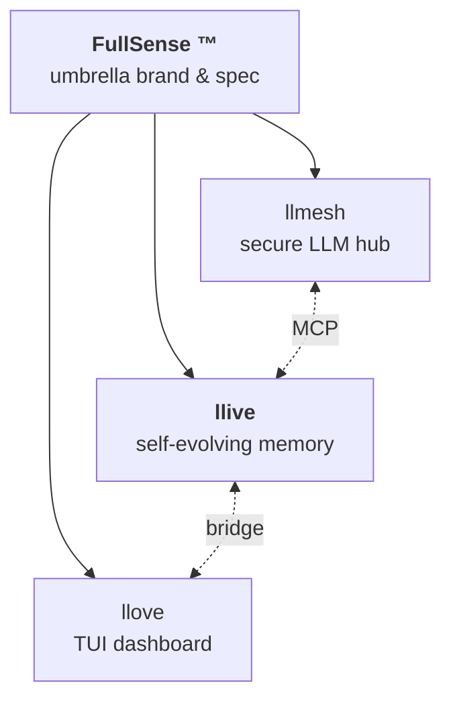
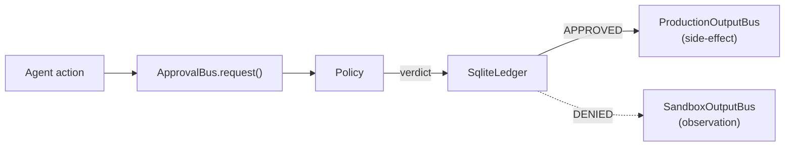

<!--
title: Facing LLM "Forgetting" Head-On — 4-layer memory × formal verification × TRIZ self-evolution × Rust hotpath, all in Python (llive v0.6.0)
tags: Python,LLM,ContinualLearning,FormalVerification,Rust
-->

# Facing LLM "Forgetting" Head-On — 4-layer memory × formal verification × TRIZ self-evolution × Rust hotpath in Python (llive v0.6.0)

> Self-evolving modular memory LLM framework — `pip install llmesh-llive`
> English translation of the [Japanese overview](qiita-overview.md).

## Architecture at a Glance



Approval Bus (v0.6.0 C-1 + C-2):



Full diagrams: <https://furuse-kazufumi.github.io/llive/>

## TL;DR

- **llive** is a research framework that places **four layers of external
  memory** (semantic / episodic / structural / parameter) and a
  variable-length BlockContainer around a fixed Decoder-only LLM core, so
  the agent can absorb new capabilities continually **without retraining the
  core weights**.
- Promotion (any structural change) is gated by **Lean / Z3 / TLA+ formal
  verification before LLM evaluation** — early-detection of failed promotes
  + reduced evaluation cost.
- **TRIZ 40 principles + 39×39 contradiction matrix + ARIZ + 9-window**
  are wired in as a mutation policy. Metric contradictions are detected
  automatically, mapped to TRIZ principles, RAD-grounded, and turned into
  CandidateDiffs end-to-end.
- **v0.6.0 (2026-05-16)** ships dual-license switch (MIT → Apache-2.0 +
  Commercial), 9-axis FullSense Spec skeleton (KAR / DTKR / APO / ICP /
  TLB / Math / PM / RPAR / SIL), production-hardened Approval Bus
  (C-1) + `@govern` ProductionOutputBus (C-2) + Cross-substrate migration
  spike (C-3 §MI1) + CLI. **853 tests / ruff clean**.

```bash
pip install llmesh-llive
```

## Why Memory and Not Just Bigger Context

> "If I show the LLM enough new info via a long context, won't it learn?"

In a single inference: yes. Across sessions: no. The state in the context
window dies when the session dies. Catastrophic forgetting is what stops
LLM adoption in audit-critical fields. llive's bet: keep the core weights
frozen, swap **external memory** in and out, and gate structural changes
through **formal verification + signed audit chain**.

## The Eight Pillars (originals) + One New Axis

1. **Frozen core + variable periphery** — Adapter / LoRA / 4-layer memory
   absorb new capabilities; the Decoder stays.
2. **4-layer memory separation** — semantic / episodic / structural /
   parameter.
3. **Declarative structure** — sub-block sequences in YAML for proposals
   and diffs.
4. **Gated self-evolution** — online does memory writes + light routing;
   structural changes go through offline review.
5. **Biological memory model embedded** — hippocampus–cortex consolidation,
   surprise score, phase transitions.
6. **Promotion behind formal verification** — Lean / Z3 / TLA+ structural
   invariants before LLM eval.
7. **llmesh / llove family integration** — industrial IoT sensors directly
   into episodic memory; HITL inside the TUI.
8. **TRIZ ideation built-in** — 40 principles + matrix + ARIZ + 9-window
   as a mutation policy.
9. **FullSense Spec v1.1 (NEW in v0.6.0)** — 9-axis skeleton (KAR / DTKR
   / APO / ICP / TLB / Math / PM / RPAR / SIL), Conformance Manifest
   holds=24 / violated=0.

## What's New in v0.6.0 (2026-05-16)

- **Approval Bus production** (C-1): Policy abstraction (`AllowList` /
  `DenyList` / `CompositePolicy`) + SQLite persistent ledger (stdlib only).
  `ApprovalBus()` with no args remains backward-compatible.
- **`@govern` + ProductionOutputBus** (C-2): side-effect emit gated by the
  approval bus, with low-level `emit_raw()` + high-level
  `emit_file()` / `emit_mcp_push()` / `emit_llove_push()`. Transport
  injection — `output/` does not depend on any specific MCP / HTTP client.
- **Cross-substrate migration spike** (C-3 §MI1): tar.gz bundles
  (`manifest.json` + ledger DB + JSONL records) port agent state across
  hosts. Ledger replay survives the move. CLI:
  `python -m llive.migration export/import/inspect`.
- **Apache-2.0 + Commercial dual-license** + NOTICE / CONTRIBUTING (DCO) /
  SECURITY / TRADEMARK + SPDX header on 204 .py files.
- **FullSense umbrella brand** — `llmesh / llive / llove` arranged under
  one brand; trademark drafts for JP / US / EU drafted.

## Architecture Diagram in 5 Minutes

The complete picture is on GitHub Pages with Mermaid diagrams:

- FullSense family tree: <https://furuse-kazufumi.github.io/llive/#fullsense-family>
- Approval Bus flow: <https://furuse-kazufumi.github.io/llive/#approval-bus-c-1--c-2>
- Migration bundle flow: <https://furuse-kazufumi.github.io/llive/#cross-substrate-migration-c-3-mi1>

## Why This Stack Will Become Career Capital

- Talking **continual learning** in implementation terms (not slideware).
- Knowing where **formal verification** can short-circuit LLM eval.
- Bridging **biology and CS** by translating consolidation cycles into
  code.
- Bringing **TRIZ 40 principles** — patent-world knowledge — into ML
  mutation policies.
- Operating an **Ed25519 audit chain** that holds up in regulated industries.

These skills appear in interview loops for AI startups, regulated-industry
AI teams, and R&D labs.

## Where to Look Next

- GitHub: <https://github.com/furuse-kazufumi/llive>
- PyPI: <https://pypi.org/project/llmesh-llive/>
- Pages: <https://furuse-kazufumi.github.io/llive/>
- Family portal (planned): <https://furuse-kazufumi.github.io/fullsense/>
- LinkedIn (en): [v0.4 overview](../linkedin/post_2026-05-14_overview.en.md) /
  [v0.6 update](../linkedin/post_2026-05-16_update.en.md)

OSS. Apache-2.0 + Commercial dual. If you're dealing with the LLM
adoption gap in regulated industries, treat this as a discussion
template — the implementation is there to point at.

> GitHub: <https://github.com/furuse-kazufumi/llive>
> PyPI: `pip install llmesh-llive`

---

## Appendix — 2026-05-16 update (v0.6.0)

After publishing the Japanese version, the project shipped:

- 9-axis skeleton complete (KAR / DTKR / APO / ICP / TLB / Math / PM /
  RPAR / SIL), Conformance Manifest holds=24 / violated=0
- Approval Bus production (Policy + SQLite Ledger) + `@govern` +
  ProductionOutputBus + Cross-substrate migration spike + CLI
- MIT → Apache-2.0 + Commercial dual-license switch
- FullSense umbrella + trademark drafts (JP/US/EU, Wave 1 + Wave 2)
- 17 demo scenarios × ja/en = 34 SVG snapshots + 5 animated SVGs (shogi /
  mindmap / rag / chat / bench)
- 853 tests / ruff clean

For details: `docs/linkedin/post_2026-05-16_update.en.md`.
