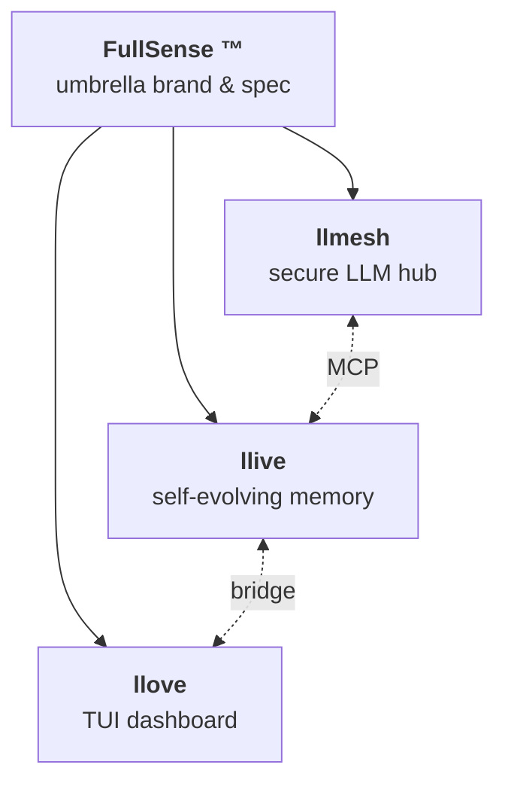
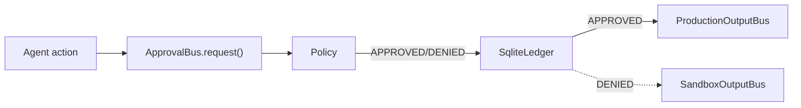

<!--
title: LLM 의 「망각」에 정면으로 마주하기 — 4 층 메모리 × 형식 검증 × TRIZ 자기 진화 × Rust 핫패스를 Python 으로 구현한 이야기 (llive v0.5.0)
tags: Python,LLM,ContinualLearning,FormalVerification,Rust
-->

# LLM 의 「망각」에 정면으로 마주하기 — 4 층 메모리 × 형식 검증 × TRIZ 자기 진화 × Rust 핫패스를 Python 으로 구현한 이야기 (llive v0.5.0)

> Self-evolving modular memory LLM framework — `pip install llmesh-llive`

## 아키텍처 개관 (FullSense family + Approval Bus + Migration)



Approval Bus 경로 (v0.6.0 C-1 + C-2):



상세 그림은 GitHub Pages (<https://furuse-kazufumi.github.io/llive/>) 참조. 기사 갱신 시 각 Phase 의 그림 / SVG / 애니메이션 이미지를 첨부할 방침 (상세: [AUTHORING.md](AUTHORING.md)).

## TL;DR

- **llive** 는, 고정 LLM 코어 주위에 **4 층 외부 기억** (semantic / episodic / structural / parameter) 과 **가변 길이 BlockContainer** 를 배치하여, 코어 가중치를 재학습하지 않고 능력을 지속적으로 받아들이는 Python 프레임워크.
- promotion (구조 변경) 은 **Lean / Z3 / TLA+ 에 의한 형식 검증** 을 LLM 평가보다 먼저 통과시킨다. 이것만으로 promote 실패의 조기 검출과 평가 비용 삭감이 가능하다.
- **TRIZ 40 원리 + 39×39 모순 매트릭스 + ARIZ + 9 화법** 을 mutation policy 로서 구현. 메트릭의 모순을 자동 검출 → 원리 매핑 → CandidateDiff 생성까지 자율 동작.
- **v0.5.0** (2026-05-14) 에서 Phase 5 first wire-in 을 달성. Rust kernel 을 핫패스 (`compute_surprise` / 시간 감쇠) 에 접속하고, Python fallback 과 **1e-6 parity** 를 보증. **444 tests / 0 lint**.
- v0.3.0 에서 Phase 3 (Controlled Self-Evolution MVR) + Phase 4 (Production Security MVR) 를 동시 릴리스, Ed25519 서명 adapter + SHA-256 audit chain 완비.
- 리포지토리: <https://github.com/furuse-kazufumi/llive> / PyPI: `pip install llmesh-llive`

```bash
pip install llmesh-llive            # core (cryptography 동봉)
pip install llmesh-llive[torch]     # HF transformers + faiss + peft + hdbscan
pip install llmesh-llive[verify]    # Z3 SMT 검증 레이어 (EVO-04)
```

---

## 왜 만들었는가

LLM 을 제품에 통합할수록 부딪히는 벽:

> 새로운 지식을 학습시키면, 어쩐 일인지 기존의 판단 기준이 무너진다.

이것은 **catastrophic forgetting (파국적 망각)** 이라고 불리며, 규제 산업·감사 필수 환경에서 AI 활용이 멈추는 가장 큰 이유 중 하나. 「거대한 LLM 코어를 재학습하지 않고, 지속적으로 능력을 흡수하는 설계 문제」로 번역하여 진행하고 있는 것이 `llive` 입니다.

## 설계의 핵심

### 1. 고정 코어 + 가변 주변

Decoder-only LLM 코어는 동결. 능력 흡수는 다음의 주변 컴포넌트가 담당.

| 층 | 담당 |
|---|---|
| Adapter / LoRA | 함수적 fine-tune |
| 4 층 외부 기억 | 지식·경험·관계·차분 가중치 |
| BlockContainer (가변 길이) | 구조적 능력 확장 |

### 2. 4 층 메모리의 책임 분리

```
semantic      ─ 지식 (사실·개념·정의)
episodic      ─ 경험 (시계열 이벤트, surprise score 부여)
structural    ─ 관계 (그래프, 의존, 참조)
parameter     ─ 차분 가중치 (Adapter / LoRA / 부분 fine-tune)
```

쓰기는 **surprise-gated** — 코어 LLM 이 예측 가능한 평범한 것은 쓰지 않는다.

### 3. 선언적 구조 기술 (YAML)

```yaml
container:
  name: erp_v3
  blocks:
    - kind: lora
      target: q_proj,v_proj
      rank: 16
    - kind: memory_router
      to: semantic
      hint: "ERP 업무 지식"
```

AI 자신이 이를 **제안·비교하기 쉬운 단위** 로 만들고 있다.

### 4. 형식 검증 부착 promotion

여기가 다른 지속 학습계와의 최대 차이. promote (구조 변경) 를 본격 반영하기 전에,

1. **Quarantined zone** 에서 shadow run
2. **Lean / Z3 / TLA+** 로 구조적 불변량을 증명
3. 그 후 LLM 평가 (eval 스위트)

를 돌린다. 형식 검증으로 **먼저 튕길 수 있는 promote** 는, LLM 평가를 돌리지 않고 끝낼 수 있다. 이것은 검증 시간과 GPU 비용 양쪽에 효과가 있다.

### 5. 생물학적 기억 모델 직접 내장

해마 - 피질 consolidation cycle 을 의사적으로 구현:

| 이벤트 | 동작 |
|---|---|
| episodic write 축적 | 단기 기억 누적 |
| consolidation cycle (주기 실행) | semantic / structural 으로 승화 |
| phase transition 검지 | 대규모 재구성의 트리거 |

### 6. TRIZ Self-Reflection (40 원리 mutation)

llive 내에서 「메트릭의 모순」이 관측되면, TRIZ 모순 매트릭스에서 **개선하는 파라미터 × 악화하는 파라미터** 로 원리를 인용한다.

예: BWT (오래된 지식 보유) vs 신규 태스크 학습 속도 → TRIZ #1 「분할」/ #15 「동적성」/ #35 「파라미터 변경」 등.

이를 mutation policy 로서 CandidateDiff 로 변환하고, Quarantined zone 에서 평가한다.

### 7. Failed Reservoir + Reverse-Evo Monitor

- **Failed Reservoir**: 과거의 실패 promote 를 「학습 데이터」 로서 재이용. 같은 패턴으로 실패하지 않도록 한다.
- **Reverse-Evo Monitor**: 본격 BWT 열화를 검지하면, 이전 버전 서명 완료 adapter 를 rollback 후보로 내놓는다 (auto-promote 는 하지 않는다, 인간 approve 필수).

### 8. Ed25519 + SHA-256 audit chain

| 무엇을 | 어떻게 지키는가 |
|---|---|
| adapter promote | release_manager 의 Ed25519 키로 서명 |
| 전 inference / memory write / model change | SHA-256 chain 에 append |
| audit verify | `llive audit verify` 로 전 기간 체인 정합 검증 |

이로써 FDA 21 CFR Part 11 / J-SOX / 바젤 III 에 대한 **구현 기반의 설명 자료** 가 갖춰진다.

---

## 구현에서 주의한 것

### Z3 를 「LLM 평가보다 먼저 끼워 넣는」 설계의 효능

LLM 평가는 느리고 비싸다. Z3 로 먼저 정적 검증함으로써,

- 구조적으로 모순되는 promote 를 **GPU 를 돌리기 전에 튕길 수 있다**
- 형식 검증 fail 의 메시지는 LLM 평가 fail 보다 **인간에게 설명하기 쉽다**
- 규제 측에도 「자동 검증으로 stop 했다」 라고 명확히 말할 수 있다

### TRIZ × LLM 의 조합

「LLM 이 브레인스토밍하면 된다」 라고 마무리하기 쉽지만, TRIZ 는 **과거 100 만 건 이상의 특허** 에서 추출된 모순 해결의 지식. LLM 의 즉흥보다 체계성에서 이기는 장면이 많다.
RAD 코퍼스 (본 프레임워크 내장) 와 접속함으로써 「TRIZ #15 동적성을 사용한 전례가, 의료 AI 영역에서도 n 건 있다」 라는 뒷받침이 가능하다.

### 병행 파이프라인의 분리

온라인 경로 (memory write + 가벼운 routing) 와, 오프라인 경로 (구조 변경 promote) 를 엄밀히 나눴다. 레이턴시 예산과 안전 경계 양쪽이 깔끔해진다.

---

## 숫자로 보는 현재 위치 (2026-05-14)

- **v0.5.0** Phase 5 first wire-in (Rust kernel 핫패스 접속)
- **444 tests / 0 lint** (v0.4.0 baseline 439 + RUST-03 parity 5)
- v0.4.0 에서 Rust skeleton (PyO3 0.22 + Cargo workspace + RUST-13 parity harness) 을 확립
- v0.5.0 에서 `BayesianSurpriseGate (MEM-07)` 의 `compute_surprise` 를 **Rust 경로로 자동 위임** (부재 시 numpy fallback, 1e-6 parity)
- v0.3.0 까지 Phase 3 (Controlled Self-Evolution) + Phase 4 (Production Security) 완료 (429 tests / 98% coverage)
- 기능: Z3 정적 검증 / Failed Reservoir / Reverse-Evo Monitor / TRIZ Self-Reflection / Ed25519 Signed Adapter / SHA-256 Audit Chain / Rust kernel
- [Unreleased]: F25 (g) `LoveBridge` writer — llive ↔ llmesh ↔ llove 를 MCP 경유로 접속하는 shim 추가
- 다음: Phase 5 잔여 (RUST-02 rayon 병렬, RUST-05〜11) 를 의미론 고정 후에 단계 착수

---

## 패밀리 구성

`llive` 는 단독으로도 사용할 수 있지만, 패밀리로 조합하면 진가가 발휘됩니다.

| 프로덕트 | 역할 |
|---|---|
| **llive** (본 기사) | 자기 진화형 모듈식 기억 LLM |
| **llmesh** | 시큐어 LLM 허브 (온프레미스 MCP 서버 + 프라이버시 필터) |
| **llove** | TUI dashboard (BWT / 감사 / 개념 그래프를 관측) |

상세는 각각의 리포지토리를 참조.

---

## 정리

- LLM 의 「망각」은 실제 운용의 본진. **코어 고정 + 주변 가변** 으로 임하면, 재학습 비용과 컴플라이언스 문제 양쪽이 내려간다.
- promote 전에 **Z3 / Lean / TLA+** 를 끼워 넣는 것만으로, LLM 평가 비용과 리스크가 크게 줄어든다.
- TRIZ 를 mutation policy 로 만들면, 브레인스토밍이 아닌 **체계적인 모순 해결** 로서 지속 학습을 돌릴 수 있다.

OSS 이므로, 규제 산업의 AI 적용 지점에서 곤란한 분은, 부디 구현을 둘러보고 논의의 발판으로 사용해주세요.

> GitHub: <https://github.com/furuse-kazufumi/llive>
> PyPI: `pip install llmesh-llive`

---

## 추보 — 2026-05-16 update (v0.6.0)

집필 후 2 일 만에 큰 진전이 있었으므로, 여기에 짧게 덧붙입니다.

- **9 축 skeleton 완성** — KAR / DTKR / APO / ICP / TLB / Math / PM / RPAR / SIL 의 9 축을 최소 구현, Conformance Manifest holds=24 / violated=0
- **Approval Bus production 화** — `policy` (AllowList/DenyList/CompositePolicy) + stdlib `sqlite3` 의 영속 ledger, 하위 호환 유지
- **MIT → Apache-2.0 + Commercial 의 dual-license 로 전환** — OSS 이용에는 명시적 특허 grant + 상용 전개의 여지 확보
- **권리 관계 파일 일괄 정비** — NOTICE / CONTRIBUTING (DCO 1.1) / SECURITY / TRADEMARK + 전 204 .py 에 SPDX header
- **815 tests / ruff clean** (v0.5.0 444 + 371 추가)

라이선스 변경은 v0.6.0 부터. v0.5.x 까지는 MIT 그대로 계속됩니다. 상세한 경위는 `docs/linkedin/post_2026-05-16_update.ja.md` 를 참조.
