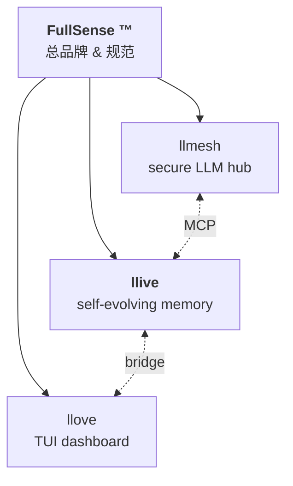
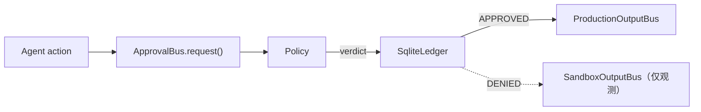

<!--
title: 正面应对 LLM「遗忘」— 4 层记忆 × 形式验证 × TRIZ 自演化 × Rust 热路径，Python 实现（llive v0.6.0）
tags: Python,LLM,持续学习,形式验证,Rust
-->

# 正面应对 LLM「遗忘」— 4 层记忆 × 形式验证 × TRIZ 自演化 × Rust 热路径，Python 实现（llive v0.6.0）

> Self-evolving modular memory LLM framework — `pip install llmesh-llive`
> 本文是 [日文版](qiita-overview.md) 的中文翻译。

## 架构一览



Approval Bus（v0.6.0 C-1 + C-2）：



完整图：<https://furuse-kazufumi.github.io/llive/>

## TL;DR

- **llive** 在固定的 Decoder-only LLM 核心周围，配置 **4 层外部记忆**
  （semantic / episodic / structural / parameter）和可变长 BlockContainer，
  让 Agent **无需重新训练核心权重** 也能持续吸收新能力。
- 任何 promotion（结构变更）先通过 **Lean / Z3 / TLA+ 形式验证**，再交给
  LLM 评估 — 早期检测失败的 promote + 降低评估成本。
- **TRIZ 40 原理 + 39×39 矛盾矩阵 + ARIZ + 9 画法** 作为变异策略写入代码。
  指标矛盾自动检测 → 原理映射 → RAD 支撑 → 生成 CandidateDiff 全自动。
- **v0.6.0**（2026-05-16）发布 dual-license 切换（MIT → Apache-2.0 +
  Commercial）、9 轴 FullSense Spec skeleton（KAR / DTKR / APO / ICP /
  TLB / Math / PM / RPAR / SIL）、production-hardened Approval Bus（C-1）+
  `@govern` ProductionOutputBus（C-2）+ Cross-substrate migration spike
  （C-3 §MI1）+ CLI。**853 tests / ruff clean**。

```bash
pip install llmesh-llive
```

## 为什么是「记忆」不是「更大上下文」

> "用很长 context 灌入新信息，LLM 不就学到了吗？"

单次推理：是。跨会话：不是。Context 一旦消失，状态也消失。Catastrophic
forgetting 正是受监管行业 LLM 落地难的核心原因之一。llive 的赌注是：
**核心权重冻结，外部记忆动态切换，结构变更全部走形式验证 + 签名审计链**。

## 8 个原柱 + 1 个新轴

1. **冻结核心 + 可变周边** — Adapter / LoRA / 4 层记忆吸收新能力；Decoder
   不动
2. **4 层记忆责任分离** — semantic / episodic / structural / parameter
3. **声明式结构** — sub-block 序列以 YAML 表达，便于提案与 diff
4. **审批驱动的自演化** — 在线只做 memory write + 轻 routing；结构变更走
   离线审查
5. **生物学记忆模型嵌入** — 海马-皮质 consolidation、surprise score、相变
6. **形式验证关卡 + promotion** — Lean / Z3 / TLA+ 结构不变量检查先于 LLM
   评估
7. **llmesh / llove 家族集成** — 工业 IoT 传感器直接进入 episodic memory；
   HITL 在 TUI 内完成
8. **TRIZ 内置** — 40 原理 + 矩阵 + ARIZ + 9 画法
9. **FullSense Spec v1.1（v0.6.0 新增）** — 9 轴 skeleton（KAR / DTKR /
   APO / ICP / TLB / Math / PM / RPAR / SIL）、Conformance Manifest
   holds=24 / violated=0

## v0.6.0 的新功能（2026-05-16）

- **Approval Bus production**（C-1）：Policy 抽象（`AllowList` /
  `DenyList` / `CompositePolicy`）+ SQLite 持久化 ledger（仅 stdlib）。
  `ApprovalBus()` 不带参数完全保持向后兼容。
- **`@govern` + ProductionOutputBus**（C-2）：副作用 emit 经过 approval bus
  门控；低层 `emit_raw()` + 高层 `emit_file()` / `emit_mcp_push()` /
  `emit_llove_push()`。Transport 注入式，`output/` 不直接依赖任何具体 MCP /
  HTTP client。
- **Cross-substrate migration spike**（C-3 §MI1）：tar.gz bundle
  （`manifest.json` + ledger DB + JSONL records）跨主机搬运 agent state。
  Ledger replay 在迁移后保持一致。CLI：
  `python -m llive.migration export/import/inspect`。
- **Apache-2.0 + Commercial 双授权** + NOTICE / CONTRIBUTING（DCO）/
  SECURITY / TRADEMARK + SPDX header 写入 204 个 .py 文件。
- **FullSense 总品牌** — `llmesh / llive / llove` 在同一品牌下层级化；
  JP / US / EU 商标 draft 已起草。

## 5 分钟看完架构

完整图在 GitHub Pages 上（Mermaid 已渲染）：

- FullSense family tree：<https://furuse-kazufumi.github.io/llive/#fullsense-family>
- Approval Bus flow：<https://furuse-kazufumi.github.io/llive/#approval-bus-c-1--c-2>
- Migration bundle flow：<https://furuse-kazufumi.github.io/llive/#cross-substrate-migration-c-3-mi1>

## 这一套是怎么累积成职业资本的

- 用实现层面（而非幻灯片层面）讨论 **持续学习**
- 知道 **形式验证** 能在哪里短路 LLM 评估
- 把生物学的 consolidation cycle 翻译成代码
- 把 **TRIZ 40 原理** —— 专利世界的知识 —— 带入 ML 的变异策略
- 运营在受监管行业能站住脚的 **Ed25519 审计链**

这些技能在 AI 创业团队、受监管行业 AI 团队、研究开发 lab 的面试 loop 里
都会被问。

## 接下来去看哪里

- GitHub：<https://github.com/furuse-kazufumi/llive>
- PyPI：<https://pypi.org/project/llmesh-llive/>
- Pages：<https://furuse-kazufumi.github.io/llive/>
- Family portal（计划中）：<https://furuse-kazufumi.github.io/fullsense/>
- LinkedIn（中文）：[v0.4 overview](../linkedin/post_2026-05-14_overview.zh.md) /
  [v0.6 update](../linkedin/post_2026-05-16_update.zh.md) /
  [v0.6 v2 update](../linkedin/post_2026-05-16_update_v2.zh.md)

OSS。Apache-2.0 + Commercial 双授权。如果你正卡在受监管行业的 LLM 落地
gap，把这个 repo 当讨论模板用 —— 实现摆在那里，可以直接指着看。

> GitHub：<https://github.com/furuse-kazufumi/llive>
> PyPI：`pip install llmesh-llive`

---

## 附录 — 2026-05-16 update（v0.6.0）

日文版发布后，项目又推进了：

- 9 轴 skeleton 完成（KAR / DTKR / APO / ICP / TLB / Math / PM / RPAR /
  SIL），Conformance Manifest holds=24 / violated=0
- Approval Bus production（Policy + SQLite Ledger）+ `@govern` +
  ProductionOutputBus + Cross-substrate migration spike + CLI
- MIT → Apache-2.0 + Commercial 双授权切换
- FullSense umbrella + 商标 draft（JP/US/EU，Wave 1 + Wave 2）
- 17 个 demo scenario × ja/en = 34 SVG snapshot + 5 个 animated SVG
  （shogi / mindmap / rag / chat / bench）
- 853 tests / ruff clean

详细：`docs/linkedin/post_2026-05-16_update.zh.md` /
`post_2026-05-16_update_v2.zh.md`。
