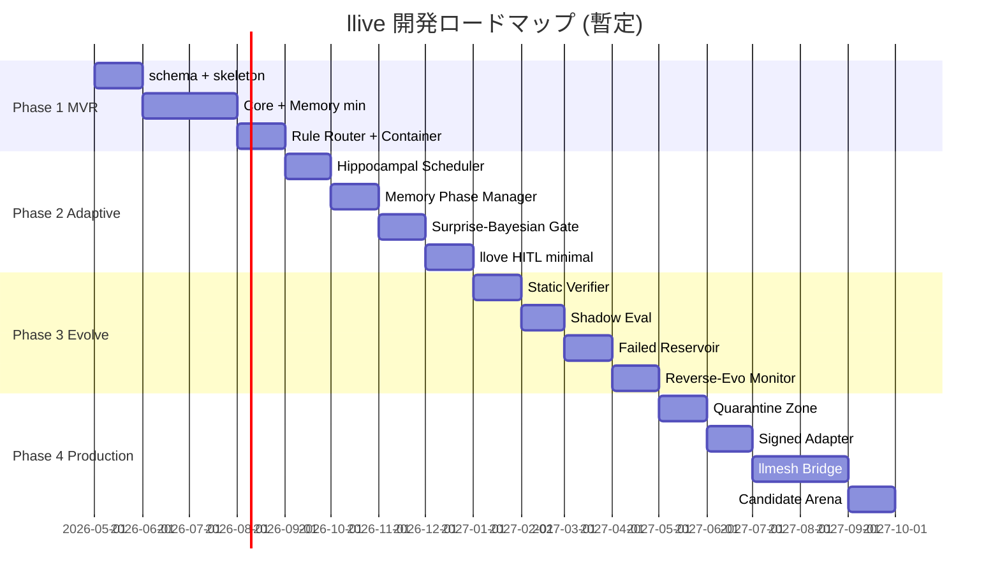

# llive ロードマップ

> v0.2 拡充版。Phase 1-4 を更に細分化し、各 milestone と llmesh / llove ファミリーとの統合点を時系列に配置。

## マイルストーン概観

## Phase 1: Minimal Viable Research Platform (MVR)

**Goal**: 1 つの ContainerSpec を読み込み、semantic + episodic memory と connect、A/B candidate 評価が走る最小研究基盤。

### Milestones

- **M1.1 Schema + Skeleton (1M)**
  - 全 YAML スキーマ確定 (`yaml_schemas.md`)
  - ディレクトリ構造 + Hexagonal layout 確立
  - JSON Schema validator 実装
  - CLI スケルトン (`llive --help`)
- **M1.2 Core Model + Memory (2M)**
  - HF Adapter (Qwen / Llama 系)
  - Semantic memory (Qdrant or Faiss)
  - Episodic memory (DuckDB)
  - Provenance 付き write
- **M1.3 Router + Container Engine (1M)**
  - Rule-based router (≥ 2 経路)
  - BlockContainerEngine + sub-block registry
  - 5 種類の sub-block 実装 (`pre_norm`, `causal_attention`, `memory_read`, `ffn`, `memory_write`)
- **M1.4 Single Candidate Eval (1M)**
  - CandidateDiff apply / invert
  - smoke bench harness
  - 受け入れ基準 (v0.1 § 受け入れ基準) クリア

**Acceptance**: PoC として 1 タスクで `baseline → candidate → A/B` が回り、route trace と memory link が JSON で出力できる。

## Phase 2: Adaptive Modular System

**Goal**: 4 層メモリ + surprise-gated write + consolidation cycle + llove TUI 最小可視化を完成。

### Milestones

- **M2.1 Structural + Parameter Memory**
  - Kùzu (graph) + filesystem-backed adapter store
  - Adapter bank + LoRA switch sub-block
- **M2.2 Hippocampal Consolidation Scheduler (FR-12)**
  - 夜間 batch + low-load 自動検知
  - replay selector + LLM 要約 + semantic write
- **M2.3 Memory Phase Manager (FR-16)**
  - phase transition rules + scheduler
  - HITL レビューポイント (TUI から trigger)
- **M2.4 Surprise-Bayesian Write Gate (FR-21)**
  - Variational ensemble の surprise estimator
  - 動的 θ
- **M2.5 llove TUI HITL minimal**
  - route trace pane
  - memory link viz pane
  - approve/deny コマンド

**Acceptance**: 連続 5 タスク学習で BWT ≥ -1% を達成、route entropy が一定範囲内、TUI 上で全推論を可視化。

## Phase 3: Controlled Self-Evolution

**Goal**: AI candidate generation + 形式検証 gate + shadow eval + failed reservoir で安全な自己進化。

### Milestones

- **M3.1 Static Verifier Layer (FR-13)**
  - YAML diff → Z3 不変量変換
  - context length / hidden_dim 保存性 / 因果性
- **M3.2 Multi-precision Shadow Evaluation (FR-14)**
  - INT8 / 4bit 並列評価
  - 上位 N% のみ FP16 本評価
- **M3.3 Failed-Candidate Reservoir (FR-15)**
  - `candidate_episodic_memory`
  - mutation policy への学習データ供給
- **M3.4 Reverse-Evolution Monitor (FR-22)**
  - forgetting 悪化方向の自動 rollback
  - Memento snapshot + Saga 補償
- **M3.5 Population-based Search (EP-04)**
  - 並列候補プール
  - 多目的 Pareto 探索

**Acceptance**: 自動 mutation で 5 世代回し、candidate acceptance rate ≥ 20%, rollback rate ≤ 10%, BWT 悪化 0 回。

## Phase 4: Multimodal / Production PoC

**Goal**: llmesh 産業 IoT 直結、署名付き adapter P2P、llove Candidate Arena で本番運用 PoC。

### Milestones

- **M4.1 Quarantined Memory Zone (FR-17)**
  - zone 別 backend + cross-zone read 制御
  - Proxy パターンで access wrapper
- **M4.2 Signed Adapter Marketplace (FR-18)**
  - Ed25519 + SBOM
  - publisher 鍵管理 + trust roots
- **M4.3 llmesh Sensor Bridge (FR-19)**
  - MQTT / OPC-UA → episodic write
  - MTEngine / XbarRChart / CUSUM 統合
  - llmesh フェアネス機構との連携
- **M4.4 Candidate Arena (FR-20)**
  - llove F16 抽象の流用
  - Elo / TrueSkill ranking
  - 継続学習対局シナリオ
- **M4.5 Production Hardening**
  - mTLS / OIDC
  - audit log + 監査チェイン
  - SLA + 監視

**Acceptance**: 産業 IoT 模擬環境で 30 日連続稼働、forgetting 監視で人手介入ゼロ、HITL UI で 50 件 candidate を捌ける。

## llmesh / llove ファミリーとの統合タイミング

| Phase | llmesh 統合 | llove 統合 |
|---|---|---|
| 1 | — | — |
| 2 | — | TUI 最小可視化 (M2.5) |
| 3 | — | Memory viz 充実 |
| 4 | Sensor Bridge + 署名 P2P (M4.3) | Candidate Arena 完全版 (M4.4) |

llmesh-suite メタパッケージへの **llive 追加** は Phase 4 完了時点（PyPI `llmesh-llive` v0.4.0）を想定。

## Phase 5: Rust Acceleration Layer (v0.5.0)

**Goal**: Python 純粋実装で意味論を凍結したうえで、ホットパス (Bayesian surprise / edge weight bulk decay / Jaccard / schema validate / audit sink / TRIZ matrix) を PyO3 + maturin で Rust 化、5× 以上の高速化を達成。

### Milestones

- **M5.1 Rust Extension Skeleton** — `crates/llive_rust_ext/`、maturin ビルド統合、`[rust]` extra 分離 (RUST-01)
- **M5.2 Numeric Kernels** — surprise compute / edge decay / Jaccard / cosine (RUST-02/03/04)
- **M5.3 Schema + Audit + TRIZ** — jsonschema-rs / crossbeam audit sink / phf TRIZ matrix (RUST-05/06/10)
- **M5.4 Wheel CI Matrix** — Linux/macOS/Windows × x86_64/arm64 cross-build (RUST-12)
- **M5.5 Parity + Benchmark Harness** — Hypothesis + proptest parity, pytest-benchmark + criterion (RUST-13/14)

**Acceptance**: `pip install llmesh-llive[rust]` 全 OS 成功 / Rust 拡張 ON/OFF 両方で 308 tests 全通過 / 5 ベンチで 5× 以上の改善。

## Phase 6: Formal Verification × Rust Bridge (v0.6.0)

**Goal**: Phase 3 で立ち上がる Static Verifier (FR-13) を Rust 側で本格運用、ChangeOp engine の bit-exact Rust 移植で formal-verification gate を完成。

### Milestones

- **M6.1 ChangeOp Rust Migration** — invert / apply / compose、proptest 100k 件 parity (RUST-07)
- **M6.2 Z3 SMT Bridge** — `z3.rs` ラッパー、context lifecycle Rust 管理 (RUST-11)
- **M6.3 Optional HNSW Backend** — hora / arroy で Faiss-CPU 依存緩和 (RUST-08)

**Acceptance**: Phase 3 EVO テストが Rust ON/OFF で同一結果 / Z3 verifier latency 50% 削減。

## Phase 7: Concurrency Reimagined (v0.7.0)

**Goal**: GIL 律速の ThreadPoolExecutor を tokio + pyo3-async-runtimes に置換、CONC-04 snapshot reads と統合。

### Milestones

- **M7.1 Async Pipeline Executor** — tokio ベースの並行ランタイム、Python `asyncio.Future` 橋渡し (RUST-09)
- **M7.2 Snapshot Isolation** — `Arc<Snapshot>` で CONC-04 を自然実装

**Acceptance**: 16-task fan-out で P99 latency 改善 / CONC-04 が Rust 側で動作。

## バージョニング戦略

- `0.0.x`: Phase 0 (完了), scaffolding
- `0.1.x`: Phase 1 完了
- `0.2.x`: Phase 2 完了
- `0.3.x`: Phase 3 完了
- `0.4.x`: Phase 4 完了
- `0.5.x`: Phase 5 完了 (Rust numeric/audit hotspots)
- `0.6.x`: Phase 6 完了 (Rust formal verification bridge)
- `0.7.x`: Phase 7 完了 (Rust async concurrency)
- `1.0.0`: production PoC 合格 (全フェーズ収束、llove F18 v2.0 と同期可能)

## リスクと先送り判断

| リスク | 影響 | 対応 |
|---|---|---|
| 形式検証の表現力不足 | Phase 3 遅延 | 先に "structural invariant only" モードで開始、複雑制約は後送り |
| llmesh の API 変更 | Phase 4 遅延 | Adapter + Bridge で抽象化、direct binding 禁止 |
| GPU 資源逼迫 | Phase 2-3 遅延 | TinyML / shadow eval を強化、CPU でも回せる subset を確保 |
| 大規模 forgetting bench の dataset 不足 | Phase 2 遅延 | 既存 CL benchmark (CLOC, CORE50 等) を流用 |

## オープンクエスチョン

- [ ] base model のデフォルト選定 (Qwen2.5-7B / Llama-3.1-8B / Phi-3.5)
- [ ] semantic memory backend の本命 (Qdrant vs Weaviate vs pgvector)
- [ ] graph backend の本命 (Kùzu vs Neo4j)
- [ ] structural memory のスキーマ汎用化レベル
- [ ] llmesh fairness 機構の最適な adapter 化方法

## v0.2.x 横断エピック: RAD 知識庫 + 外部 LLM 連携

Phase 1 MVR と並走する横断エピック。生物学的記憶モデルの semantic 出口に Raptor RAD を
接続し、Ollama / LM Studio / Claude Desktop / Open WebUI から MCP 経由で呼び出せる
**ローカルファースト記憶 LLM** として実用化する。VLM とコーディング特化 LLM も視野。

### Epic RAD-A. 取り込み層 (`data/rad/` + `scripts/import_rad.py`) — 完了 2026-05-15

- 49 分野・44,864 docs・~112 MB を `data/rad/<分野>_v2/` に物理コピー
- stdlib のみ、サイズ + mtime 差分、`--mirror` で削除も同期
- `_index.json` メタ生成、`_learned/` 書き層を予約

### Epic RAD-B. 知識庫 API (`src/llive/memory/rad/`) — 完了 2026-05-15

- **B.1 RadCorpusIndex (読み)**: `loader.py` / `query.py` / `skills.py`
  - 環境変数 `LLIVE_RAD_DIR` → `RAPTOR_CORPUS_DIR` → `data/rad/` の解決
  - corpus2skill 階層スキル (`INDEX.md` + `metadata.json`) があれば優先
  - キーワード + ファイル名 + 軽量 grep の段階検索
- **B.2 書き層 (`append_learning`)**: `_learned/<分野>/<doc-id>.md` + `provenance.json`
  - 生物学的記憶モデル (`semantic.py` / `consolidation.py`) からの書き戻し経路
  - episodic → consolidation → semantic → RAD 書き戻し
- **B.3 Consolidator 統合**: `Consolidator(rad_index=...)` → ConceptPage が
  自動的に `_learned/<page_type>/<concept_id>.md` にミラー、出典は
  `derived_from=[event_ids]` で生イベントへ追跡可能 (LLW-AC-01 維持)
- **B.4 テスト**: `tests/unit/test_rad.py` (25 cases) +
  `test_consolidation_rad_mirror.py` (4 cases)

### Epic RAD-C. 外部 LLM 連携 — 進行中

- **C-1 LLM backend abstraction** — `src/llive/llm/backend.py`
  - OpenAI 互換 / Anthropic / Ollama / llama-cpp の薄いアダプタ
  - **VLM 対応**: LLaVA / Qwen2.5-VL / Phi-3.5-vision / Llama 3.2 Vision (multimodal 入力)
  - **コーディング特化**: Qwen2.5-Coder / DeepSeek-Coder / Code Llama
- **C-2 MCP server** — `src/llive/mcp/server.py` — 完了 2026-05-15
  - tools: `list_rad_domains`, `get_domain_info`, `query_rad`, `read_document`,
    `append_learning` (`tools.py` で transport-independent な純 Python 実装)
  - 接続先: Claude Desktop / LM Studio / Open WebUI / Cursor / Continue.dev
  - pyproject: `[mcp]`, `[vlm]`, `[coding]` extras 追加
- **C-2.1 拡張 tool (後続)**: VLM (`vlm_describe_image`) +
  coding (`code_complete`, `code_review`) + memory (`recall_memory`)
- **C-3 OpenAI 互換 HTTP server (任意)** — Ollama 等が直接 llive を呼べる

### マイルストーン (SemVer に占有させず名前付き)

注意: 主軸 SemVer は Phase 1-7 に予約済 (`0.2.x = Phase 2 完了`, etc.) のため、
RAD エピックは横断的な作業として独立に扱い、リリースに混ぜる際は
build メタ (`+rad-a`, `+rad-b`) で識別する。SemVer 番号は占有しない。

- ✓ **RAD-A**: 取り込み層 (完了)
- ✓ **RAD-B.1-B.4**: 知識庫 API + Consolidator 統合 (完了)
- ✓ **RAD-C-2**: MCP server (基本 tool 5 つ完了)
- ⧖ **RAD-C-1**: LLM backend abstraction (text → VLM → coding)
- □ **RAD-C-2.1**: VLM / coding / recall_memory tool 拡張
- □ **RAD-C-3**: OpenAI 互換 HTTP server (Ollama 直叩き)

### 受け入れ基準

- ✓ RAD-A: `py -3.11 scripts/import_rad.py` で 49 分野コピー完了、`_index.json` 生成
- ✓ RAD-B: `RadCorpusIndex.query("buffer overflow", domain="security_corpus_v2")`
  で関連 doc 返却、Consolidator が `_learned/<page_type>/` に書き戻し
- ✓ RAD-C-2: Claude Desktop の MCP 設定で llive サーバを登録、`query_rad` tool が動く
- □ RAD-C-1: Ollama (Qwen2.5-VL) で画像入力 + RAD クエリが連携
