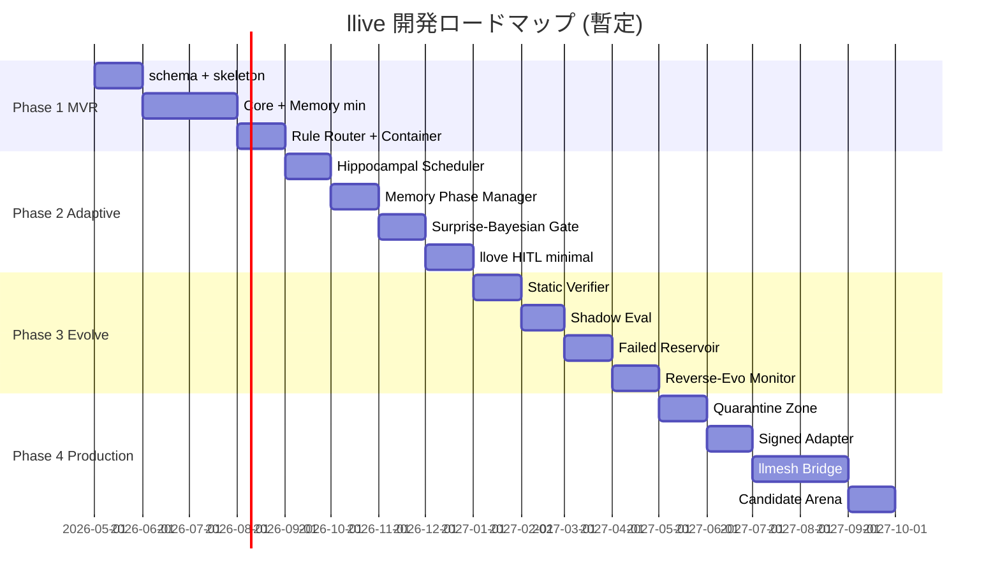

# llive ロードマップ

> v0.2 拡充版。Phase 1-4 を更に細分化し、各 milestone と llmesh / llove ファミリーとの統合点を時系列に配置。

## マイルストーン概観

## Phase 1: Minimal Viable Research Platform (MVR)

**Goal**: 1 つの ContainerSpec を読み込み、semantic + episodic memory と connect、A/B candidate 評価が走る最小研究基盤。

### Milestones

- **M1.1 Schema + Skeleton (1M)**
  - 全 YAML スキーマ確定 (`yaml_schemas.md`)
  - ディレクトリ構造 + Hexagonal layout 確立
  - JSON Schema validator 実装
  - CLI スケルトン (`llive --help`)
- **M1.2 Core Model + Memory (2M)**
  - HF Adapter (Qwen / Llama 系)
  - Semantic memory (Qdrant or Faiss)
  - Episodic memory (DuckDB)
  - Provenance 付き write
- **M1.3 Router + Container Engine (1M)**
  - Rule-based router (≥ 2 経路)
  - BlockContainerEngine + sub-block registry
  - 5 種類の sub-block 実装 (`pre_norm`, `causal_attention`, `memory_read`, `ffn`, `memory_write`)
- **M1.4 Single Candidate Eval (1M)**
  - CandidateDiff apply / invert
  - smoke bench harness
  - 受け入れ基準 (v0.1 § 受け入れ基準) クリア

**Acceptance**: PoC として 1 タスクで `baseline → candidate → A/B` が回り、route trace と memory link が JSON で出力できる。

## Phase 2: Adaptive Modular System

**Goal**: 4 層メモリ + surprise-gated write + consolidation cycle + llove TUI 最小可視化を完成。

### Milestones

- **M2.1 Structural + Parameter Memory**
  - Kùzu (graph) + filesystem-backed adapter store
  - Adapter bank + LoRA switch sub-block
- **M2.2 Hippocampal Consolidation Scheduler (FR-12)**
  - 夜間 batch + low-load 自動検知
  - replay selector + LLM 要約 + semantic write
- **M2.3 Memory Phase Manager (FR-16)**
  - phase transition rules + scheduler
  - HITL レビューポイント (TUI から trigger)
- **M2.4 Surprise-Bayesian Write Gate (FR-21)**
  - Variational ensemble の surprise estimator
  - 動的 θ
- **M2.5 llove TUI HITL minimal**
  - route trace pane
  - memory link viz pane
  - approve/deny コマンド

**Acceptance**: 連続 5 タスク学習で BWT ≥ -1% を達成、route entropy が一定範囲内、TUI 上で全推論を可視化。

## Phase 3: Controlled Self-Evolution

**Goal**: AI candidate generation + 形式検証 gate + shadow eval + failed reservoir で安全な自己進化。

### Milestones

- **M3.1 Static Verifier Layer (FR-13)**
  - YAML diff → Z3 不変量変換
  - context length / hidden_dim 保存性 / 因果性
- **M3.2 Multi-precision Shadow Evaluation (FR-14)**
  - INT8 / 4bit 並列評価
  - 上位 N% のみ FP16 本評価
- **M3.3 Failed-Candidate Reservoir (FR-15)**
  - `candidate_episodic_memory`
  - mutation policy への学習データ供給
- **M3.4 Reverse-Evolution Monitor (FR-22)**
  - forgetting 悪化方向の自動 rollback
  - Memento snapshot + Saga 補償
- **M3.5 Population-based Search (EP-04)**
  - 並列候補プール
  - 多目的 Pareto 探索

**Acceptance**: 自動 mutation で 5 世代回し、candidate acceptance rate ≥ 20%, rollback rate ≤ 10%, BWT 悪化 0 回。

## Phase 4: Multimodal / Production PoC

**Goal**: llmesh 産業 IoT 直結、署名付き adapter P2P、llove Candidate Arena で本番運用 PoC。

### Milestones

- **M4.1 Quarantined Memory Zone (FR-17)**
  - zone 別 backend + cross-zone read 制御
  - Proxy パターンで access wrapper
- **M4.2 Signed Adapter Marketplace (FR-18)**
  - Ed25519 + SBOM
  - publisher 鍵管理 + trust roots
- **M4.3 llmesh Sensor Bridge (FR-19)**
  - MQTT / OPC-UA → episodic write
  - MTEngine / XbarRChart / CUSUM 統合
  - llmesh フェアネス機構との連携
- **M4.4 Candidate Arena (FR-20)**
  - llove F16 抽象の流用
  - Elo / TrueSkill ranking
  - 継続学習対局シナリオ
- **M4.5 Production Hardening**
  - mTLS / OIDC
  - audit log + 監査チェイン
  - SLA + 監視

**Acceptance**: 産業 IoT 模擬環境で 30 日連続稼働、forgetting 監視で人手介入ゼロ、HITL UI で 50 件 candidate を捌ける。

## llmesh / llove ファミリーとの統合タイミング

| Phase | llmesh 統合 | llove 統合 |
|---|---|---|
| 1 | — | — |
| 2 | — | TUI 最小可視化 (M2.5) |
| 3 | — | Memory viz 充実 |
| 4 | Sensor Bridge + 署名 P2P (M4.3) | Candidate Arena 完全版 (M4.4) |

llmesh-suite メタパッケージへの **llive 追加** は Phase 4 完了時点（PyPI `llmesh-llive` v0.4.0）を想定。

## バージョニング戦略

- `0.0.x`: Phase 0 (現在), scaffolding
- `0.1.x`: Phase 1 完了
- `0.2.x`: Phase 2 完了
- `0.3.x`: Phase 3 完了
- `1.0.0`: Phase 4 完了 + production PoC 合格

## リスクと先送り判断

| リスク | 影響 | 対応 |
|---|---|---|
| 形式検証の表現力不足 | Phase 3 遅延 | 先に "structural invariant only" モードで開始、複雑制約は後送り |
| llmesh の API 変更 | Phase 4 遅延 | Adapter + Bridge で抽象化、direct binding 禁止 |
| GPU 資源逼迫 | Phase 2-3 遅延 | TinyML / shadow eval を強化、CPU でも回せる subset を確保 |
| 大規模 forgetting bench の dataset 不足 | Phase 2 遅延 | 既存 CL benchmark (CLOC, CORE50 等) を流用 |

## オープンクエスチョン

- [ ] base model のデフォルト選定 (Qwen2.5-7B / Llama-3.1-8B / Phi-3.5)
- [ ] semantic memory backend の本命 (Qdrant vs Weaviate vs pgvector)
- [ ] graph backend の本命 (Kùzu vs Neo4j)
- [ ] structural memory のスキーマ汎用化レベル
- [ ] llmesh fairness 機構の最適な adapter 化方法
