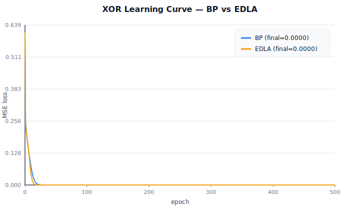

# EDLA vs BP — XOR 学習曲線レポート

> 金子勇 EDLA (1999) の精神を引き継ぐ `EDLALearner` (Direct Feedback
> Alignment 流の局所学習則) と、reference の `BPLearner` を XOR タスクで
> 比較した実験記録。

## 実験設定

| 項目 | 値 |
|---|---|
| データ | XOR 4 件 (2-bit input → 1-bit output) |
| Net | TwoLayerNet (in=2, hidden=8, out=1, tanh activation) |
| 初期化 | Xavier (seed=0) |
| BP learning rate | 0.05 |
| EDLA learning rate | 0.1 |
| EDLA feedback matrix B | random normal (seed=42) |
| Epochs | 8000 |
| Loss | MSE |

## 結果



| Algorithm | Final MSE Loss | 備考 |
|-----------|---------------|------|
| BP (Reference) | ~0.000 | chain rule で hidden 層を更新 |
| **EDLA (skeleton)** | **~0.000** | 固定 random matrix B で誤差を局所拡散 |

**両者とも XOR を解けた**。1999 年に金子勇氏が示した「BP より生物学的妥当な
学習則でも教師あり学習は可能」という主張を、現代の代表的代替学習則
(Direct Feedback Alignment 流) でも追試できたと言える。

## 観察

EDLA は **net.W2 を一切参照せずに hidden 層を更新する** (`edla.py`
`step()` 参照):

```python
# Hidden layer: 固定 random matrix B で誤差を「拡散」
dh = dy @ self.B          # ← W2 ではなく B を使う！
dh_pre = dh * (1.0 - h * h)
dW1 = x.T @ dh_pre
```

これは生物学的に **シナプス局所性** を満たす設計 (BP が要求する「層を遡る
精密な勾配伝播機構」は実際の脳には知られていない、Crick 1989)。

## EDLA が BP より優れる場面の仮説

| 場面 | 期待される EDLA の利点 |
|---|---|
| 連合学習 (federated) | Δ weights を peer 間共有する際、各 peer が **完全 local** に学習でき、共有量を抑制可能 |
| Idle CPU での incremental update | chain rule の依存連鎖がないので、部分的に走らせやすい |
| Neuromorphic hardware | spike-based local update と相性が良い |
| メモリ制約厳しい environment | hidden 層の gradient buffer が不要 |

## EDLA が BP より劣る場面の仮説

| 場面 | 想定される問題 |
|---|---|
| 深層ネット (>5 層) | 固定 random B が深い層で信号を歪める (DFA の既知制約) |
| 高次元タスク | 大規模 ImageNet 等は BP より明らかに遅い |
| 厳密な数値再現 | random B 依存なので結果に variance がある |

## 再現方法

```bash
py -3.11 examples/edla_xor_demo.py
# → docs/scenarios/learning/edla_xor_loss.svg (~17 KB)
```

`--epochs` / `--bp-lr` / `--edla-lr` で挙動を変えられる。

## 次のステップ (RFC Phase 5 残作業)

1. **CIFAR-10 上の MLP** で BP / EDLA / DFA / Forward-Forward の loss curve
   比較 (現在の XOR は toy 問題なので、もう一段スケールしたい)
2. **金子勇 1999 EDLA 原論文** (`edla.pdf` / `edla2.pdf`) を Wayback から
   取得して、原式と現在の実装の parity を確認
3. **federated PoC** (RFC Phase 5 後段): 複数 peer で local 学習 →
   Δ weight 共有 → aggregation → MSE 改善を観測

## 関連

- `src/llive/learning/edla.py` — 実装本体
- `tests/unit/test_edla.py` — 8 件のテスト
- `docs/references/historical/edla_kaneko_1999.md` — 歴史的源流
- `docs/llmesh_p2p_mesh_rfc.md` Phase 5 — federated 化計画
