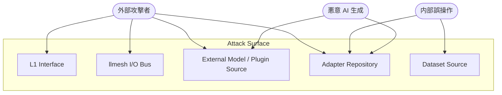
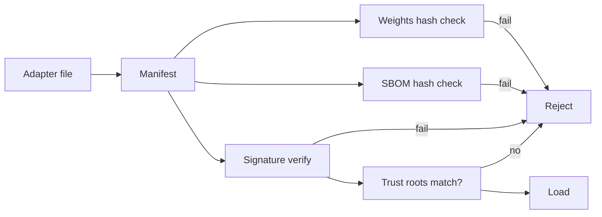

# llive セキュリティモデル

> v0.1 NFR-06 と FR-17 / FR-18 の精密化。Threat model、attack surface、defenses、運用責任を定義する。

## 1. 想定脅威モデル (STRIDE ベース)

| カテゴリ | 例 | 影響 | 対策要素 |
|---|---|---|---|
| **S**poofing | 偽 adapter / 偽 candidate を流す | 構造汚染、悪意モデル | FR-18 Signed Adapter Marketplace |
| **T**ampering | YAML diff の改竄、memory node の不正書換 | 推論結果操作 | provenance 必須 + 署名検証 |
| **R**epudiation | 「自分は実行していない」 | 監査不能 | OpenTelemetry trace + signed audit log |
| **I**nformation disclosure | quarantine 経由でプライベートデータ漏洩 | プライバシー違反 | FR-17 Quarantined Zone + 暗号化 |
| **D**enial of service | candidate 大量投入、memory write 過剰 | 評価帯飽和 | rate limit + FR-13 Static Verifier 先行 |
| **E**levation of privilege | 未承認 candidate が production へ昇格 | 構造改竄 | FR-07 多段審査 + HITL gate |

## 2. Attack Surface



## 3. 防御層 (Defense in Depth)

### Layer A: Boundary (信頼境界)

- L1 Interface での auth (mTLS or OIDC)
- llmesh I/O Bus 経由は **必ず署名検証**、`quarantine` zone へデフォルト入庫
- 外部プラグイン / モデルファイルは SHA-256 manifest + Ed25519 署名必須

### Layer B: Validation (検証)

- すべての YAML / JSON 入力に Schema validation (Draft 2020-12)
- FR-13 Static Verifier で構造的不変量検査
- prompt 入力には `jailbreak_detector` sub-block を任意挿入可能

### Layer C: Isolation (隔離)

- `quarantine` zone: 別 DB ファイル / 別 vector index
- per-experiment namespace (`exp:` / `staging:` / `prod:` prefix)
- container 評価は subprocess 分離、IPC は msgpack + 署名

### Layer D: Audit (監査)

- 全 state 遷移を OpenTelemetry trace + immutable audit log
- audit log は append-only sqlite + 定期 SHA-256 chain
- HITL 承認には reviewer の OIDC token 添付

### Layer E: Recovery (復旧)

- Memento snapshot を昇格前後で保持
- Saga 補償 step で多段巻き戻し
- Reverse-Evolution Monitor (FR-22) が継続監視

## 4. Signed Adapter Marketplace 詳細 (FR-18)

### 鍵管理

- Ed25519 鍵ペアを **`adapter publisher` ごとに保持**
- public key fingerprint を `provenance.signed_by` に記録
- 信頼鍵リスト (trust roots) はファイル `config/trust_roots.yaml` で管理
- 鍵 rotation は `llive trust rotate <fp>` コマンド (deprecation grace period 30 日)

### SBOM (Software Bill of Materials)

各 adapter に同梱:

```yaml
sbom:
  format: cyclonedx-1.6
  components:
    - name: base_model
      version: qwen2.5-7b
      hash: sha256:...
    - name: training_dataset
      ref: hf:org/dataset@v2
      hash: sha256:...
    - name: framework
      version: llive==0.2.0
    - name: dependencies
      ref: pyproject.lock
      hash: sha256:...
  licenses: [MIT, Apache-2.0]
  produced_at: 2026-05-13T07:00:00Z
```

### 署名対象

canonical JSON (RFC 8785) で正規化したペイロード:

```
sign_payload = canonical_json({
  "adapter_id": ...,
  "target_modules": [...],
  "weights_hash": sha256(weights_safetensors),
  "sbom_hash": sha256(sbom_yaml),
  "score_bundle": {...},
  "issued_at": ...,
})
signature = ed25519.sign(private_key, sign_payload)
```

### 検証フロー



## 5. Quarantined Memory Zone 詳細 (FR-17)

### Zone 定義

| Zone | 入庫条件 | read 制約 |
|---|---|---|
| `trusted` | 内部生成 + 署名 OK | 制約なし |
| `quarantine` | 外部 / 未署名 / 信頼鍵外 | cross-zone read 不可、in-zone read のみ |
| `archived` | TTL 経過 + 利用頻度低 | read 不可、復元は HITL |

### Cross-zone read の例外

特定の sub-block (`quarantine_aware_attention`) が明示的に zone をまたぐ場合:
- 入力に zone tag を保持
- 出力 hidden state にも zone tag を伝播
- downstream の memory_write 時に zone を引き継ぐ
- 全段で audit log

## 6. Prompt Injection / Jailbreak 防御

| 攻撃 | 対策 |
|---|---|
| memory 経由 indirect injection | retrieved chunks に `[source: <zone>]` タグ強制付与、LLM プロンプトで信頼度差別化 |
| HITL UI 経由 social engineering | llove TUI で reviewer 警告（"untrusted" zone source 含む候補は赤帯） |
| adapter 経由 backdoor | SBOM + 署名 + zero-cost proxy + shadow eval |
| dataset poisoning | dataset hash 必須、`bench/pollution/` で異常検知 |

## 7. プライバシー要件

- PII (Personal Identifiable Information) 含む input は `privacy_class=confidential` を `TaskSpec` に明示
- `confidential` データは:
  - episodic memory への write 時に **selective storage** (raw 保存禁止、要約のみ)
  - 共有 memory backend への write 禁止
  - llmesh Bus への publish 禁止 (zone="local-only")
- データ削除要求 (GDPR right to be forgotten) は `node_id` 単位で実施可能
- 削除時は MemoryEdge を cascade、`tombstone` を残す

## 8. インシデント対応

| インシデント | 検知 | 対応 |
|---|---|---|
| 異常な署名検証失敗増 | cross_zone_violation_count + audit log | 該当 publisher の鍵を deny list へ |
| 大量 candidate DoS | rate limit + queue depth metric | rate limit 自動引き締め、HITL alert |
| pollution rate 急上昇 | bench/pollution 自動監視 | 該当時刻以降の write を quarantine へ強制 |
| Reverse-Evolution 自動 rollback | FR-22 | 監査ログ + HITL 通知 |

## 9. 開発時の遵守事項

- secret は **環境変数 + secret manager** から取得、リポジトリ commit 禁止
- 設定ファイルに API key を書かない（`raptor/.claude/settings.local.json` パターンを反面教師）
- pre-commit hook で gitleaks / detect-secrets 必須
- CI で `bandit` / `semgrep` / `osv-scanner` 必須
- Dependencies は pinned + sbom 生成

## 10. セキュリティ責任分界

| 責任 | 担当 |
|---|---|
| 設計レビュー | maintainer + security WG |
| 鍵管理 | publisher 各位 + 共通 trust roots 管理者 |
| インシデント受付 | `security@llive.dev` |
| Vulnerability disclosure | GitHub Security Advisories (private fork) |
| Patch SLA | critical: 7 日 / high: 30 日 / medium: 90 日 |
