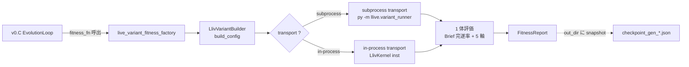
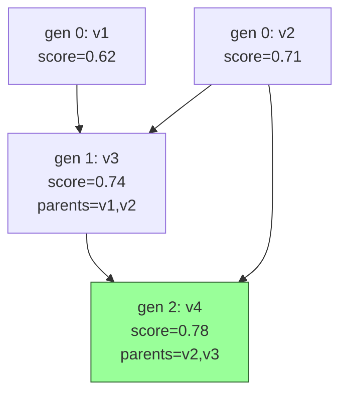

# llive v0.C Phase 2 — 実 LlivKernel spawn の interface spec

**Drafted:** 2026-05-21
**Status:** spec draft. **実装は将来** (credential / 環境準備後).
**Prereq:** v0.C Phase 1 着地済 (`llive_variant.py` mock baseline + checkpoint).

## 0. 目的

v0.C Phase 1 の **mock fitness を実 LlivKernel に置換** する経路を確定する.
派生集団進化を「**実 llive instance を 1 体ずつ spawn して評価**」段階に
進める.

「1 個体 5 分 × 50 体 × 30 世代 = 約 3 日」の運用を **serial + checkpoint +
resume で安全に回す** ことが目標.

## 1. 2 transport の責務分担



| Transport | 用途 | 利点 | 欠点 |
|---|---|---|---|
| **subprocess** | 隔離評価 (default) | data_dir / memory backend 完全独立, OOM が他派生に波及しない | 起動 overhead 2-5s |
| **in-process** | dev / smoke | 起動 overhead 0, debug 容易 | global state 汚染リスク, OOM が GA loop 全体を巻き込む |

## 2. subprocess transport (LV-09a)

### 2.1 起動コマンド

```bash
py -3.11 -m llive.variant_runner \
    --config-json /tmp/llive-variants/<variant_id>/config.json \
    --output-json /tmp/llive-variants/<variant_id>/result.json \
    --prompts-json /tmp/llive-variants/<variant_id>/prompts.json \
    --max-wallclock 300
```

### 2.2 入出力契約

**Input (`config.json`)**:

```json
{
  "variant_id": "v12345678",
  "data_dir": "/tmp/llive-variants/v12345678/",
  "thought_factor_weights": {"factor_structurize": 0.53, ...},
  "memory_thresholds": {"semantic_threshold": 0.51, ...},
  "backend_name": "mamba",
  "sampler": {"temperature": 0.77, "top_p": 0.79, "kv_quant": "q8_0"},
  "proactive": {"gift_value_threshold": 0.61, "cooldown_minutes": 29.8}
}
```

**Output (`result.json`)**:

```json
{
  "variant_id": "v12345678",
  "score": 0.7514,
  "breakdown": {
    "latency_ms": 4521.3,
    "quality": 0.78,
    "stability": 0.83,
    "safety": 1.0,
    "honesty": 0.65,
    "factor_coverage": 0.81,
    "memory_efficiency": 0.92,
    "proactive_balance": 0.78,
    "brief_completion_rate": 0.93,
    "thought_depth_avg": 4.2
  },
  "runtime_metadata": {
    "llama_cpp_sha": "abc1234",
    "llama_cpp_release_tag": "b4501",
    "gguf_spec_version": "3",
    "sampler_chain_spec": "...",
    "kv_cache_quantization": "q8_0",
    "model_quant": "q4_k_m"
  },
  "n_samples": 5,
  "notes": "production llive instance, brief_count=5",
  "elapsed_seconds": 287.4
}
```

### 2.3 ephemeral data_dir 戦略

```
/tmp/llive-variants/                    # data_dir_root (LlivVariantBuilder)
├── v12345678/                          # variant_id 単位
│   ├── config.json                     # 入力
│   ├── prompts.json                    # 評価用 prompts
│   ├── result.json                     # 出力 (FitnessReport を JSON 化)
│   ├── memory/                         # MEM-01〜07 の persistence
│   │   ├── semantic/index.npy
│   │   ├── episodic/events.jsonl
│   │   └── structural/edges.jsonl
│   └── logs/                           # debug log
│       └── variant_<run_id>.log
├── v23456789/
├── ...
└── _shared/                            # 全派生で共有する read-only artifact
    └── prompts/standard.json            # 標準評価 prompts (Phase 2 で確定)
```

評価終了後の cleanup ポリシー (LV-DISP-01):

- **default**: 上位 top_n 体の `result.json` + `memory/` だけを `winners/`
  に hard-link 保存, 残りは即削除.
- **debug mode**: 全 `result.json` を `runs/<timestamp>/` に保存.
- **disk full guard**: 50 GB 超で警告 → 古い世代を自動 evict.

### 2.4 fail mode

| failure | 対応 |
|---|---|
| subprocess timeout (max_wallclock 超過) | FitnessReport(score=-inf, notes="timeout") |
| subprocess crash (exit != 0) | FitnessReport(score=-inf, notes="crashed: stderr 抜粋") |
| result.json 不在 / parse 失敗 | FitnessReport(score=-inf, notes="invalid output") |
| data_dir 作成失敗 (disk full) | RuntimeError raise (GA loop 全体停止) |
| llama-server 接続失敗 | result.json に notes 記録 + score=0.0 (再評価可能) |

## 3. in-process transport (LV-09b)

```python
from llive.kernel import LlivKernel  # 将来の公開 API
from llive.perf.evolutionary.llive_variant import LlivVariantBuilder

def in_process_variant_fitness(genome) -> FitnessReport:
    cfg = LlivVariantBuilder().build_config(genome, variant_id="dev")
    kernel = LlivKernel.from_variant_config(cfg)
    try:
        result = kernel.run_eval_briefs(prompts=STANDARD_PROMPTS)
    finally:
        kernel.shutdown()  # in-process でも明示的に cleanup
    return result.to_fitness_report()
```

**注意**: in-process transport は **default にしない**. global state 汚染 +
OOM 連鎖のリスクが subprocess 経路と比べて高い. dev/debug 限定.

## 4. Phase 2 着手判断 checklist

実装着手前に確認:

- [ ] credential 復旧 (Anthropic / OpenAI / Gemini) — 不要なら mock backend で先行可
- [ ] llama-server + Codestral-Mamba GGUF が起動状態
- [ ] `STANDARD_PROMPTS` の確定 (5-10 件, FullSense 評価 spec から)
- [ ] disk free 50 GB 以上 (派生 50 体 × memory 各 ~500MB 想定)
- [ ] memory `feedback_d_drive_preference` に従い data_dir は D ドライブ
- [ ] checkpoint_every=1 + max_wallclock_seconds=3600 で safely 停止できること確認

## 5. Phase 2 → 3 への接続

Phase 3 (LV-10 系統樹可視化) は Phase 2 完了後. `winners/` ディレクトリの
hard-link を辿って世代間の lineage を Mermaid に描く.



## 6. 関連

- `docs/requirements_v0.C_llive_variant_evolution.md` (要件 LV-01〜10)
- `docs/experiments/llive_variant_v0_C_2026_05_21.md` (Phase 1 実走 log)
- `src/llive/perf/evolutionary/llive_variant.py` (Phase 1 mock 本体)
- `src/llive/perf/evolutionary/loop.py` (checkpoint / resume / budget)
- portal `docs/spec/lleval_v0_1_implementation_notes.md` (lleval 連携)
- lleval `docs/integration_with_llive.md` (Genome → Config bridge spec)
- maintainer memory:
  - [[feedback-d-drive-preference]] (data_dir = D ドライブ)
  - [[feedback-llive-measurement-purity]] (on-prem 一次走者)
  - [[feedback-quiet-hours]] (深夜帯 sleep)
  - [[project-llive-v0C-variant-evolution]] (v0.C 総括)
