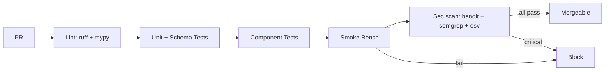

# llive テスト戦略

> v0.1 § 品質保証要件 / NFR-05 の精密化。各層・各拡張点の test pyramid、CI gating、再現性ルールを定義。

## 1. Test Pyramid

```
              ┌────────────────┐
              │  E2E (5%)      │  full pipeline + HITL stub
              ├────────────────┤
              │  Integration   │  container + memory + router
              │     (20%)      │
              ├────────────────┤
              │  Component     │  per-layer
              │     (25%)      │
              ├────────────────┤
              │  Unit (50%)    │  sub-block / utility / schema
              └────────────────┘
```

## 2. レイヤ別テスト

### L1 Interface
- **Unit**: CLI argument parser, request validator
- **Component**: REST / MCP endpoint contract (FastAPI TestClient)
- **CI**: PR mandatory

### L2 Orchestration
- **Unit**: pipeline composition, router fallback
- **Component**: end-to-end inference with mock model + mock memory
- **Integration**: real model (smallest 1B) + real memory backend

### L3 Core Model Adapter
- **Unit**: adapter pattern conformance (5 fake backends)
- **Component**: HF / vLLM 双方で同 prompt 同出力 (tolerance あり)
- **Snapshot**: well-known prompt の reference output diff

### L4 Block Container Engine
- **Unit**:
  - 各 sub-block 単体テスト（IO 契約 + numerical correctness）
  - schema validation (positive / negative cases)
  - Builder の YAML→ExecutionPlan 変換
- **Component**: ContainerSpec full lifecycle (load, compose, execute, profile)
- **Property-based** (hypothesis): ランダム sub-block 順序 × 不変条件（hidden_dim 保存）

### L5 Memory Fabric
- **Unit**: Repository CRUD, edge integrity, provenance stamping
- **Component**: 4 layer cross-link, consolidation cycle
- **Integration**: 実 backend (Qdrant / DuckDB / Kùzu) との smoke
- **Chaos**: backend down / latency spike / consistency violation

### L6 Evolution Manager
- **Unit**: ChangeOp apply / invert, lifecycle state transitions
- **Component**: 候補 N 件の short_eval / shadow_eval / promote / rollback
- **Property-based**: ランダム CandidateDiff の apply→invert→apply 同一性
- **Saga**: 多段 promote の途中失敗で正しく補償される

### L7 Observability
- **Unit**: log enrichment, metric emit
- **Component**: trace context propagation across layers
- **CI**: smoke ベンチで dashboard 生成可能性

### L8 llove HITL
- **Unit**: TUI widget state transitions (Textual Pilot)
- **Component**: HITL approve / deny コマンドが Evolution に到達
- **Visual regression**: TUI snapshot (textual screenshot)

### llmesh I/O Bus
- **Unit**: MQTT / OPC-UA payload encoding
- **Integration**: mosquitto / open62541 ローカルブローカ
- **Chaos**: broker down / reconnect / message loss

## 3. 拡張点ごとのテスト規約

新規 plugin 追加時は **以下 6 テスト必須**:

1. **IO Contract Test** — input/output tensor shape & dtype 検証
2. **Config Schema Test** — invalid config が reject される
3. **Determinism Test** — 同 seed で同出力
4. **Numerical Stability Test** — fp16 / bf16 / fp32 で大幅乖離なし
5. **Resource Profile Test** — `latency_cost` / `vram_cost` が実測と一致 (±20%)
6. **Integration Smoke** — 既存 ContainerSpec の中で動作する

これを `tests/conformance/test_<name>_conformance.py` として自動生成するテンプレートを提供。

## 4. ベンチマーク統合

| ベンチ種 | 頻度 | gate? |
|---|---|---|
| smoke (`bench/mini`) | PR / commit | yes |
| standard | nightly | warn |
| forgetting | nightly | warn (BWT 閾値) |
| pollution | weekly | warn |
| ablation | weekly | warn |
| full | release-candidate | yes |

ベンチ結果は `bench/_runs/<timestamp>/` に保存、Aggregator が `metrics_db.duckdb` へ追記。

## 5. 再現性要件

- **Seed**: 全乱数源を `RUN_SEED` 一元管理
  - torch / numpy / random / cuda.manual_seed_all
  - sub-block 内乱数は `seed_from(run_seed, subblock_id)`
- **Determinism Hooks**:
  - `torch.use_deterministic_algorithms(True)` をテストモード時に強制
  - cuBLAS 等の非決定的経路はテスト時に避ける
- **Snapshot**:
  - well-known prompt × well-known seed → reference hash
  - drift 検知時に CI 警告
- **Environment**:
  - `pyproject.toml` + `uv.lock` で固定
  - Python 3.11.x (memory `project_python_311_unification` 方針)

## 6. CI/CD パイプライン



- pre-commit: ruff format + ruff check + gitleaks
- GitHub Actions: ubuntu-latest + macos-latest + windows-latest
- 別 workflow: nightly bench (self-hosted GPU runner)

## 7. テストデータ管理

| 種別 | 場所 | サイズ |
|---|---|---|
| 単体テスト用 fixture | `tests/fixtures/` | ≤ 10MB / file |
| 中規模 dataset | HF Hub `llive/test-datasets` | LFS |
| ベンチ用 | 公開: HF / 私的: D:/data/llive_bench/ | 任意 |
| 再現用 snapshot | `tests/snapshots/` | 軽量 |

## 8. テスト品質メトリクス

- **Coverage**: branch coverage 目標 ≥ 80% (core layer), ≥ 60% (extensions)
- **Mutation testing**: `mutmut` で main path のみ
- **Flaky test detection**: pytest-randomly + retry オプション、3 連続失敗で flag

## 9. テスト命名規則

```
tests/
  unit/
    test_<module>_<scenario>.py
  component/
    test_<layer>_<feature>.py
  integration/
    test_<flow>_end_to_end.py
  conformance/
    test_<plugin_name>_conformance.py
  property/
    test_<invariant>_property.py
  chaos/
    test_<failure_mode>_chaos.py
```

関数名:

```python
def test_<unit>_when_<condition>_then_<expected>():
    ...
```

## 10. テストフェーズ別優先度

| Phase | 重点 |
|---|---|
| Phase 1 (MVR) | Unit + Component (L4/L5/L2)、Snapshot |
| Phase 2 | Property-based + 拡張点 conformance |
| Phase 3 | Saga + Chaos + 全層 Integration |
| Phase 4 | E2E + visual regression + nightly full bench |
