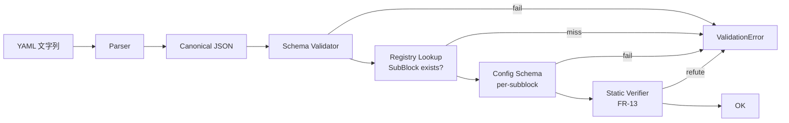

# llive YAML スキーマ詳細

> v0.1 §「宣言的スキーマ要件」の精密化。Container / Sub-block / Candidate Diff の正式 JSON Schema、検証規則、変更追跡規約を定義する。

## 1. 設計方針

- **形式**: YAML 1.2（人間編集）、内部表現は JSON で正規化
- **検証**: JSON Schema Draft 2020-12 で全構造を validate
- **拡張**: 未知 sub-block / 未知 action を schema レベルで reject (`additionalProperties: false`)
- **進化**: schema 自体に `schema_version` を持ち、互換性ルールを SemVer で管理
- **差分追跡**: ChangeOp ベースで `apply` / `invert` を機械的に実現

## 2. ContainerSpec スキーマ

```yaml
$schema: https://llive.dev/schemas/container-spec.v1.json
$id: container-spec.v1
type: object
required: [schema_version, container_id, subblocks]
additionalProperties: false
properties:
  schema_version: { type: integer, const: 1 }
  container_id:   { type: string, pattern: "^[a-z][a-z0-9_]+_v\\d+$" }
  routing_tags:   { type: array, items: { type: string }, uniqueItems: true }
  cost_profile:
    type: object
    additionalProperties: false
    properties:
      latency: { enum: [low, medium, high] }
      vram:    { enum: [low, medium, high] }
      est_flops_per_token: { type: integer, minimum: 0 }
  subblocks:
    type: array
    minItems: 1
    items: { $ref: "#/$defs/SubBlockRef" }
  nested_containers:
    type: array
    items: { $ref: "#/$defs/NestedContainer" }

$defs:
  SubBlockRef:
    type: object
    required: [type]
    additionalProperties: false
    properties:
      type:   { type: string }    # validated against SubBlockRegistry at runtime
      name:   { type: string }    # optional alias for trace
      config: { type: object }    # validated against type's config_schema
      condition: { $ref: "#/$defs/ConditionSpec" }   # optional

  NestedContainer:
    type: object
    required: [target, container_ref]
    properties:
      target:        { type: string }
      condition:     { $ref: "#/$defs/ConditionSpec" }
      container_ref: { type: string }

  ConditionSpec:
    oneOf:
      - { type: object, required: [surprise_gt], properties: { surprise_gt: { type: number } } }
      - { type: object, required: [task_tag],    properties: { task_tag: { type: string } } }
      - { type: object, required: [route_depth_lt], properties: { route_depth_lt: { type: integer } } }
      - { type: object, required: [all_of], properties: { all_of: { type: array, items: { $ref: "#/$defs/ConditionSpec" } } } }
      - { type: object, required: [any_of], properties: { any_of: { type: array, items: { $ref: "#/$defs/ConditionSpec" } } } }
```

### 例

```yaml
schema_version: 1
container_id: adaptive_reasoning_v1
routing_tags: [reasoning, long-context]
cost_profile: { latency: medium, vram: medium }
subblocks:
  - type: pre_norm
  - type: causal_attention
  - type: memory_read
    config: { source: [semantic, episodic], top_k: 8 }
  - type: cross_memory_attention
  - type: adapter
    config: { selector: task_conditioned }
  - type: ffn_large
  - type: reflective_probe
  - type: memory_write
    config: { policy: surprise_gated }
    condition: { surprise_gt: 0.7 }
  - type: residual
```

## 3. SubBlockSpec スキーマ（plugin 登録時）

```yaml
$schema: https://llive.dev/schemas/subblock-spec.v1.json
$id: subblock-spec.v1
type: object
required: [schema_version, name, version, io_contract, plugin_module]
additionalProperties: false
properties:
  schema_version: { type: integer, const: 1 }
  name: { type: string, pattern: "^[a-z][a-z0-9_]+$" }
  version: { type: string, pattern: "^\\d+\\.\\d+\\.\\d+$" }
  io_contract:
    type: object
    required: [input, output]
    properties:
      input:
        type: object
        properties:
          hidden_dim: { type: integer }
          seq_dim:    { type: boolean }
          extras:     { type: array, items: { type: string } }
      output:
        type: object
        properties:
          hidden_dim: { type: integer }
          seq_dim:    { type: boolean }
          extras:     { type: array, items: { type: string } }
  trainable:           { type: boolean }
  supports_streaming:  { type: boolean }
  latency_cost_per_token_ms: { type: number, minimum: 0 }
  vram_cost_mb:        { type: number, minimum: 0 }
  config_schema:       { type: object }    # JSON Schema for instance config
  plugin_module:       { type: string }    # Python import path
```

## 4. CandidateDiff スキーマ

```yaml
$schema: https://llive.dev/schemas/candidate-diff.v1.json
$id: candidate-diff.v1
type: object
required: [schema_version, candidate_id, base_candidate, changes]
additionalProperties: false
properties:
  schema_version: { type: integer, const: 1 }
  candidate_id:   { type: string, pattern: "^cand_\\d{8}_\\d{3,}$" }
  base_candidate: { type: string }
  rationale:      { type: array, items: { type: string } }
  changes:
    type: array
    minItems: 1
    items: { $ref: "#/$defs/ChangeOp" }

$defs:
  ChangeOp:
    oneOf:
      - { $ref: "#/$defs/InsertSubblock" }
      - { $ref: "#/$defs/RemoveSubblock" }
      - { $ref: "#/$defs/ReplaceSubblock" }
      - { $ref: "#/$defs/ReorderSubblocks" }
      - { $ref: "#/$defs/AddRoutingTag" }
      - { $ref: "#/$defs/SetAdapter" }
      - { $ref: "#/$defs/SetMemoryPolicy" }

  InsertSubblock:
    type: object
    required: [action, target_container, after, spec]
    properties:
      action: { const: insert_subblock }
      target_container: { type: string }
      after:  { type: string }      # subblock 名 or "head"
      spec:   { $ref: "container-spec.v1#/$defs/SubBlockRef" }

  RemoveSubblock:
    type: object
    required: [action, target_container, target_subblock]
    properties:
      action: { const: remove_subblock }
      target_container: { type: string }
      target_subblock:  { type: string }

  ReplaceSubblock:
    type: object
    required: [action, target_container, from, to]
    properties:
      action: { const: replace_subblock }
      target_container: { type: string }
      from: { type: string }
      to:   { $ref: "container-spec.v1#/$defs/SubBlockRef" }

  ReorderSubblocks:
    type: object
    required: [action, target_container, new_order]
    properties:
      action: { const: reorder_subblocks }
      target_container: { type: string }
      new_order: { type: array, items: { type: string } }

  AddRoutingTag:
    type: object
    required: [action, target_container, tag]
    properties:
      action: { const: add_routing_tag }
      target_container: { type: string }
      tag: { type: string }

  SetAdapter:
    type: object
    required: [action, target_subblock, adapter_id]
    properties:
      action: { const: set_adapter }
      target_subblock: { type: string }
      adapter_id: { type: string }

  SetMemoryPolicy:
    type: object
    required: [action, memory_type, policy]
    properties:
      action: { const: set_memory_policy }
      memory_type: { enum: [semantic, episodic, structural, parameter] }
      policy: { type: object }
```

### 例

```yaml
schema_version: 1
candidate_id: cand_20260513_001
base_candidate: baseline_qwen_lora_mem_v2
rationale:
  - reduce_vram_under_long_context
  - improve_specialization
changes:
  - action: insert_subblock
    target_container: adaptive_reasoning_v1
    after: memory_read
    spec:
      type: compress
      config: { method: low_rank_projection }
  - action: replace_subblock
    target_container: adaptive_reasoning_v1
    from: ffn_large
    to:
      type: moe_ffn
      config: { experts: 4, top_k: 2 }
```

## 5. ChangeOp の invert 規約

各 ChangeOp は機械的に逆操作を生成可能とする（rollback の自動化）。

| 順 ChangeOp | 逆 ChangeOp |
|---|---|
| `insert_subblock(after=X, spec=Y)` | `remove_subblock(target=Y.name)` |
| `remove_subblock(target=X)` | `insert_subblock(after=prev(X), spec=X.original)` |
| `replace_subblock(from=X, to=Y)` | `replace_subblock(from=Y, to=X)` |
| `reorder_subblocks(new_order=L')` | `reorder_subblocks(new_order=L)` |
| `add_routing_tag(tag=T)` | `remove_routing_tag(tag=T)` |
| `set_adapter(adapter_id=A')` | `set_adapter(adapter_id=A)` |
| `set_memory_policy(policy=P')` | `set_memory_policy(policy=P)` |

これにより `Memento` パターン無しでも completed-CandidateDiff から逆向き Diff を派生でき、`Saga` 補償 step として再利用可能。

## 6. 検証パイプライン



## 7. schema バージョニング規約

- `schema_version` は整数。MAJOR バンプは破壊的変更
- 移行ツール `llive schema migrate <from> <to>` を提供
- 旧 schema は `archive/schemas/v<n>/` に永続保存
- migrate 失敗ファイルは `quarantine` に隔離
